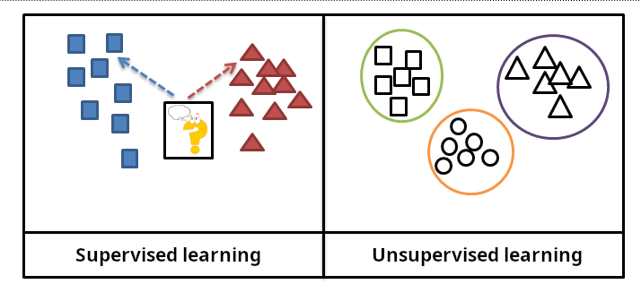
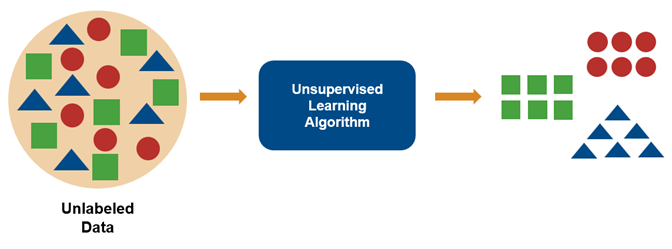
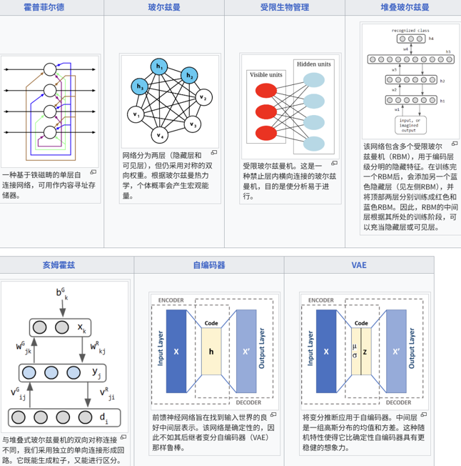
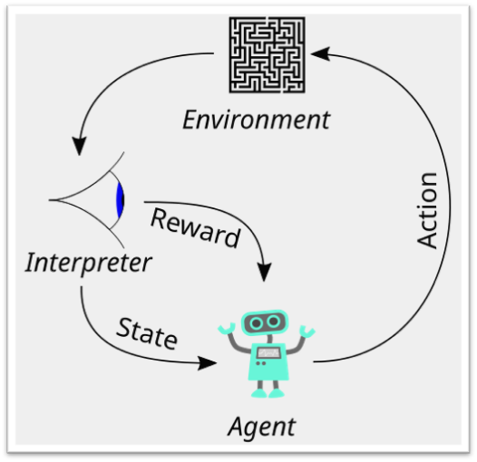
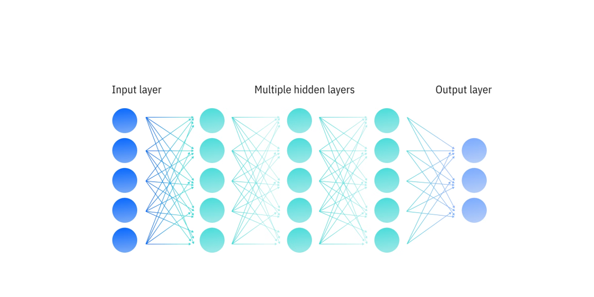
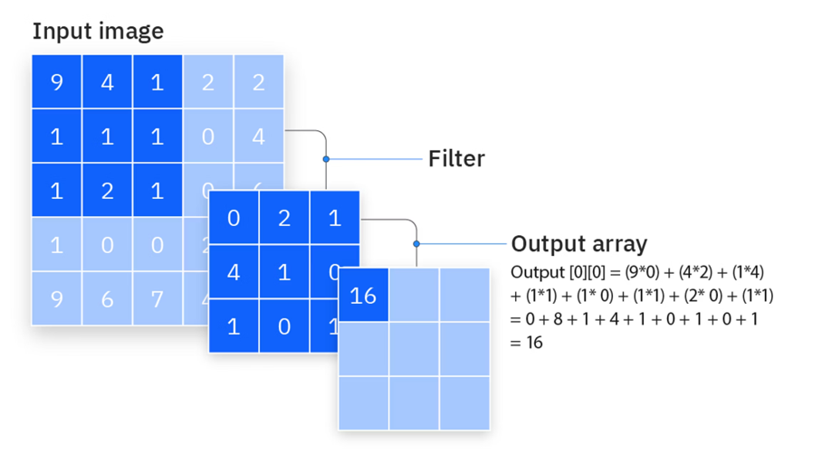
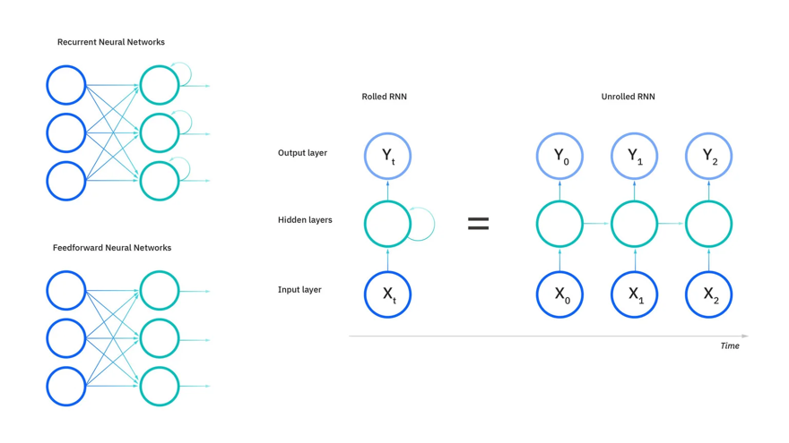

## AI

从广义上讲，人工智能 (Artificial Intelligence, AI) 是指让计算机系统模拟、延伸和扩展人类智能的理论、方法、技术及应用系统。

其核心目标是让机器能够像人一样思考、学习、推理、感知和行动。

我们可以将 AI 的发展和应用大致分为几个层次：

1. 弱人工智能 (Artificial Narrow Intelligence, ANI):
- 定义: 专用于特定任务的 AI。这是我们目前所处并广泛应用的阶段。
- 例子:
  - **机器学习 (Machine Learning, ML)**: AI 的一个核心子集，让机器通过从数据中学习模式来做出预测或决策，而不是通过明确的编程指令。例如，垃圾邮件过滤器、推荐引擎。
  - **深度学习 (Deep Learning, DL)**: 机器学习的一个分支，使用深度神经网络（模仿人脑结构）来处理更复杂的数据模式。例如，图像识别、自然语言处理 (NLP)。
  - **生成式 AI (Generative AI)**: 深度学习的最新突破，能够创造新的、原创性的内容。例如，大型语言模型 (Large Language Models, LLMs) 如 GPT-4（生成文本）、Midjourney（生成图像）、Suno（生成音乐）。

2. 强人工智能 (Artificial General Intelligence, AGI):
- 定义: 具备与人类同等智慧，能够理解、学习并应用其智能来解决任何问题的 AI。
- 现状: 目前仍处于理论和探索阶段，是 AI 领域的“圣杯”。

3. 超人工智能 (Artificial Superintelligence, ASI):
- 定义: 在几乎所有领域都远远超越最聪明人类智慧的 AI。
- 现状: 纯属科幻和哲学探讨范畴。

当我们今天讨论 AI 时，我们主要指的是弱人工智能，特别是机器学习、深度学习和生成式 AI。

## 机器学习

机器学习是人工智能（AI）的一个核心子领域，其本质是让计算机系统从数据中自动学习模式和规律，并利用这些规律来做出预测或决策，而无需进行明确的编程。

传统编程:
- 输入: 数据 + 程序 (由人类编写的规则)
- 输出: 答案
- 例子: 你编写一个函数`is_spam(email)`，里面包含上百条规则，如“如果邮件包含‘免费赢大奖’，则判定为垃圾邮件”。

机器学习:
- 输入: 数据 + 期望的答案 (标签)
- 输出: 程序 (由机器自己生成的模型/规则)
- 例子: 你给机器喂入成千上万封邮件，并告诉它哪些是垃圾邮件、哪些不是。机器会自动学习垃圾邮件的特征（例如，常见的词语、发件人模式等），并生成一个能够自行判断新邮件的模型。

从“授人以鱼（直接给规则）”变成了“授人以渔（教机器如何自己学习规则）”。

根据学习方式和训练数据的不同，机器学习主要可以分为三大类型：监督学习、无监督学习和强化学习。

### 监督学习(Supervised Learning)

向老师学习，有标准答案。

训练数据: 带有“标签”或“正确答案”的数据。每一条输入数据都对应着一个已知的、期望的输出。

算法的目标是学习一个从输入到输出的映射函数。它通过不断地将自己的预测结果与“正确答案”进行比较，并逐步调整自身模型来减小误差。

主要分为两类任务:
- 分类 (Classification): 预测一个离散的类别标签。
  - 问题: “这是 A 还是 B 还是 C？”
  - 例子:
  - **垃圾邮件检测**: 判断一封邮件是“垃圾邮件”还是“非垃圾邮件”。
  - **图像识别**: 判断一张图片里是“猫”、“狗”还是“鸟”。
  - **情感分析**: 判断一段评论的情感是“积极”、“消极”还是“中性”。

- 回归 (Regression): 预测一个连续的数值。
  - 问题: “这个值是多少？”
  - 例子:
  - **房价预测**: 根据房子的面积、位置、房龄等特征，预测其价格。
  - **股票价格预测**: 根据历史数据和市场指标，预测明天的股价。
  - **天气预报**: 预测明天的最高气温。

 ### 无监督学习 (Unsupervised Learning)

 自己探索，寻找数据内在的结构。

 训练数据: 没有“标签”或“正确答案”的数据。算法只有输入数据，不知道期望的输出是什么。

 算法的目标是在数据中发现隐藏的模式、结构或关系。

 主要分为两类任务:
- 聚类 (Clustering): 将数据自动分组，使得同一组内的数据尽可能相似，不同组之间的数据尽可能不同。
  - 问题: “哪些数据点是相似的？”
  - 例子:
  - **客户分群**: 根据用户的购买行为、浏览历史，将客户分为“高价值客户”、“潜力客户”、“流失风险客户”等群体。
  - **新闻分类**: 自动将海量新闻文章聚类成“体育”、“科技”、“财经”等主题。

- 降维 (Dimensionality Reduction): 在保留最重要信息的前提下，减少数据的特征数量。
  - 问题: “如何用更少的特征来表示这些数据？”
  - 例子:
  - **数据可视化**: 将高维数据（例如，有100个特征）降低到二维或三维，以便在图表上展示。
  - **特征提取**: 在人脸识别中，将一张百万像素的图片压缩成一个几百维的特征向量，用于后续的比对。

 对于神经网络来说，下面是各种无监督网络的连接图。圆圈代表神经元，圆圈之间的边代表连接权重。

 随着网络设计的改变，会添加特征以实现新的功能，或移除特征以加快学习速度。

 例如，神经元可以在确定性（Hopfield）和随机性（Boltzmann）之间切换以实现鲁棒的输出；可以移除层内的权重（RBM）以加快学习速度；或者允许连接变得不对称（Helmholtz）。

### 强化学习 (Reinforcement Learning)
通过试错来学习，有奖励和惩罚。

算法（称为智能体 Agent）在一个环境 (Environment) 中采取行动 (Action)。根据行动的结果，环境会给予智能体一个奖励 (Reward) 或 惩罚 (Penalty)。智能体的目标是通过不断地试错，学习一套策略 (Policy)，以最大化其长期累积的奖励。

强化学习本质上是关于智能体、环境和目标之间的关系。文献中普遍采用马尔可夫决策过程（MDP）来描述这种关系。

强化学习智能体通过与环境交互来学习问题。环境提供关于其当前状态的信息。

智能体随后利用这些信息来确定要采取哪些行动。

如果该行动从周围环境获得奖励信号，则鼓励智能体在未来处于类似状态时再次采取该行动。

此后，这个过程会针对每个新状态重复进行。

随着时间的推移，智能体通过奖励和惩罚来学习在环境中采取能够实现特定目标的行动。

应用领域:
- **游戏 AI**: AlphaGo 就是通过自我对弈（一种强化学习）来学习下围棋的。
- **机器人控制**: 控制机器人的手臂来抓取物体。
- **自动驾驶**: 决策系统（何时加速、何时刹车、何时变道）。
- **资源管理**: 动态调整数据中心的资源分配以降低能耗。

## 深度学习

深度学习是机器学习的一个特定分支，其核心是使用一种叫做人工神经网络 (Artificial Neural Networks, ANNs)，特别是深度神经网络 (Deep Neural Networks, DNNs) 的模型，来从大规模数据中学习复杂的、高层次的模式。

传统机器学习在处理复杂数据（如图像、声音、自然语言）时，需要一个叫做“特征工程 (Feature Engineering)”的关键步骤。这个步骤需要人类专家手动设计和提取有用的特征。

例子（传统人脸识别）: 人类专家需要手动编写算法来提取眼睛的间距、鼻子的长度、嘴巴的形状等特征，然后将这些特征喂给一个分类器。

深度学习的革命性突破在于：它实现了**端到端 (End-to-End)**的学习，能够自动完成特征工程。

针对不同类型的数据和任务，研究人员设计了多种专门的神经网络架构。

### 卷积神经网络 (Convolutional Neural Networks, CNNs)

处理网格状数据，特别是图像。

通过 **卷积层** (Convolutional Layers) 和 **池化层** (Pooling Layers) 来有效地提取空间层次特征。

卷积层使用 **滤波器** (filters) 来检测图像中的局部模式（如边缘、纹理），而池化层则对特征图进行降采样，减少计算量并增强模型的鲁棒性。

**应用**: 图像分类、目标检测、人脸识别、医学影像分析。

现在想象一下，将一个 5x5 的滤波器与输入图像中一个 5x5 的像素网格相乘。在数学术语中，这被称为卷积：一种数学运算，其中一个函数修改（或卷积）另一个函数。

如果像素值与滤波器的值相似，则乘积（点积）会很大，这些像素所代表的特征将被捕获；否则，点积会很小，这些像素将被忽略。

将图像的一小部分像素值（左图）乘以卷积滤波器（中图），得到原始像素的低维表示（右图），该表示反映了原始像素与滤波器所表示的信息的相似程度。

### 循环神经网络 (Recurrent Neural Networks, RNNs)

处理序列数据，即数据点之间存在时间或顺序关系。

网络的隐藏状态会像“记忆”一样，在处理序列中的下一个元素时，保留之前元素的信息。

变体: 由于标准 RNN 存在 **梯度消失/爆炸** 问题，难以处理长序列，其实际应用中更多的是其强大的变体，如 LSTM (Long Short-Term Memory) 和 GRU (Gated Recurrent Unit)。

**应用**: 自然语言处理（机器翻译、情感分析）、语音识别、时间序列预测。

循环神经网络（RNN），以 **展开** 和 **折叠** 两种形式展示。

这导致传统循环神经网络（RNN）存在一些根本性的缺陷，尤其是在训练方面。

回想一下，反向传播计算损失函数的梯度，该梯度决定了每个模型参数应该如何增加或减少。

当这些参数更新在过多的“相同”循环层中重复进行时，这些更新会呈指数级增长：增大参数会导致梯度爆炸，而减小参数会导致梯度消失。

这两个问题都会导致训练不稳定、训练速度变慢，甚至完全停止训练。

因此，标准RNN仅限于处理相对较短的序列。

### Transformer 模型

同样用于处理序列数据，但革命性地改进了 RNN 的处理方式。

引入了 **自注意力机制** (Self-Attention Mechanism)。它允许模型在处理序列中的每个元素时，直接计算该元素与序列中所有其他元素的相关性权重，从而能够更好地捕捉长距离依赖关系，并且更适合并行计算。

Transformer 架构是当前自然语言处理 (NLP) 领域绝对的主宰，是所有大型语言模型(LLMs)(如 GPT, BERT, LLaMA)的基础。

**应用**: GPT-4, ChatGPT, Google Bard, 机器翻译，文本生成，问答系统。

### Mamba 模型

Mamba模型是一种相对较新的神经网络架构，于2023年首次提出，它是基于 **状态空间模型** (SSM) 的一种独特变体。

与Transformer模型类似，Mamba模型提供了一种创新的方法，可以有选择地优先处理特定时刻最相关的信息。

Mamba模型最近已成为Transformer架构的有力竞争对手，尤其是在 **逻辑层级模型** (LLM) 领域。

深度学习通过构建模仿人脑信息处理方式的深度神经网络，实现了从原始数据中自动学习复杂特征的能力。以**CNN、RNN和Transformer**为代表的多种强大架构，使其在计算机视觉、自然语言处理等领域取得了突破性的进展，并成为当前 AI 革命的核心驱动力。
