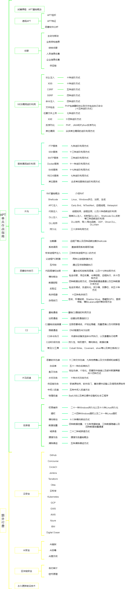

# 🛡️ AI-Security-Knowledge-Base

> 这是一个系统性的 AI 安全研究项目，涵盖了从基础机器学习算法理论到前沿大模型注入攻击、AI 免杀对抗及深度伪造（Deepfake）的完整知识体系。

---

## 🏗️ 知识体系架构

本库内容分为四大板块：**AI 核心算法**、**威胁建模**、**红队进攻**及**蓝队防御**。

### 🧬 一：AI 基础与理论
深入理解模型背后的数学逻辑，是寻找算法漏洞的前提。
*   [**AI 概论**](./AI.md) - 人工智能发展史、分支及核心概念。
*   [**深度学习架构**](./深度学习.md) - 从 CNN/RNN 到 Transformer 架构的深度解构。
*   [**核心机器学习算法**](./监督学习算法.md) - 线性/逻辑回归、SVM、决策树、随机森林及朴素贝叶斯。
*   [**无监督学习探索**](./无监督学习算法.md) - 聚类分析（K-Means, GMM）与关联规则。
*   [**强化学习原理**](./强化学习.md) - 智能体（Agent）博弈逻辑与自动化决策基础。

### 🚨 二：威胁建模与风险框架
基于国际主流安全标准，分析 AI 系统的攻击面。
*   [**AI 安全风险框架**](./AI安全.md) - 深度解读 **OWASP ML/LLM Top 10**，涵盖 Prompt Injection、数据中毒及模型反演。
*   [**MCP 专项安全**](./MCP安全.md) - 针对 **Model Context Protocol** 的最新安全研究，包括工具投毒与 Cursor IDE 漏洞分析。

### 🏹 三：红队进攻演练
探索 AI 在网络攻防中作为“武器”的实战利用。
*   [**进攻性 AI 实战**](./进攻性AI.md) - 
    *   **AI 漏洞扫描**：利用 `Shennina` 与 `Shannon` 实现推理型自动化渗透。
    *   **恶意软件对抗**：利用 `Pesidious` 与 `MalwareGAN` 进行强化学习驱动的免杀变异。
    *   **深度伪造欺诈**：实时音视频克隆（`Deep-Live-Cam`, `Voice-Pro`）的原理与利用。

### 🛡️ 四：蓝队防御赋能
研究如何利用算法构建更具预见性的安全防御体系。
*   [**算法赋能安全**](./算法赋能安全.md) - 基于机器学习的异常流量检测、自动化审计与威胁猎取。

---

## 🚀 核心关注方向

| 关注领域 | 核心技术 | 重点工具 |
| :--- | :--- | :--- |
| **LLM Security** | Prompt Injection, Excessive Agency | Gitleaks, Prompt-Guard |
| **Adversarial ML** | Evasion Attacks, Data Poisoning | Pesidious, ART (Adversarial Robustness Toolbox) |
| **Identity Fraud** | Deepfake, Voice Cloning | Deep-Live-Cam, RVC-WebUI |
| **Automation** | Autonomous Pentesting Agents | Shannon, MetaGPT |

---

## 🛠️ 建议阅读方式

1.  **初学者**：建议从 `AI.md` 开始，按顺序阅读算法模块，建立底层的数学直觉。
2.  **安全从业者**：直接进入 `AI安全.md` 了解 OWASP 风险框架，并参考 `进攻性AI.md` 进行本地实验。
3.  **开发者**：重点阅读 `MCP安全.md` 与 `算法赋能安全.md`，构建安全的 AI 集成方案。

---

## 完整视频课程：

更强大可实战化的代码，更多漏洞进阶方式，更多方法！

## ⚠️ 免责声明

**重要提示：** 本仓库所涉及的技术内容仅供安全教学、合规审计及学术研究使用。
*   禁止将本项目中的任何技术用于非法用途。
*   在使用进攻性工具前，请确保您已获得目标系统的明确授权。
*   作者不对任何滥用本仓库内容导致的损失负责。

---

## 🤝 贡献与交流

欢迎提交 Issue 或 Pull Request 来完善文档。如果你觉得这个项目对你有帮助，请点一个 **Star** 🌟。

---
**Last Updated:** 2026-03-06  
**Author:** GhostWolfLab/Snowwolf