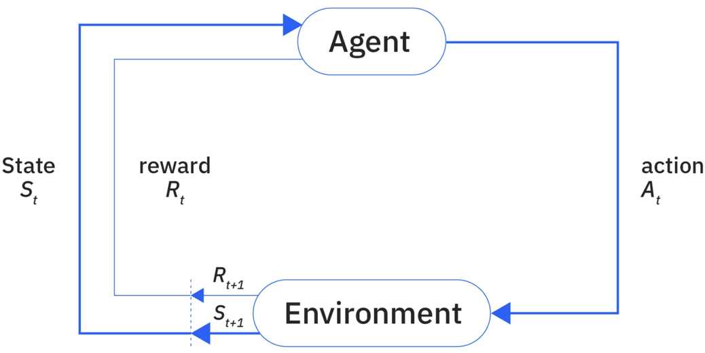
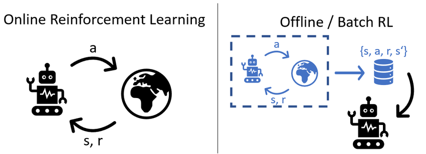
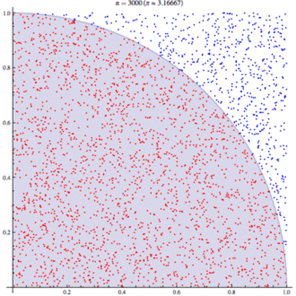
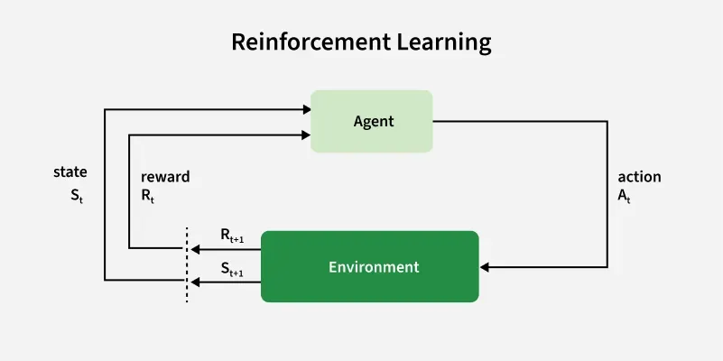
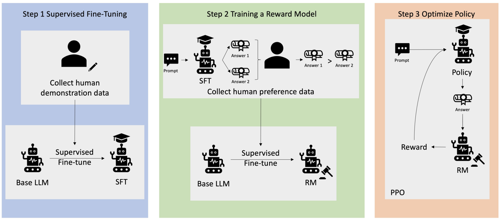

## 强化学习 (Reinforcement Learning) 

**强化学习** (Reinforcement Learning, RL)是一种独特的机器学习范式。在 RL 中，一个**自主智能体** (Autonomous Agent) 通过与环境的直接交互来学习如何做出最优决策，其学习过程完全由**试错** (Trial and Error) 驱动。

>   **自主智能体**: 指任何能够在没有人类直接指令的情况下，独立感知环境并做出决策和行动的系统。机器人、自动驾驶汽车、游戏 AI 都是典型的自主智能体。

RL 专注于解决**序贯决策** (Sequential Decision-Making) 问题，即智能体需要做出**一系列**决策，以在不确定的环境中达成一个长期目标。

## 马尔可夫决策过程 (MDP)

RL 的核心过程——即智能体与环境的交互关系——在学术上通常被建模为**马尔可夫决策过程 (Markov Decision Process, MDP)**。

*   **交互循环**:
    1.  **观察状态**: 智能体观察环境的当前**状态** (State)。
    2.  **采取行动**: 智能体根据其内部的**策略** (Policy)，选择一个**行动** (Action)。
    3.  **环境反馈**: 环境根据智能体的行动，转换到一个**新状态**，并给予一个**奖励信号** (Reward Signal)。
    4.  **学习更新**: 智能体根据收到的奖励（积极或消极），更新其策略，以便未来在类似状态下做出更好的决策。

这个循环不断重复，智能体通过最大化其**累积奖励**来学习最优策略。

*   **状态空间 (State Space)**: 环境可能存在的所有状态的集合。
*   **行动空间 (Action Space)**: 智能体在任何状态下可以采取的所有可能行动的集合。

## 探索与利用

由于没有“标准答案”来指导，RL 智能体面临一个永恒的困境：
*   **利用 (Exploitation)**: 执行那些根据过往经验，已知能带来高奖励的行动。
*   **探索 (Exploration)**: 尝试新的、未知的行动，以期发现可能会带来更高奖励的更优策略。

智能体**不能只做其一**。如果只“利用”，它可能会陷入一个局部最优解，错过更好的选择。如果只“探索”，它将永远无法稳定地获得高回报。因此，所有 RL 算法的核心，都在于如何巧妙地平衡这两者。

## 核心组件

除了智能体、环境和目标，RL 问题通常由以下四个核心子元素来定义：

1.  **策略 (Policy)**:
    *   **定义**: 智能体的“行为准则”。它是一个映射函数，定义了从环境状态到应采取行动的规则。例如，自动驾驶汽车的策略可能将“检测到行人”这个状态映射到“刹车”这个行动。

2.  **奖励信号 (Reward Signal)**:
    *   **定义**: RL 问题的**目标**。环境在每个时间步反馈给智能体的一个标量值。智能体的唯一目标就是最大化其**累积**的奖励。
    *   **示例**: 对于自动驾驶汽车，奖励信号可以是一个复合函数，包括：减少行驶时间（正奖励）、避免碰撞（巨大正奖励）、保持在车道内（正奖励）、避免急加速/减速（正奖励）等。

3.  **价值函数 (Value Function)**:
    *   **定义**: 评估一个状态或状态-行动对的“**长期价值**”。
    *   **与奖励的区别**:
        *   **奖励**是**即时的 (immediate)** 好处。
        *   **价值**是**长期的 (long-term)** 预期总回报。
    *   **示例**: 自动驾驶汽车为了抄近道（获得即时奖励）而驶上人行道，可能会导致碰撞（巨大的长期惩罚），因此这个状态的“价值”很低。智能体通过学习价值函数，学会做出具有长远眼光的决策。

4.  **模型 (Model)**:
    *   **定义**: （可选组件）对环境行为的模拟。模型可以预测：在当前状态下，如果采取某个行动，环境将转换到哪个新状态，以及会得到什么奖励。
    *   **分类**:
        *   **基于模型的 (Model-Based) RL**: 智能体先学习一个环境模型，然后利用这个模型进行规划。
        *   **无模型的 (Model-Free) RL**: 智能体不学习环境模型，直接通过试错学习策略或价值函数。这是目前更主流的方法。

## 数据收集方式

1.  **在线学习 (Online Learning)**:
    *   智能体通过**直接与环境实时交互**来收集数据并学习。

2.  **离线学习 (Offline Learning / Batch RL)**:
    *   智能体**无法直接与环境交互**，只能从一个**预先收集好的、固定的**历史数据集中学习。
    *   **应用**: 在许多现实场景中（如医疗、金融），让一个不成熟的智能体直接与真实环境交互的成本和风险过高，因此离线学习变得越来越重要。

## 强化学习算法类别

### 动态规划 (Dynamic Programming, DP)

**基于模型**的方法。

需要一个完全已知的环境模型。它通过**贝尔曼方程 (Bellman Equation)** 来迭代计算最优的价值函数和策略。

**贝尔曼方程**: 一个核心的递归方程，它将一个状态的价值分解为“即时奖励”和“所有未来状态的折扣价值”。

$$
v_t(s) = \max_{a \in A(s)} \{ r_t(s,a) + \sum_{s' \in S} p(s'|s,a) v_{t+1}(s') \}
$$

### 蒙特卡洛方法 (Monte Carlo, MC)

**无模型**，完全基于经验。

智能体通过完整地运行一个“回合 (episode)”（从开始到结束），然后根据这个回合的最终总回报来更新其价值估计。

必须等到一个回合结束后才能进行学习。

###  时序差分学习 (Temporal Difference, TD Learning)

**结合了 DP 和 MC 的优点**。

它也是**无模型**的，但**不需要**等待一个回合结束。它在**每一步**之后，都会用新观察到的奖励和对下一个状态价值的估计，来**自举** (bootstrap)式地更新当前状态的价值估计。

根据 **预测”与“实际”之间的差异** (Temporal Difference) 来进行学习。

**主要变体**:
*   **SARSA**: **在线策略 (On-policy)** 方法，它评估和改进的是当前正在执行的那个策略。
*   **Q-Learning**: **离线策略 (Off-policy)** 方法，它使用两个策略：一个用于探索（行为策略），另一个用于评估和改进（目标策略）。这使其能更有效地利用历史经验。

---

## RLHF (基于人类反馈的强化学习)

传统的 AI 训练，特别是对于生成任务（如写一篇文章、回答一个开放式问题），面临一个巨大的挑战：**我们很难用一个简单的数学公式来定义什么是“好”的输出。**

例如，对于一个语言模型，我们想让它做到：
*   **有用的 (Helpful)**: 能准确回答问题，提供有效信息。
*   **诚实的 (Honest)**: 不捏造事实。
*   **无害的 (Harmless)**: 不生成暴力、歧视或危险的内容。

这些目标非常复杂、模糊，且充满了人类的主观价值观。你无法像在游戏中那样简单地定义一个“得分函数”（例如，吃到金币+10分）。

**RLHF 的核心思想就是：既然“好”与“坏”是由人类来判断的，那么就让我们直接把人类的偏好 (Human Preferences) 教给 AI。**

### RLHF工作流程

RLHF 的实现过程通常分为三个核心阶段：

一个清晰的三阶段流程图：1. 预训练 -> 2. 奖励模型训练 -> 3. 强化学习微调。

#### **阶段一：预训练一个基础语言模型 (Pre-training a Base Language Model)**

*   **目标**: 获得一个具备基本语言能力（语法、事实知识、推理）的基础模型。
*   **方法**: 这一步是标准的**监督学习**。在一个巨大的、来自互联网的文本语料库上，训练一个大型语言模型（如 GPT）。模型的任务非常简单：**预测下一个词是什么**。
*   **结果**: 我们得到一个“博学但不懂分寸”的模型。它知道很多知识，但不知道如何与人类进行有意义的、符合期望的对话。它可能会一本正经地胡说八道，也可能会输出有害内容。我们称之为**预训练模型 (Pre-trained Model)**。

#### **阶段二：训练一个奖励模型 (Training a Reward Model)**

*   **目标**: 创建一个 AI “裁判”，这个裁判要学会**模仿人类的偏好**，能够为任何一段文本输出一个“得分”，分数越高代表人类越喜欢。
*   **方法**:
    1.  **收集人类偏好数据**:
        *   首先，让预训练模型对同一个提示 (Prompt) 生成多个不同的回答（例如，A, B, C, D）。
        *   然后，**人类标注员 (Human Labelers)** 会对这些回答进行**排序**，例如，他们可能会认为 `回答B > 回答D > 回答A > 回答C`。
        *   这个过程会重复成千上万次，收集大量关于人类偏好的**对比数据**。
    2.  **训练奖励模型**:
        *   **奖励模型 (Reward Model, RM)** 本身也是一个神经网络。
        *   它的任务不是生成文本，而是**接收一段文本，输出一个标量分数**。
        *   我们使用上一步收集的排序数据来训练它。训练的目标是：对于人类偏好的 `回答B > 回答D`，奖励模型给出的分数也应该满足 `Score(B) > Score(D)`。
*   **结果**: 我们得到一个能够**量化“好坏”**的 AI 裁判。它学会了用一个分数来代表人类的复杂偏好。

#### **阶段三：通过强化学习微调语言模型 (Fine-tuning with Reinforcement Learning)**

*   **目标**: 利用我们刚刚训练好的 AI “裁判”，来进一步优化我们的语言模型，使其生成的回答能够获得更高的“偏好分数”。
*   **方法**: 这里就是**强化学习**发挥作用的地方。
    *   **智能体 (Agent)**: 我们的**语言模型** (第一阶段的预训练模型的一个副本)。
    *   **环境 (Environment)**: 在这个场景中，环境比较抽象。可以理解为“接收提示并等待回答”的上下文。
    *   **行动空间 (Action Space)**: 极其巨大，包含了模型可以生成的所有可能的词语序列（句子、段落）。
    *   **策略 (Policy)**: 语言模型本身就是策略。它决定了在给定一个提示和已生成的文本序列后，下一个最可能生成的词是什么。
    *   **奖励函数 (Reward Function)**: **这就是我们的奖励模型！**
*   **工作流程**:
    1.  从一个数据集中随机抽取一个提示 (Prompt)。
    2.  **语言模型 (智能体)** 根据其当前策略，生成一个回答。
    3.  这个回答被同时喂给 **奖励模型 (AI 裁判)**。
    4.  奖励模型为这个回答打一个**分数 (奖励)**。
    5.  这个奖励信号被用来**更新语言模型的策略**（通过 PPO - Proximal Policy Optimization 等 RL 算法）。目标是调整模型的参数，使其未来更有可能生成能获得高分的回答。
*   **结果**: 经过这个 RL 循环的反复迭代，语言模型逐渐学会了如何生成更符合人类偏好的、更有用、更无害的回答。这就是我们最终得到的、能够与我们流畅对话的 AI 模型（如 ChatGPT）。

---

### RLHF 的重要性与局限性

*   **重要性**:
    *   **对齐 (Alignment)**: RLHF 是解决 AI 对齐问题的第一次大规模成功尝试。它将一个纯粹基于统计预测的模型，与复杂的人类价值观和意图进行了“对齐”。
    *   **超越监督学习**: 对于复杂的生成任务，人类很难写出“完美”的范例让模型去模仿（监督学习）。而**比较两个回答哪个更好**，对人类来说则容易得多。RLHF 巧妙地利用了这一点。

*   **局限性与挑战**:
    *   **可扩展性**: 过程复杂且昂贵，高度依赖于大量高质量的人类标注。
    *   **奖励 hacking (Reward Hacking)**: 智能体可能会找到奖励模型的“漏洞”，生成一些能获得高分、但实际上并不符合人类期望的“钻空子”的回答。
    *   **标注员偏见**: 奖励模型的价值观完全取决于标注员的偏好。如果标注员群体存在偏见，这些偏见也会被固化到最终的模型中。
    *   **对齐的幻觉**: 最终的模型只是在**模仿**它所理解的人类偏好，而不是真正“理解”了背后的道德和伦理原则。

RLHF 是一种革命性的技术，它通过“训练一个模仿人类偏好的 AI 裁判，再用这个裁判作为强化学习的奖励函数来训练 AI 本身”的三步流程，成功地将大型语言模型的能力与人类的期望进行了对齐，是当前 AGI 发展道路上的一座重要里程碑。

---

强化学习是一种强大的、通过与环境交互进行试错来学习决策策略的框架。

它不依赖于静态的标注数据，而是通过最大化奖励信号来驱动学习，使其在游戏、机器人和复杂决策等领域展现出了超越人类的潜力，是通往更通用人工智能的关键路径之一。