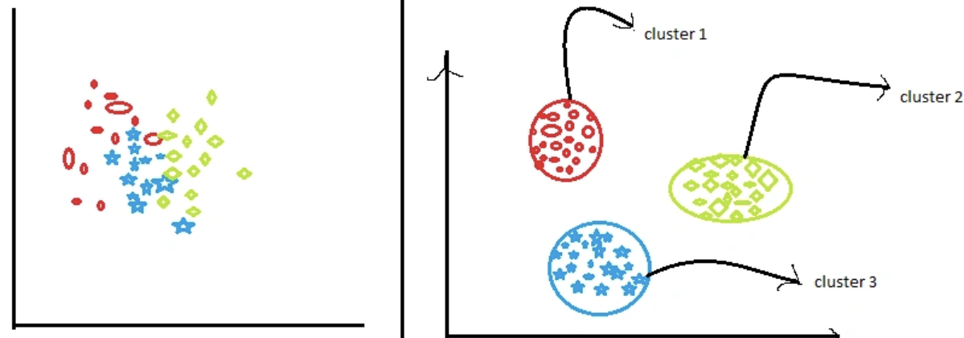
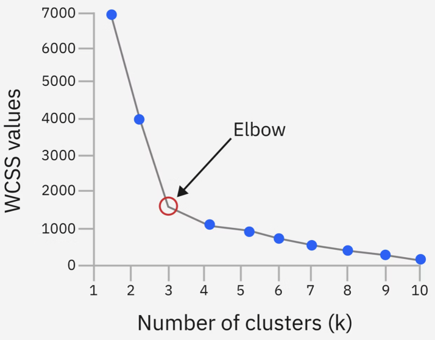
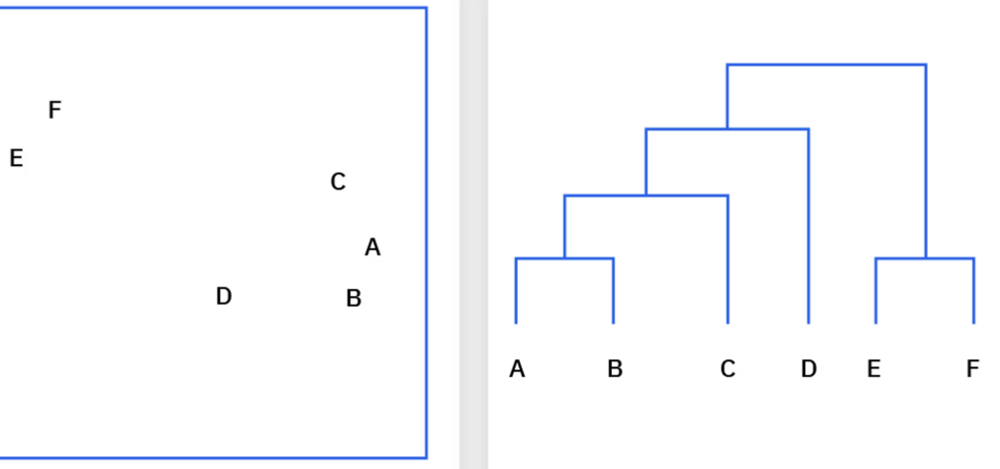
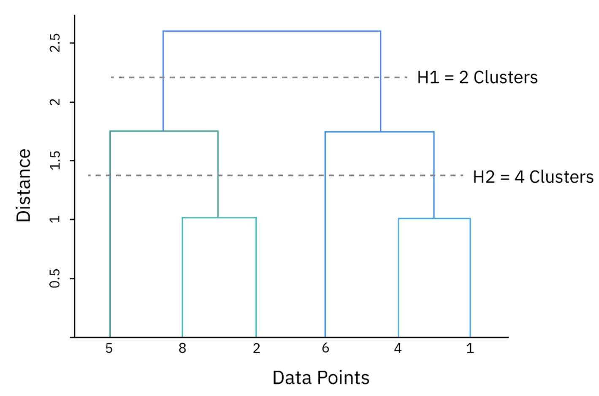
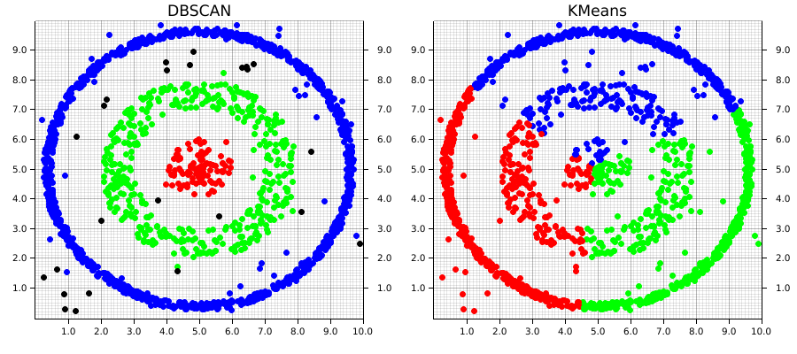
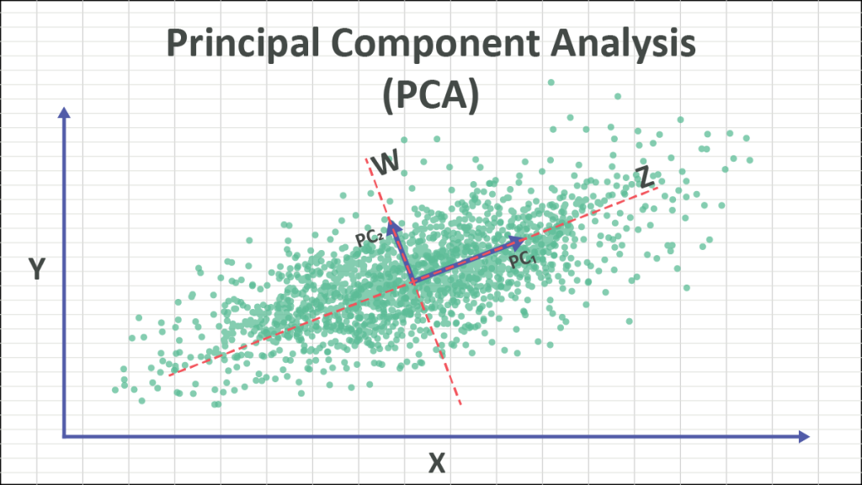
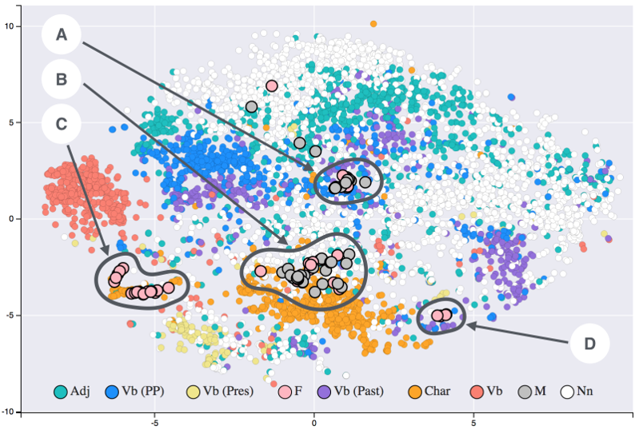

## 无监督学习

无监督学习处理的是没有标签 (unlabeled) 的数据。算法的目标不是去预测一个已知的输出，而是去理解数据本身的内在结构。

主要任务可以分为两大类：聚类 (Clustering) 和 降维 (Dimensionality Reduction)。

## 聚类

将数据集划分为若干个簇 (clusters)，使得同一个簇内的数据点尽可能相似，而不同簇之间的数据点尽可能不同。

可以将聚类理解为在数据中寻找自然分组，从而了解可能存在的类别以及这些类别的定义。聚类可以帮助发现数据点之间的潜在关系，从而了解不同类别之间共享哪些特征或特性。

根据所使用的聚类算法，可以从数据中移除异常值或将其标记为异常值。聚类还可以通过检测哪些数据点不属于任何聚类或与聚类关联较弱，从而帮助进行异常检测，这些数据点可能是数据生成过程中的异常情况。

聚类算法有时被区分为硬聚类和软聚类。
- **硬聚类**：每个数据点仅属于一个簇，其是否属于某个簇是一个二元值
- **软聚类**：每个数据点被赋予一个概率，该概率可能属于每个已识别的簇。

没有绝对最佳的聚类方法，应该根据自身需求和所处理的数据选择最合适的聚类方法。

## 聚类算法的主要类型

聚类算法种类繁多，其核心差异在于对“簇”（Cluster）的定义各不相同。根据输入数据的大小、维度、类别的刚性以及预期簇的数量，不同的建模方法各有优劣。值得注意的是，一种算法可能在某个数据集上表现出色，但在另一个数据集上却效果平平。

### 基于质心的聚类

基于质心的聚类通过将数据集划分为基于其**质心**（Centroid）距离的相似组来进行。根据数据的特性，每个簇的质心可以是该簇内所有点的均值（Mean）或中位数（Median）。

#### K-Means 算法

这是应用最广泛的质心聚类技术。K-Means 假设每个簇的中心定义了该簇，并通常使用**欧几里得距离**作为度量标准。
*   **初始化**：用户需预设期望的簇数量（即“K”值）。
*   **迭代**：算法通过不断最小化每个点与其所属簇质心之间的总距离，最终识别出最优的 K 个簇。
*   **特性**：属于“硬聚类”方法，即每个点被分配到唯一的簇，没有概率归属。
*   **局限性**：
    *   适用于簇大小相近、无显著离群点且密度均匀的数据。
    *   在高维数据或簇大小/密度差异巨大时表现较差。
    *   **对离群点极度敏感**：由于质心基于均值计算，容易受到异常值的影响而产生过拟合。

#### K-Medoids 算法

为了解决 K-Means 对离群点敏感的问题，K-Medoids 使用数据集中的实际对象（中心点）作为簇中心。
*   **原理**：选择簇内与其他所有对象距离总和最小的点作为“中心点”。
*   **优势**：由于中心点是现有的数据点而非虚拟的均值，因此该算法对噪声和离群点的鲁棒性更强。

---

### 层次聚类

层次聚类（有时称为基于连接的聚类）根据属性的邻近性和连接性对数据点进行分组。该方法假设距离较近的对象比距离较远的对象更相关。

*   **无需预设 K 值**：与 K-Means 不同，层次聚类不需要提前指定簇的数量。
*   **树状图 (Dendrogram)**：算法会生成一个层次化的图网络，可以通过树状图直观地展示发现的簇及其所属关系。

层次聚类主要有两种实现路径：

#### 聚合式 (Agglomerative - 自下而上)
*   **逻辑**：从每个独立的数据点开始，通过计算当前层次所有簇的邻近矩阵，逐层合并最相似的簇。
*   **合并标准 (Linkage)**：
    *   **单连接 (Single-linkage)**：使用两个簇之间最短的点对距离。
    *   **全连接 (All-pairs linkage)**：使用所有点对的平均距离。
    *   **质心连接 (Centroid-linkage)**：使用质心间的距离。
*   **挑战**：可能出现“链式效应”，即大簇会不断吸引邻近点而变得越来越大。此外，计算速度通常比分裂式慢。

#### 分裂式 (Divisive - 自上而下)
*   **逻辑**：从包含所有点的单一簇开始，递归地将其划分为树状结构。
*   **步骤**：首先使用平铺聚类方法（如 K-Means）拆分数据集，然后对误差平方和（SSE）最大的簇进行进一步拆分。
*   **优势**：结构更灵活，不需要构建完全平衡的树，且在不需要深入到单个点层级时，计算速度通常比聚合式更快。

---

### 基于分布的聚类

基于分布的聚类（也称概率聚类）根据数据点的概率分布对其进行分组。该方法假设数据是由各维度上的正态分布过程生成的。

#### 高斯混合模型 (GMM) 与 EM 算法
GMM 是此类方法的典型代表。它不使用欧几里得等距离度量，而是寻找各维度上定义明确的分布。

**期望最大化 (Expectation-Maximization, EM) 过程：**
1.  **期望步 (Expectation)**：将每个数据点分配给各个簇，并计算该点属于特定簇（如簇 A 或簇 B）的概率。
2.  **最大化步 (Maximization)**：根据数据点属于该簇的似然性，更新定义每个簇的参数（加权均值位置和协方差矩阵）。
3.  **迭代**：重复上述步骤直到收敛。

*   **软聚类特性**：每个点被赋予属于某个簇的概率。这意味着一个点可能以不同的概率同时关联多个簇。
*   **应用场景**：非常适合分类模糊的场景。例如：一首歌可能既有民谣特征也有摇滚特征；一个观众可能主要看西班牙语节目，但偶尔也看英语节目。
*   **局限性**：在大规模数据集上拟合多次分布可能会导致极高的计算成本。

---

### 基于密度的聚类

基于密度的聚类通过检测点集中的高度密集区域，并将其与空旷或稀疏区域分隔开来实现。

*   **任意形状**：不同于基于质心或分布的方法，它可以发现任何形状、大小或密度的簇。
*   **噪声处理**：能够清晰地区分属于簇的数据点和应被标记为“噪声”的孤立点。
*   **无需先验知识**：在不知道簇数量或数据包含大量噪声时非常有用。

#### DBSCAN 算法
这是最著名的基于密度的空间聚类算法。它将数据点分为三类：
1.  **核心点 (Core Points)**：在指定半径的邻域内包含至少预设数量（MinPoints）的点。
2.  **边界点 (Border Points)**：邻域内点数少于 MinPoints，但其邻域内包含核心点。
3.  **离群点 (Outlier)**：既不是核心点也不是边界点的点，即噪声类。

#### HDBSCAN 算法
这是 DBSCAN 的变体，**不需要手动设置参数**，使其比原始版本更灵活。
*   **优势**：对噪声不敏感，且能更有效地处理数据中密度不均匀的簇。

---

### 基于网格的聚类

虽然不如前四种常用，但在**高维聚类**中，基于网格的算法表现出极高的性能优势。

*   **空间划分**：算法将高维数据空间划分为有限数量的网格单元（Cell）。
*   **高效性**：所有落在同一单元内的点都被视为同一个簇。这种方法大大减少了搜索“最近邻”所需的时间。

#### STING 算法 (Statistical Information Grid)
*   **逻辑**：将空间区域划分为矩形单元，并构建多个不同分辨率的层级。高层单元被细分为多个低层单元。
*   **优势**：在处理海量大数据时非常高效。
*   **局限性**：簇边界只能是水平或垂直定义的，无法检测非矩形的边界。

#### CLIQUE 算法
*   **逻辑**：结合了基于网格和基于密度的思想。它在子空间中寻找密集单位，并衡量相似的簇是否应连接在一起。
*   **优势**：能够在极高维的数据中检测出任意形状的簇。

---

## 聚类算法

将数据集划分为若干个簇 (clusters)，使得同一个簇内的数据点尽可能相似，而不同簇之间的数据点尽可能不同。

### K-均值聚类 (K-Means Clustering)

“近朱者赤，近墨者黑”。

1. 初始化: 随机选择 K 个数据点作为初始的“簇中心 (centroids)”。

2. 分配: 将每个数据点分配给离它最近的那个簇中心，从而形成 K 个簇。

3. 更新: 重新计算每个簇中所有数据点的平均值，将这个平均值作为新的簇中心。

4. 迭代: 重复步骤 2 和 3，直到簇中心不再发生显著变化为止。

确定最佳聚类数量的一种方法是肘部法则。

肘部法则是一种图形方法，用于在k均值聚类算法中找到最佳聚类数量。它测量每个数据点与其聚类中心之间的欧氏距离，并根据“簇内平方和”（WCSS）变化趋于平缓的位置来选择聚类数量。该值代表每个聚类内的总方差，并以聚类数量为横坐标绘制。

肘部法则的第一步是计算每个聚类 (k) 的 WCSS 值。然后，将 WCSS 值绘制在 y 轴上，聚类数量绘制在 x 轴上。随着聚类数量的增加，这些点应该形成一个一致的模式。根据这种模式，可以确定一个最佳聚类数量的范围。在确定聚类数量时，要考虑计算成本。聚类数量越多，所需的处理能力就越强，尤其是在处理大型数据集时。

这种方法未必是最佳选择，尤其对于高维或形状不规则的数据集而言。另一种选择最佳聚类数的方法是轮廓系数分析。

---

### 层次聚类 (Hierarchical Clustering)

“自下而上聚合”或“自上而下分裂”。

层次聚类有两种类型。
- **聚合式** (Agglomerative): (最常用) 一开始，每个数据点都是一个独立的簇。然后，在每一步中，都将最相似（距离最近）的两个簇合并成一个新簇。这个过程不断重复，直到所有数据点最终合并成一个大簇。

- **分裂式** (Divisive): (不常用) 一开始，所有数据点都在一个大簇中。然后，在每一步中，将一个簇分裂成两个最不相似的子簇，直到每个数据点都成为一个独立的簇。

整个过程可以被可视化为一个树状图 (Dendrogram)，清晰地展示了数据点是如何一步步合并的。你可以通过在不同高度“切割”这棵树，来得到不同数量的簇。

层次聚类算法利用**相异度矩阵**（Dissimilarity Matrix）来决定哪些簇应当合并或分裂。相异度是指通过选定的**链接方法**（Linkage Method）测得的两个数据点之间的距离。相异度矩阵中的数值表达了：

*   集合中单点之间的**距离**（例如欧几里得距离）。
*   **链接聚类准则**：该准则将相异度定义为不同集合间点对距离的函数。

---

#### 链接方法

除了最常用的欧几里得距离外，还可以使用闵可夫斯基距离、汉明距离、马氏距离、豪斯多夫距离和曼哈顿距离。需要注意的是，即使是同一数据集，使用不同的链接方法也会生成完全不同的簇。选择何种方法取决于数据类型、数据密度、簇的形状以及是否存在离群点或噪声。

##### A. 最小链接
单链接方法通过分析两个簇中点对之间的最短距离，并将其作为簇间的距离。
*   **优点**：能很好地处理非椭圆形状的簇。
*   **缺点**：极易受噪声和离群点影响。
*   **局限性**：存在**链式效应（Chaining Effect）**——两个簇之间仅需几个点作为“桥梁”就可能导致它们合并为一个大簇。
*   **公式**：
    $$\min_{a \in A, b \in B} d(a, b)$$
    * 其中 A 和 B 是两个观测集合，d 是距离函数。*

##### B. 最大链接
根据两个簇中距离最远的点对来计算簇间距离。
*   **优点**：对噪声和离群点的敏感度低于最小链接法。
*   **缺点**：当存在球状或超大簇时可能会扭曲结果。
*   **特性**：相比最小链接，最大链接通常会产生更趋于球形的簇。
*   **公式**：
    $$\max_{a \in A, b \in B} d(a, b)$$

##### C. 平均链接
该方法将簇间距离定义为两个簇中所有点对距离的平均值。分为两种算法：不加权组平均法（UPGMA）和加权组平均法（WPGMA）。
*   **UPGMA（不加权）**：所有距离对平均值的贡献权重相等。
    $$\frac{1}{|A| \cdot |B|} \sum_{a \in A} \sum_{b \in B} d(a, b)$$
*   **WPGMA（加权）**：
    $$d(i \cup j, k) = \frac{d(i, k) + d(j, k)}{2}$$
    * 其中 i 和 j 是合并成新簇的两个最近簇，k 是另一个簇。*

##### D. 质心链接
计算两个簇的中心（质心）之间的距离。
*   **公式**：
    $$\|\mu_A - \mu_B\|^2$$
    * 其中 $\mu_A$ 和 $\mu_B$ 分别是簇 A 和 B 的质心。*

##### E. Ward 最小方差法
Ward 法的核心是最小化合并簇时产生的平方和增量。起初每个点自成一簇（平方和为 0），随着合并，平方和会增加。该方法致力于使合并后的簇内点到中心距离的平方和最小。
*   **适用性**：非常适合定量变量，且受噪声和离群点影响较小。
*   **公式**：
    $$\frac{|A| \cdot |B|}{|A \cup B|} \|\mu_A - \mu_B\|^2 = \sum_{x \in A \cup B} \|x - \mu_{A \cup B}\|^2 - \sum_{x \in A} \|x - \mu_A\|^2 - \sum_{x \in B} \|x - \mu_B\|^2$$

---

#### Lance-Williams 算法
可以通过 Lance-Williams 算法对 Ward 法进行优化。该算法使用递归公式更新簇间距离，从而高效地找到最适合合并的最近簇对。

---

#### 聚合式聚类步骤 (Agglomerative Clustering - AGNES)
这是一种**自下而上**的方法。每个数据点最初都是一个独立的簇，算法根据相异度矩阵不断合并最相似的簇。
1.  使用特定的距离度量计算**相异度矩阵**。
2.  将每个数据点分配为一个初始簇。
3.  基于链接准则**合并**最相似的两个簇。
4.  **更新**距离矩阵。
5.  重复步骤 3 和 4，直到合并为单一簇或满足停止条件。

---

#### 分裂式聚类步骤 (Divisive Clustering - DIANA)
这是一种**自上而下**的方法。所有点最初都在一个大簇中，然后递归地分裂。分裂式方法在识别大簇方面表现更佳，且因为从全局分布开始考虑，准确度往往高于聚合式。
1.  **开始**：将大小为 N 的数据集中的所有点置于一个簇中。
2.  **分裂**：使用平铺聚类方法（如 **K-Means**）将簇分裂为两个互不相似的子簇。
3.  **迭代**：重复步骤 2，选择最适合分裂的簇进行操作，并在每次迭代后从凝聚力最差的簇中移除离群点。
4.  **停止**：当每个样本都成为独立簇时停止，否则继续。

为了提高效率，分裂式方法通常结合 K-Means 来执行分裂，通过最小化质心点之间的簇内平方和（即惯性准则）来实现。

---

#### 层次聚类结果

层次聚类的结果通常通过**树状图**（Dendrogram，一种二叉树结构）来呈现。
*   **X 轴**：代表各个独立的数据点。
*   **Y 轴（或线条高度）**：表示簇在合并（聚合式）或分裂（分裂式）时的距离或相异度。线条越高，说明被合并的两个簇之间的差异越大。

树状图是决定最终模型中应包含多少个簇的核心工具。以下是两种主要的策略：

##### 寻找“自然切断点”
观察树状图，寻找分支变少且线条变长的区域。较长的垂直线条通常意味着这些簇之间存在显著的距离，是进行切分的理想位置。

##### 水平切割法
通过在树状图中画一条水平线，计算该线穿过的垂直线数量，即可得出在该相异度水平下的簇数量。

*   **示例分析**：
    *   假设水平线 **H1** 穿过了 2 条垂直线。这表明在此阶段存在两个簇：一个包含点 5、8 和 2，另一个包含其余所有点。
    *   **判断标准**：一条水平线在不触碰到其他水平分支的情况下，能够上下移动的距离越长，说明该簇数的选择对模型而言越稳健。
    *   对比 **H2**：如果 H2 穿过了 4 条垂直线，但它在上下移动时很快就会触碰到其他分支，那么选择两个簇（H1）通常比选择四个簇（H2）更合适。

#### 评估聚类模型的稳健性

一个强大的聚类模型应具备**高类内相似度**（Intraclass Similarity）和**低类间相似度**（Interclass Similarity）。由于聚类质量很难有绝对的定义，链接准则和簇数的选择会极大地影响结果。

在建模时，建议尝试不同的配置，并根据以下因素进行综合考量：
*   **实际逻辑**：基于数据集大小、簇形状和噪声水平，确定的簇数是否符合逻辑？
*   **统计特征**：检查每个簇的均值、最大值和最小值。
*   **度量标准**：所选的相异度指标（如欧几里得距离）或链接准则（如 Ward 法）是否最匹配当前数据？
*   **异常值影响**：离群点是否对簇的形成产生了过度干扰？
*   **领域知识**：结果是否符合特定业务领域或数据集的背景知识？

---

#### 确定最优簇数的其他方法

除了观察树状图，还可以参考以下定量方法：

1.  **肘部法 (Elbow Method)**：
    - 绘制“簇内平方和”随“簇数”变化的曲线。
    - 寻找曲线下降速度突然放缓的转折点（即“肘部”），该点对应的通常是最优簇数。
2.  **间隔统计量 (Gap Statistic)**：
    - 将实际数据的簇内平方和与随机分布（零参考分布）下的预期值进行比较。
    - 间隔值（Gap）最大处即为最优簇数，这代表实际聚类效果远好于随机分配。

---

### DBSCAN (Density-Based Spatial Clustering of Applications with Noise)

“物以类聚”的密度版本。

将簇定义为由高密度区域连接而成的区域。

一个点如果在其邻域内有足够多的其他点，它就被视为一个“核心点”。

一个簇就是由这些核心点和它们可达的“边界点”组成的。

那些既不是核心点也不是边界点的点，则被标记为“噪声点 (Noise)”。

## 降维算法 (Dimensionality Reduction Algorithms)

在尽可能保留原始数据信息的前提下，将高维数据（拥有很多特征）转换为低维数据。

### 主成分分析 (Principal Component Analysis, PCA)
“抓住主要矛盾”。

PCA 试图找到一个新的坐标系，使得数据在这个新坐标系下的方差 (variance) 最大化。

- 第一个新坐标轴（称为第一主成分）指向数据方差最大的方向；
- 第二个新坐标轴与第一个正交，并指向剩余方差最大的方向，以此类推。

通过只保留前几个最重要的主成分，就可以用更低的维度来表示原始数据。

### t-分布随机邻域嵌入 (t-SNE - t-Distributed Stochastic Neighbor Embedding)

“保持邻里关系”。

t-SNE 是一种非线性降维方法，其主要目标是在低维空间中（通常是 2D 或 3D），尽可能地保持原始高维空间中数据点之间的局部邻近关系。

它会尝试让在高维空间中相似的点，在低维空间中也靠得很近。

## Apriori算法

**Apriori 算法**是无监督学习中**关联规则学习（Association Rule Learning）**最经典的算法。它主要用于从大规模交易数据集中挖掘频繁出现的项集，并揭示事物之间的潜在关联。

最著名的应用案例就是**啤酒与尿布**：超市通过分析发现，买尿布的男性通常也会顺便买啤酒。

Apriori 的目标是寻找数据中的**频繁项集（Frequent Itemsets）**。
*   **项集**：一个或多个物品的组合（如 {面包, 牛奶}）。
*   **频繁**：项集在数据库中出现的频率超过了用户预设的阈值。

### Apriori 性质（剪枝机制）
如果直接遍历所有可能的物品组合，计算量会呈爆炸式增长。Apriori 引入了一个关键性质来大幅缩小搜索范围：

*   **向下闭合性**：如果一个项集是**频繁**的，那么它的所有子集也一定是频繁的。
*   **逆反命题（用于剪枝）**：如果一个项集是**非频繁**的，那么它的所有超集（包含它的更大组合）也一定是非频繁的。
    *   **例子**：如果 {啤酒} 买的人很少（不频繁），那么 {啤酒, 尿布} 肯定也不频繁，算法会直接跳过对包含“啤酒”的更大组合的计算。

### 衡量指标
要判断一条关联规则（如 $A \rightarrow B$：买了 A 就会买 B）是否有价值，通常使用以下三个指标：

#### 支持度 (Support)
衡量某项集在总交易中出现的频率。
*   **公式**：$Support(A) = \frac{\text{包含 A 的交易次数}}{\text{总交易次数}}$
*   **意义**：代表了规则的**普遍性**。如果支持度太低，说明这个组合很罕见，没有商业价值。

#### 置信度 (Confidence)
衡量在购买了 A 的情况下，购买 B 的概率有多大。
*   **公式**：$Confidence(A \rightarrow B) = \frac{Support(A \cap B)}{Support(A)}$
*   **意义**：代表了规则的**可靠性**。

#### 提升度 (Lift) —— **最重要的指标**
衡量 A 的出现对 B 出现概率的提升程度。
*   **公式**：$Lift(A \rightarrow B) = \frac{Confidence(A \rightarrow B)}{Support(B)}$
*   **判断标准**：
    *   **Lift > 1**：A 与 B 正相关，规则有价值（买了 A 确实更有可能买 B）。
    *   **Lift = 1**：A 与 B 相互独立，关联纯属巧合。
    *   **Lift < 1**：A 与 B 负相关（买了 A 反而不买 B）。

### 算法运行步骤
1.  **设定阈值**：预设最小支持度和最小置信度。
2.  **生成 1-项集**：计算所有单个物品的支持度，剔除不达标的物品。
3.  **迭代连接**：将达标的项集进行组合（如 1-项集组合成 2-项集），再次计算支持度并剔除。
4.  **循环**：重复此过程，直到无法生成更长且满足要求的项集。
5.  **提取规则**：在频繁项集中，根据最小置信度筛选出最终的关联规则。

## 高斯混合模型 (Gaussian Mixture Model, GMM)

高斯混合模型是无监督学习中一种极其重要的**概率式聚类**算法。

如果说 **K-Means** 是通过“距离”来硬性划分领地，那么 **GMM** 就是通过“概率”来描述数据的归属。它假设所有的数据点都是由有限个高斯分布（正态分布）混合生成的。

### 从硬划分到软归属

*   **K-Means 的局限**：它假设簇是圆形的（球状），且每个点只能属于一个簇（硬聚类）。如果数据是长条形的或者重叠严重，K-Means 效果很差。
*   **GMM 的进化**：它允许簇呈现出各种形状（椭圆、长条），并且认为每个点属于某个簇是有概率的（软聚类）。例如，一个点可能 70% 属于 A 簇，30% 属于 B 簇。

为了描述一个高斯混合模型，我们需要为每一个子成分（子高斯分布）确定三个参数：

1.  **均值 ($\mu$)**：决定了簇中心的位置。
2.  **协方差矩阵 ($\Sigma$)**：决定了簇的形状和方向（是圆的还是扁的，是横着的还是斜着的）。
3.  **混合系数 ($\pi$)**：决定了每个子分布在整体中所占的权重（大小）。

### EM 算法

由于我们不知道每个点的具体分类（隐变量），我们无法直接用简单的公式算出最优参数。因此，GMM 使用 **期望最大化算法** (Expectation-Maximization, EM) 进行迭代优化：

1. E 步 (Expectation) —— 预估
    *   根据当前的参数（初始可能是随机的），计算每个数据点由各个高斯分布生成的概率（即“责任权重”）。
    *   直白点说：就是猜每个点现在更像是哪个“铃铛”产生的。

2. M 步 (Maximization) —— 更新
    *   根据上一步算出的权重，重新计算每个高斯分布的均值、协方差和混合系数，使得当前的观测数据出现的概率最大化。
    *   直白点说：就是根据刚才的猜测，调整“铃铛”的大小、位置和形状，让它们更贴合数据。

**循环往复**：重复 E 步和 M 步，直到参数不再发生显著变化。

### GMM vs. K-Means

| 特性 | K-Means | GMM |
| :--- | :--- | :--- |
| **聚类类型** | 硬聚类（0 或 1） | 软聚类（概率分布） |
| **几何假设** | 圆形/球形分布 | 椭圆形分布（更灵活） |
| **数学基础** | 基于距离（欧几里得） | 基于概率（极大似然估计） |
| **参数要求** | 只需均值 | 均值、方差、混合权重 |
| **计算复杂度** | 较低，速度极快 | 较高，迭代时间长 |

---

无监督学习是数据科学中不可或缺的一部分。

聚类算法（如 K-Means, DBSCAN）帮助我们从海量数据中自动发现群体和模式，而降维算法（如 PCA, t-SNE）则帮助我们应对“维度灾难”，让我们能够更好地理解和可视化复杂的数据。