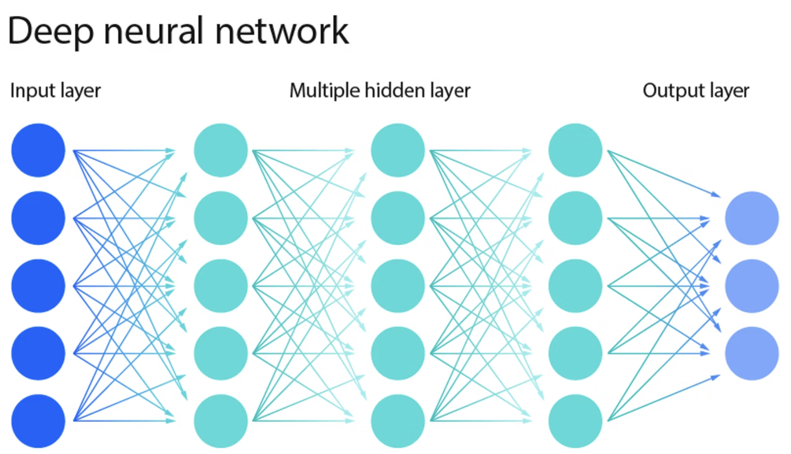
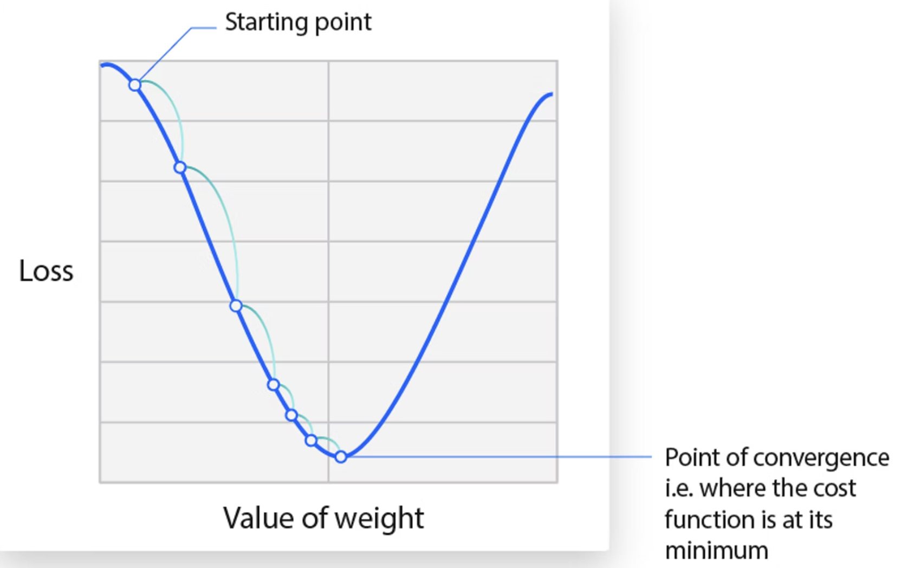
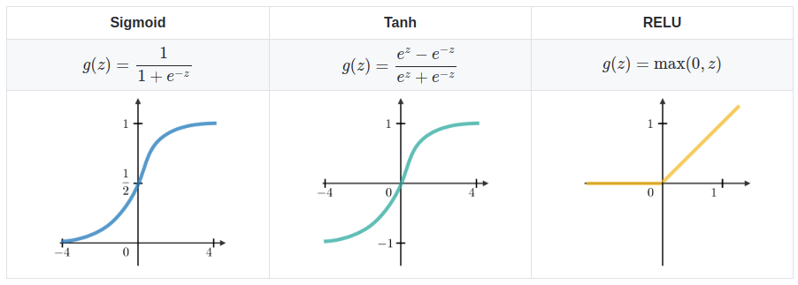
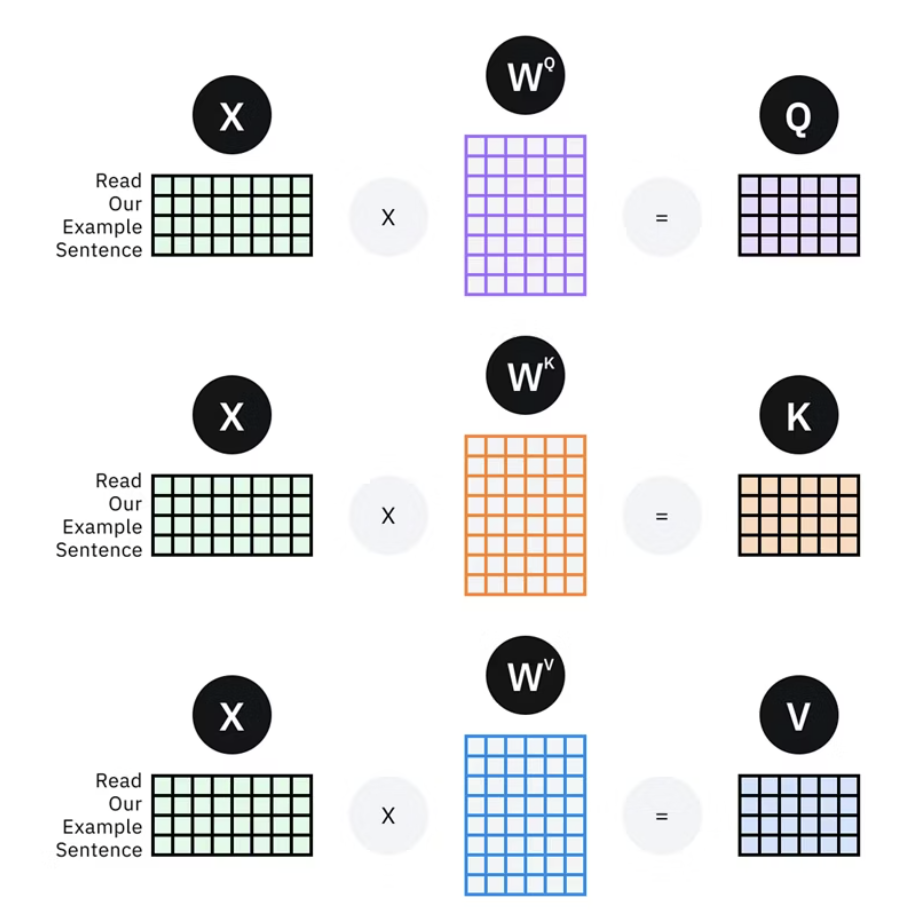
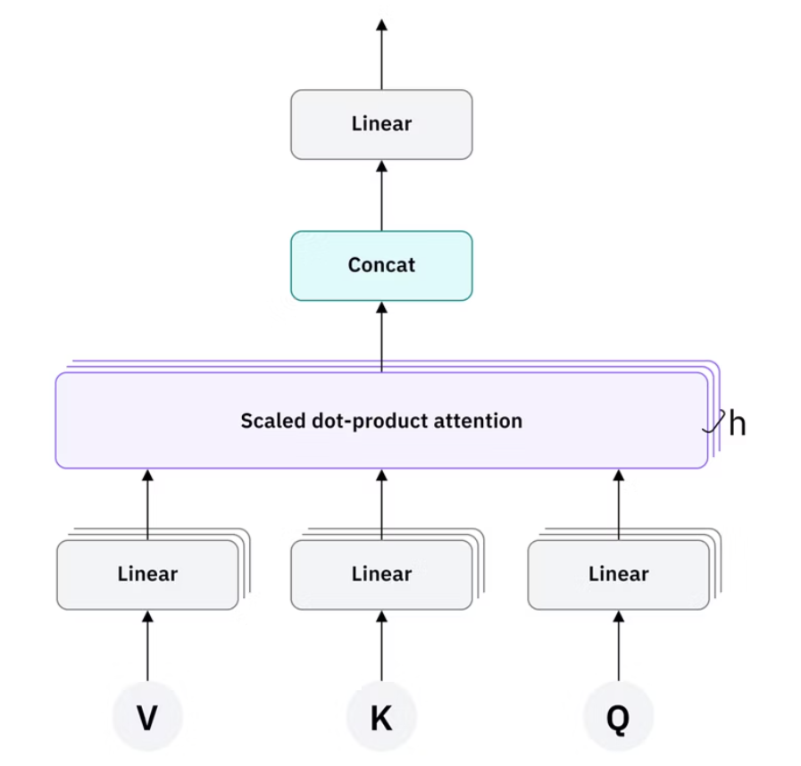
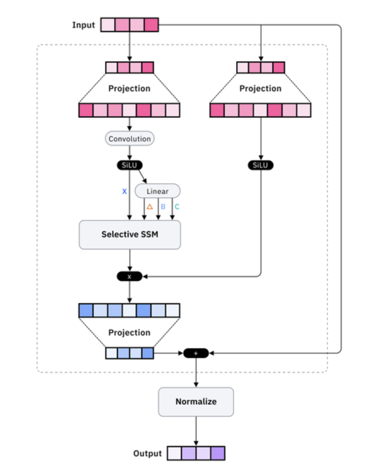
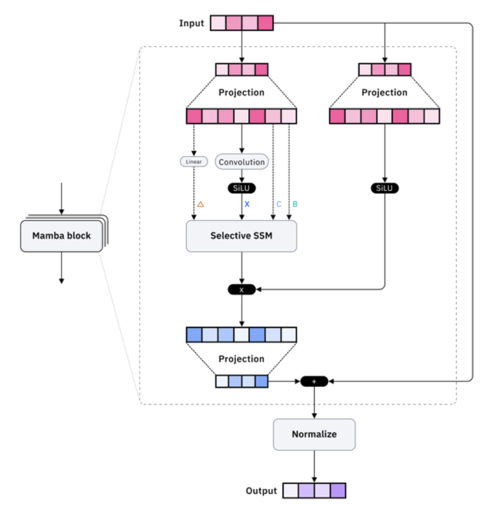
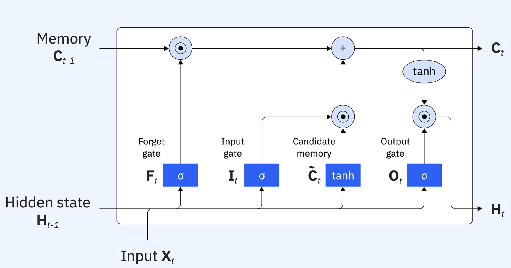
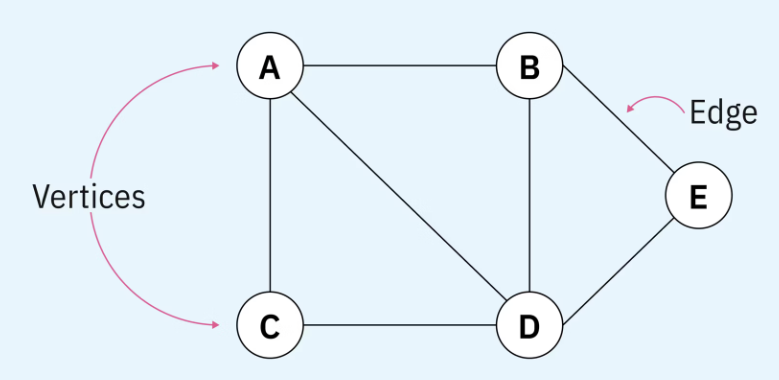
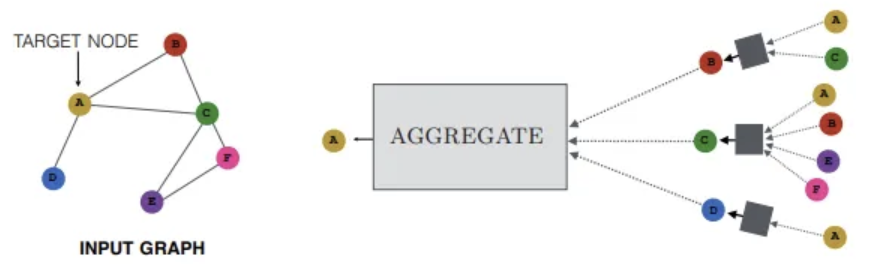

## 深度学习 (Deep Learning, DL)

**深度学习**是机器学习的一个特定分支，其核心是使用一种叫做**人工神经网络** (Artificial Neural Networks, ANNs)，特别是**深度神经网络** (Deep Neural Networks, DNNs)的模型，来从大规模数据中学习复杂的、高层次的模式。

**与传统机器学习的关系**:
*   **机器学习**是一个广阔的领域。
*   **神经网络**是实现机器学习的一种模型。
*   **深度学习**特指那些使用了**深层**（即包含许多层）神经网络的机器学习方法。

深度学习试图**模仿人脑处理信息的方式**。人脑的视觉皮层就是通过一系列层次化的神经元来识别物体的：底层的神经元可能只识别边缘和颜色，中层的神经元将这些组合成形状（如眼睛、鼻子），更高层的神经元再将这些形状组合成一张完整的人脸。

深度学习正是借鉴了这种**层次化的特征提取** (Hierarchical Feature Extraction) 思想。

## 神经网络

从宏观上看，人工神经网络（Neural Networks）的灵感源于人脑中通过电信号进行通信的生物神经元。早在 1943 年，Warren McCulloch 和 Walter Pitts 就提出了第一个神经元的数学模型，证明了简单的计算单元可以执行函数运算。随后，Frank Rosenblatt 于 1958 年引入了**感知器**（Perceptron），这是一种旨在执行模式识别的算法，也是现代神经网络的历史前身——本质上是一种输出受限的线性模型。

我们可以通过一个简单的垃圾邮件检测示例来理解神经网络的工作流程。

1.  **输入与特征**: 一封电子邮件被输入网络，其中的特征——如“奖金”、“金钱”、“亲爱的”或“中奖”等词语——作为输入信号。
2.  **分层处理**:
    *   网络中的**底层神经元**会评估每个输入信号的重要性。
    *   **更高层次的神经元**则将这些信息组合成更抽象的线索，以捕捉邮件的上下文和语气。
3.  **输出预测**: 最终的输出层会计算出这封邮件是垃圾邮件的**概率**。如果这个概率足够高，邮件就会被标记。

本质上，神经网络学习了如何将原始的、零散的特征，转化为有意义的模式，并利用这些模式来进行预测。

这个过程由两个基本概念驱动：**权重**（Weights） 和 **偏置**（Biases）。

*   **权重 (Weights)**: 像一个调节旋钮，控制着每个输入特征对最终决策的影响强度。例如，“奖金”这个词的权重可能会远高于“你好”。
*   **偏置 (Biases)**: 一个内置的阈值，它允许神经元在输入信号本身较弱时也能被激活。

通过在训练过程中不断调整这些模型参数，网络逐渐学会了如何做出准确的预测。

### 神经网络的数学结构

从数学上讲，神经网络通过学习一个函数 $f(X)$，将输入向量 $X = (x_1, x_2, ...)$ 映射到一个预测响应 $Y$。它与其他传统机器学习算法的**核心区别**在于其**分层结构**和执行**非线性转换**的能力。

一个神经网络由以下几个部分组成：

*   **输入层 (Input Layer)**:
    负责接收原始的输入特征 $(X_1, X_2, X_3, ...)$。

*   **隐藏层 (Hidden Layers)**:
    由多个人工神经元（或节点）组成，负责将输入转换为新的、更抽象的表示。在数学上，隐藏层执行的是一个**线性变换**：将前一层的输出（或原始输入）乘以其对应的权重，再加上偏置，然后传递给下一层。

*   **输出层 (Output Layer)**:
    在隐藏层完成线性变换后，一个**非线性激活函数**（如 `tanh`, `sigmoid`, `ReLU`）被应用于其输出，以产生最终的预测结果（例如，回归任务中的一个数值，或分类任务中的一个概率分布）。

### 神经网络的训练过程

与其他机器学习算法一样，神经网络也需要经过严格的训练才能表现出色。

#### 单神经元的计算

在一个神经元内部，计算分为两步：

1.  **线性变换**: 计算所有输入的加权和，并加上偏置。
    $$ z = \sum_{i=1}^{n} w_i x_i + b $$

2.  **非线性激活**: 将加权和 `z` 传递给一个激活函数 $\sigma$。
    $$ a = \sigma(z) $$

其中：
*   $x_i$ 是输入特征
*   $w_i$ 是权重
*   $b$ 是偏置
*   $\sigma$ 是激活函数
*   $a$ 是该神经元的输出

### 反向传播与梯度下降

神经网络的强大之处在于它能从数据中自动学习正确的权重和偏置。这个学习过程通过**反向传播（Backpropagation）**算法实现，分为四个核心步骤：

1.  **前向传播 (Forward Pass)**:
    输入数据流经整个网络，在每一层进行线性变换和非线性激活，最终在输出层产生一个预测值 $\hat{Y}$。

2.  **计算误差 (Error Calculation)**:
    使用**损失函数（Loss Function）**来衡量预测值 $\hat{Y}$ 与真实标签 $Y$ 之间的差距。

3.  **反向传播 (Backward Pass)**:
    这个误差会从输出层开始，**反向**传播回网络中的每一层。在每个神经元上，算法利用微积分中的**链式法则**，精确地计算出每个权重和偏置对总误差的“贡献度”（即梯度）。

4.  **权重更新 (Weight Update)**:
    使用一种名为**梯度下降（Gradient Descent）**的优化算法，将每个权重和偏置沿着能**减小误差最快**的方向进行微小的调整。

模型参数（权重）沿着损失函数的梯度方向逐步更新，最终到达损失最小化的收敛点。

这个“前向传播 -> 计算误差 -> 反向传播 -> 更新权重”的循环会在整个训练数据集上重复成千上万次。每一次迭代，网络的内部参数都会被微调，使其预测结果越来越接近正确答案。

## 深度学习架构

针对不同类型的数据和任务，研究人员设计了多种专门的神经网络架构。

### 卷积神经网络 (Convolutional Neural Networks, CNNs)

处理网格状数据，特别是图像。

通过 **卷积层** (Convolutional Layers) 和 **池化层** (Pooling Layers) 来有效地提取空间层次特征。

卷积层使用 **滤波器** (filters) 来检测图像中的局部模式（如边缘、纹理），而池化层则对特征图进行降采样，减少计算量并增强模型的鲁棒性。

现在想象一下，将一个 5x5 的滤波器与输入图像中一个 5x5 的像素网格相乘。在数学术语中，这被称为卷积：一种数学运算，其中一个函数修改（或卷积）另一个函数。

如果像素值与滤波器的值相似，则乘积（点积）会很大，这些像素所代表的特征将被捕获；否则，点积会很小，这些像素将被忽略。

将图像的一小部分像素值（左图）乘以卷积滤波器（中图），得到原始像素的低维表示（右图），该表示反映了原始像素与滤波器所表示的信息的相似程度。

#### 附加卷积层

初始卷积层之后可以再连接一个卷积层。

这样一来，卷积神经网络（CNN）的结构就会呈现层级结构，因为后续层可以感知到前一层感受野内的像素。

例如，假设我们要判断一幅图像中是否包含自行车。

我们可以把自行车想象成各个部件的组合，包括车架、车把、车轮、脚踏板等等。

自行车的每个部件在神经网络中构成一个低层模式，而这些部件的组合则代表一个高层模式，从而在CNN中形成特征层级结构。

最终，卷积层将图像转换为数值，使神经网络能够解释并提取相关的模式。

#### 池化层

池化层，也称为下采样，用于降低输入维度，减少输入中的参数数量。与卷积层类似，池化操作也使用滤波器扫描整个输入，但不同之处在于该滤波器没有权重。相反，池化核对感受野内的值应用聚合函数，从而填充输出数组。池化主要有两种类型：

- 最大池化： 当滤波器在输入图像上移动时，它会选择像素值最大的像素发送到输出数组。顺便一提，这种方法比平均池化更常用。
- 平均池化： 当滤波器在输入上移动时，它会计算感受野内的平均值，并将该平均值发送到输出数组。

虽然池化层会丢失大量信息，但它也给卷积神经网络带来了诸多好处。这些好处有助于降低复杂度、提高效率并限制过拟合的风险。 

#### 全连接层

全连接层的名称恰如其分地描述了它的特性。如前所述，在部分连接层中，输入图像的像素值并非直接连接到输出层。

然而，在全连接层中，输出层中的每个节点都直接连接到前一层中的一个节点。

该层根据前几层提取的特征及其不同的滤波器执行分类任务。卷积层和池化层通常使用 ReLU 函数，而全连接层通常使用 softmax 激活函数来对输入进行适当分类，产生 0 到 1 之间的概率值。

---

### 循环神经网络 (Recurrent Neural Networks, RNNs)

处理序列数据，即数据点之间存在时间或顺序关系。

网络的隐藏状态会像“记忆”一样，在处理序列中的下一个元素时，保留之前元素的信息。

变体: 由于标准 RNN 存在 **梯度消失/爆炸** 问题，难以处理长序列，其实际应用中更多的是其强大的变体，如 LSTM (Long Short-Term Memory) 和 GRU (Gated Recurrent Unit)。

循环神经网络（RNN），以 **展开** 和 **折叠** 两种形式展示。

这导致传统循环神经网络（RNN）存在一些根本性的缺陷，尤其是在训练方面。

回想一下，反向传播计算损失函数的梯度，该梯度决定了每个模型参数应该如何增加或减少。

当这些参数更新在过多的“相同”循环层中重复进行时，这些更新会呈指数级增长：增大参数会导致梯度爆炸，而减小参数会导致梯度消失。

这两个问题都会导致训练不稳定、训练速度变慢，甚至完全停止训练。

因此，标准RNN仅限于处理相对较短的序列。

#### 激活函数

**激活函数 (Activation Function)** 是应用于神经网络每一层神经元输出的数学函数。它的核心作用是**引入非线性**，从而使网络能够学习和模拟数据中复杂的非线性模式。

如果没有激活函数，RNN 将只能计算输入的线性变换，使其无法处理现实世界中普遍存在的非线性问题，尤其是在自然语言处理 (NLP)、时间序列分析和序列数据预测等任务中。

激活函数在 RNN 中的角色：

1.  **引入非线性**: 这是最基本的功能，允许网络学习复杂的模式。
2.  **控制输出范围**: 激活函数通常会将神经元的输出值限制在一个特定范围内（例如，0 到 1 或 -1 到 1），这有助于在网络的正向和反向传播过程中，防止梯度值变得过大（梯度爆炸）或过小（梯度消失）。
3.  **控制记忆更新**: 在 RNN 中，激活函数在每个时间步应用于**隐藏状态 (Hidden State)**。这使得网络能够根据当前输入和过去的隐藏状态，来控制其内部“记忆”的更新方式。

#### 常见的激活函数

*   **Sigmoid 函数**:
    *   **输出范围**: `(0, 1)`
    *   **用途**: 常用于解释输出为**概率**，或在 LSTM 等结构的“门 (gates)”中，用来决定**保留或遗忘**多少信息。
    *   **缺点**: 容易引发**梯度消失问题 (Vanishing Gradient Problem)**，因此不太适合用于深度网络。

*   **Tanh (双曲正切) 函数**:
    *   **输出范围**: `(-1, 1)`
    *   **用途**: 这是 RNN 中非常常用的激活函数。因为其输出以 0 为中心，这有助于实现更好的梯度流，使网络更容易学习到长期依赖关系。

*   **ReLU (修正线性单元) 函数**:
    *   **输出**: `max(0, x)`
    *   **用途**: 在 CNN 等前馈网络中非常流行。但在标准的 RNN 中，其无上界的特性可能会加剧**梯度爆炸问题 (Exploding Gradient Problem)**。
    *   **变体**: Leaky ReLU 和 Parametric ReLU 等变体通过在负值区引入一个小的斜率，部分缓解了这些问题。

#### RNN 的架构变体

与一次性处理所有输入的前馈网络不同，RNN 的输入和输出长度是可变的。这使得它能够适应各种不同的序列任务，并由此衍生出多种架构。

**1. 标准 RNN** (Standard RNNs)

*   **结构**: 最基础的 RNN 形式。每个时间步的输出，同时取决于**当前输入**和**前一个时间步的隐藏状态**。
*   **问题**: 存在严重的**梯度消失**问题，导致其难以捕捉和学习到序列中相距较远的**长期依赖关系**。
*   **适用场景**:
    *   处理具有**短期依赖**的简单任务，例如预测一个简短句子中的下一个词。
    *   实时处理传感器数据，以在短时间内检测异常。

**2. 双向循环神经网络** (Bidirectional RNNs, BRNNs)

*   **核心思想**: 单向 RNN 在做预测时，只能利用过去的信息。而 BRNN 则认为，要更好地理解当前位置的上下文，**未来的信息**同样重要。
*   **结构**: BRNN 由两个独立的 RNN 组成：一个**前向 RNN** 按正常顺序处理序列，一个**后向 RNN** 按相反顺序处理序列。在每个时间步，两个 RNN 的输出被合并起来，作为最终的输出。
*   **示例**: 在处理短语“feeling under the weather”时，如果模型在预测第二个词时，已经“看到”了序列末尾的“weather”，它就能以更高的置信度预测出第二个词是“under”。
*   **适用场景**: 机器翻译、命名实体识别等需要完整上下文信息的 NLP 任务。

**3. 长短期记忆网络** (Long Short-Term Memory, LSTM)

*   **核心思想**: 由 Sepp Hochreiter 和 Jürgen Schmidhuber 提出，专门用于解决标准 RNN 的**长期依赖**问题。
*   **结构**: LSTM 的核心创新在于引入了**单元状态 (Cell State)** 和三个精巧的“**门 (Gates)**”：
    *   **遗忘门 (Forget Gate)**: 决定从过去的单元状态中丢弃哪些信息。
    *   **输入门 (Input Gate)**: 决定将当前输入中的哪些新信息存入单元状态。
    *   **输出门 (Output Gate)**: 决定从更新后的单元状态中输出哪些信息。
*   **工作原理**: 这三个门就像是信息流动的“水龙头”，通过学习，LSTM 可以精确地控制在“记忆传送带”（单元状态）上，哪些信息应该被长期保留，哪些应该被遗忘，哪些应该被更新。
*   **示例**: 在句子“Alice 对坚果过敏。她不能吃*花生酱*。”中，LSTM 的单元状态可以长期保持“坚果过敏”这个关键上下文，从而在处理后面的句子时，准确地预测出不能吃的食物是“花生酱”。

**4. 门控循环单元** (Gated Recurrent Units, GRU)

*   **核心思想**: 对 LSTM 的一种简化和优化，同样旨在解决短期记忆问题。
*   **结构**: GRU 没有独立的单元状态，而是直接在隐藏状态上传递信息。它只有**两个门**：
    *   **重置门 (Reset Gate)**: 决定如何将新的输入与过去的记忆相结合。
    *   **更新门 (Update Gate)**: 决定保留多少过去的记忆，以及更新多少新的记忆。
*   **与 LSTM 的对比**: GRU 的结构更简单，参数更少，因此**计算效率更高**，训练速度更快。在许多任务中，它的性能与 LSTM 相当，使其成为实时或资源受限应用的一个有吸引力的选择。

**5. 编码器-解码器 RNN** (Encoder-Decoder RNN)

*   **核心思想**: 专门用于处理**序列到序列 (Sequence-to-Sequence, Seq2Seq)** 的任务，其中输入序列和输出序列的长度可能不同。
*   **结构**:
    *   **编码器 (Encoder)**: 一个 RNN，负责将整个输入序列（例如，一句德语）压缩成一个固定长度的上下文向量（**Context Vector**），这个向量可以被看作是整个输入序列的“思想总结”。
    *   **解码器 (Decoder)**: 另一个 RNN，它接收这个上下文向量作为初始状态，然后逐个生成输出序列的元素（例如，一句英语）。
*   **问题**: 固定长度的上下文向量成为了信息瓶颈，特别是当输入序列很长时。后来的**注意力机制 (Attention Mechanism)** 正是为了解决这个问题而提出的。
*   **适用场景**: 机器翻译、文本摘要、问答系统。

---

### Transformer 模型

Transformer 模型的核心创新，在于其**自注意力机制 (Self-Attention Mechanism)**。这一机制的灵感，在概念上可以类比于关系数据库的查询过程。

在数据库中，我们使用一个唯一的“键 (Key)”来存储和检索一个对应的“值 (Value)”。当我们需要信息时，我们发起一个“查询 (Query)”。系统会比较我们的“查询”和数据库中所有的“键”，找到最匹配的条目，然后返回其对应的“值”。

模型为序列中的每一个词元生成三个不同的向量：

1.  **查询向量 (Query Vector, Q)**:
    代表当前词元正在“寻找”什么信息。它像一个探照灯，用来扫描序列中的其他词元，以计算它们对当前词元含义的影响程度。

2.  **键向量 (Key Vector, K)**:
    代表当前词元“是什么”，即它自身包含的信息。

3.  **值向量 (Value Vector, V)**:
    代表当前词元实际应该传递出去的信息内容。

**注意力权重** (Attention Weights) 的计算，正是通过比较一个词元的 **Query** 和所有其他词元的 **Key** 的相似度来完成的。如果 Query 和某个 Key 非常匹配，那么这个 Key 对应的 Value 将在最终的计算中占据更大的权重。

对于大型语言模型（LLM）而言，其“数据库”就是它在海量训练数据中学到的词汇表。注意力机制正是利用这个“数据库”中的信息，来理解语言的上下文。

#### Transformer 的工作流程

**1. 词元化与输入嵌入** (Tokenization & Input Embeddings)

人类语言的基本单位是字符，而 AI 模型处理语言的基本单位是**词元** (Token)。一个词元可以是一个完整的单词、一个词根或一个标点符号。每个词元都被赋予一个唯一的 ID 数字，LLM 正是通过这些 ID 来导航其庞大的词汇“数据库”。这种词元化的处理方式，极大地降低了文本处理所需的计算资源。

在进入注意力层之前，模型需要为每个词元生成一个初始的、不包含上下文信息的**向量嵌入** (Vector Embedding)。这个嵌入可以是在训练过程中学习到的，也可以直接采用预训练好的词嵌入模型（如 Word2Vec）。

**2. 位置编码** (Positional Encoding)

词语的顺序和位置对其语义至关重要。循环神经网络 (RNNs) 的序列化处理方式天然地保留了位置信息。而 Transformer 模型由于其并行处理的特性，必须**显式地**为每个词元添加位置信息。

通过**位置编码**，模型会在输入进入注意力机制之前，为每个词元的嵌入向量加上一个代表其**相对位置**的向量。这样一来，距离越近的两个词元，其位置向量就越相似，从而在计算注意力时，模型会自然地更关注邻近的词元。

**3. 生成 Q, K, V 向量**

当位置信息被添加后，更新后的每个词元嵌入向量将被用来生成 **Query, Key, 和 Value** 这三个新的向量。

这个过程是通过将词元嵌入向量，并行地输入到三个不同的**前馈神经网络层**来完成的。每一层都拥有一组独特的权重矩阵，这些权重是在大规模文本语料库上通过自监督学习预训练得到的。

*   词元嵌入 $\times$ 权重矩阵 $W_Q \rightarrow$ **查询向量 (Q)**
*   词元嵌入 $\times$ 权重矩阵 $W_K \rightarrow$ **键向量 (K)**
*   词元嵌入 $\times$ 权重矩阵 $W_V \rightarrow$ **值向量 (V)**

> Transformer 注意力机制简化图：输入词元的嵌入向量分别乘以 Q, K, V 的权重矩阵，生成各自的向量。

**4. 计算自注意力** (Computing Self-Attention)

自注意力的核心功能，就是为序列中的每一个词元，计算出一个**新的、融合了全局上下文信息的表示**。

对于序列中的任意一个词元 $x$，其更新过程如下：
1.  **计算注意力分数**: 将词元 $x$ 的 **Query 向量**与序列中**所有**词元（包括它自己）的 **Key 向量**进行点积运算，得到相似度分数。这些分数经过缩放和 Softmax 函数处理，转化为一组**注意力权重**。
2.  **加权求和**: 将序列中**所有**词元的 **Value 向量**，分别乘以它们对应的注意力权重。
3.  **生成上下文向量**: 将所有经过加权后的 Value 向量**求和**，得到一个单一的向量。这个向量聚合了整个序列中与词元 $x$ 相关的所有信息。
4.  **更新表示**: 最后，将这个新生成的上下文向量与词元 $x$ **原始的**（经过位置编码后）嵌入向量相结合（通常是相加）。

经过这个过程，词元 $x$ 的向量表示就被成功地更新了，它不再是一个孤立的表示，而是**深度融合了整个序列的上下文信息**。

---

#### Transformer 的增强机制

**1. 多头注意力** (Multi-Head Attention)

一个词语在句子中可能扮演多种角色，与其他词语存在多种不同类型的关系。为了捕捉这种复杂性，Transformer 实现了**多头注意力**机制。

*   **工作原理**: 模型并不只计算一次注意力，而是将原始的 Q, K, V 向量拆分成 `h` 个更小的子集（称为“头”）。然后，它在 `h` 个并行的“注意力头 (Attention Heads)”中独立地计算注意力。
*   **效果**: 在训练过程中，每个注意力头会自发地学会关注一种不同类型的语义关系（例如，一个头可能关注语法依赖，另一个头可能关注同义词关系）。
*   **整合**: 在每个注意力块的最后，这 `h` 个头的输出结果会被**拼接（Concatenate）**在一起，然后通过一个最终的前馈层进行整合。

> 著名的多头注意力机制图示，展示了多个并行计算的注意力头。

**2. 残差连接与层归一化** (Residual Connections & Layer Normalization)

在深度网络中，信息在逐层传递时可能会丢失或发生梯度消失/爆炸。Transformer 巧妙地运用了两种技术来解决这个问题：

*   **残差连接 (Residual Connections)**: 在每个注意力块或前馈层的输出被计算出来后，它会**再加上**该块的**原始输入**。这相当于创建了一条“信息高速公路”，确保原始的、未经处理的语义信息不会在深层网络中丢失。
*   **层归一化 (Layer Normalization)**: 在每个残差连接之后，都会进行一次层归一化。这个操作会将向量的均值调整为 0，方差调整为 1，从而稳定训练过程，加速模型收敛。

---

#### Transformer 模型的应用与演进

Transformer 架构最初是为机器翻译而设计的，但它很快就催生了**大型语言模型（LLMs）**，并引爆了生成式 AI 的革命。

*   **自回归解码器模型 (Autoregressive Decoder-only LLMs)**:
    *   **代表**: GPT 系列, Claude, Llama, Granite 等。
    *   **设计**: 专注于**文本生成**。它们通过自监督学习，在一个巨大的文本语料库上训练，任务就是不断地**预测下一个词**。
    *   **应用**: 文本生成、摘要、问答等。

*   **掩码语言模型 (Masked Language Models, MLMs)**:
    *   **代表**: BERT 及其衍生模型。
    *   **设计**: 在训练时，输入文本中的一些词元会被随机地“**遮盖** (masked)”，模型的任务是**预测被遮盖的词元是什么**。
    *   **优势**: 这种“完形填空”式的训练，使得 MLM 模型对于需要深度双向上下文理解的任务表现极其出色。
    *   **应用**: 文本分类、情感分析、命名实体识别、学习高质量的词嵌入。

---

### Mamba 模型

Mamba模型是一种相对较新的神经网络架构，于2023年首次提出，它是基于 **状态空间模型** (SSM) 的一种独特变体。

与Transformer模型类似，Mamba模型提供了一种创新的方法，可以有选择地优先处理特定时刻最相关的信息。

Mamba模型最近已成为Transformer架构的有力竞争对手，尤其是在 **逻辑层级模型** (LLM) 领域。

#### 状态空间模型 (State Space Models, SSMs)

**状态空间模型** (SSMs) 最初被设计用来基于给定的输入序列，预测一个**连续动态系统**的下一个状态。想象一下预测电路中的电信号、气象模式的演变，或是移动物体的飞行轨迹。从概念和数学上看，SSMs 与 2017 年 Transformer 出现之前主导自然语言处理（NLP）领域的**循环神经网络** (RNNs)，以及卷积神经网络 (CNNs) 和隐马尔可夫模型 (HMMs) 都有着紧密的联系。

顾名思义，SSMs 通过对**状态空间**进行建模来进行预测。状态空间是一个数学表示，它包含了描述一个系统状态所需的所有变量，以及这些变量之间相互关联的所有可能性。

一个 SSM 接收一个输入序列 $x(t)$，将其映射到一个潜在的**状态表示** $h(t)$——类似于 RNN 的隐藏状态——最终目的是预测一个输出序列 $y(t)$。任何 SSM 的核心都可以由两个方程来描述：

1.  **状态方程**: 描述了状态如何随时间演变。
    $$ h'(t) = A \cdot h(t) + B \cdot x(t) $$

2.  **输出方程**: 描述了当前状态如何影响最终输出。
    $$ y(t) = C \cdot h(t) + D \cdot x(t) $$

模型的关键参数是矩阵 **A, B, C, D**。在传统应用（如控制理论）中，这些矩阵通常是固定的，代表一个已知系统的动态特性。而在现代深度学习中，这些矩阵本身成为了**可以通过机器学习来优化的参数**，由神经网络的可学习权重来表示。

*   **状态方程**：矩阵 **A** 决定了系统在没有外部输入时如何自我演变，而矩阵 **B** 则决定了当前输入 $x(t)$（例如，文本序列中的下一个词元）如何影响系统状态。在语言模型中，当前状态 $h(t)$ 就代表了文本序列的**上下文**，其作用等同于 Transformer 模型中的 **KV 缓存**。
*   **输出方程**：矩阵 **C** 决定了当前状态如何转化为输出，而矩阵 **D** 则允许输入直接影响输出（通常被简化忽略）。在 Mamba 这样的 LLM 中，输出方程用于生成序列的下一个词元。

#### 从连续到离散：让 SSM 理解文本

传统的 SSM 用于处理连续信号，但文本是**离散**的序列。为了让 SSM 能够处理离散序列，我们需要引入一个**离散化 (Discretization)** 的过程。

*   **核心思想**: 引入一个新的参数——**步长 $\Delta$**——来模拟在每个离散时间步 `t` 对一个连续信号进行采样。
*   **效果**: 离散化后的 SSM 在数学上等价于一个 RNN，使其能够处理序列到序列的任务。其方程通常被重写为 RNN 风格的下标形式：
    $$ h_t = \bar{A} h_{t-1} + \bar{B} x_t $$
    $$ y_t = \bar{C} h_t $$

#### 结构化 SSM (S4)

标准的离散 SSM 与 RNN 一样，存在两个致命缺陷：**训练效率低下**和**无法处理长序列**。2021 年，Albert Gu 等人提出的**结构化状态空间序列模型** (S4) 通过两大创新解决了这些问题。

1. 通过卷积实现高效训练

*   **洞察**: 离散 SSM 的一个关键特性是它只涉及**线性**运算（乘法和加法）。这种线性的、重复的递归过程，可以在数学上被“展开”成一个**一维卷积核**。
*   **双重优势**: 这使得 S4 模型可以“见风使舵”：
    *   **训练时**: 当整个输入序列都已知时，它作为一个**卷积神经网络** (CNN) 运行，可以利用**快速傅里叶变换** (FFT) 进行极其高效的并行计算。
    *   **推理时**: 当需要逐个生成输出时，它作为一个**循环神经网络** (RNN) 运行，推理速度极快。

2. 通过结构化矩阵捕捉长期依赖

*   **问题**: 标准 SSM 和 RNN 一样，难以捕捉序列中相距遥远的元素之间的关系（**长期依赖问题**）。
*   **HiPPO 理论**: 为了解决这个问题，S4 模型不再随机初始化矩阵 **A** 和 **B**，而是使用一种源自**正交多项式**的 **HiPPO** 理论来构造它们的初始值。
*   **惊人效果**: 论文指出，仅仅将矩阵 A 从随机矩阵改为 HiPPO 矩阵，就在序列 MNIST 基准测试上将性能从 60% 提升到了 98%，有效地解决了 SSM 的“长期记忆”问题。后续的变体（如 Mamba）虽然使用了不同的初始化方案，但都保留了 HiPPO 的核心思想：**通过对角线结构来确保状态更新的稳定性和独立性**。

#### Mamba 模型：赋予 SSM “选择性”与“硬件感知”

Mamba 架构的核心是两大创新，它直接借鉴并挑战了 Transformer 的核心优势。

1. 选择性状态空间模型

*   **动机**: Transformer 的强大之处在于其**注意力机制**，它能根据当前上下文，**选择性地**关注或忽略输入历史的某些部分。而传统的 SSM 必须处理整个输入历史，这在复杂的语言建模中是一个巨大的障碍。
*   **S6 的创新**: Mamba 的作者们提出了一种“**选择性扫描**”机制。他们重新设计了 SSM，使其关键参数（步长 $\Delta$, 矩阵 B 和 C）不再是固定的，而是**由当前输入词元 $x_t$ 动态生成**。
    *   **工作原理**: 当前词元的嵌入向量会通过三个并行的线性层，分别生成 $\Delta_t$, $B_t$, 和 $C_t$ 的值。这与 Transformer 中 Q, K, V 的生成方式如出一辙。
*   **选择性从何而来**:
    *   **$\Delta_t$ (步长)**: 决定了当前输入对“记忆”（隐藏状态）的影响程度。$\Delta_t$ 越大，旧信息的“遗忘”速度就越快；$\Delta_t$ 越小，当前输入的影响就越小，甚至可以完全忽略。
    *   **$B_t$ 和 $C_t$**: 动态地决定了当前输入**如何更新**隐藏状态，以及更新后的状态**如何影响**最终输出。
*   **A 矩阵的角色**: 值得注意的是，矩阵 A 保持不变，其作用仍然是高效地“记忆”整个输入历史。而**选择**使用哪些历史信息的任务，则交给了动态生成的 B 和 C 矩阵。

2. 硬件感知的并行扫描

*   **挑战**: “选择性”机制使得模型不再是“线性时不变 (LTI)”的，因此无法再使用 S4 的卷积快捷方式进行并行训练。
*   **巧妙的解决方案**: Mamba 利用了 SSM 计算的**结合律**特性。它将长序列的计算分解成许多可以独立并行处理的小块，然后通过一种**并行前缀和扫描** (Parallel Prefix Sum Scan) 的算法进行高效合并。
*   **FlashAttention 的启发**: 更进一步，这个算法在设计上充分考虑了 GPU 的内存层次结构（SRAM vs. HBM），其优化原理与 Tri Dao（也是 Mamba 的作者之一）之前开发的 **FlashAttention** 技术一脉相承，最大限度地提升了计算效率。

3. Mamba 块 (The Mamba Block)

与 Transformer 中的“注意力块”类似，Mamba 架构的基本单元是“**Mamba 块**”。它将核心的 **S6 模块**与**门控机制 (Gating Mechanism)** 和**卷积层**结合在一起，形成一个强大的信息处理单元。

> Mamba 块的结构图

#### Mamba vs Transformer

*   **速度与内存**: 在所有与速度和内存相关的指标上，Mamba 都全面优于 Transformer。
    *   **训练**: Transformer 的内存需求随序列长度**二次方增长**，而 Mamba 仅为**线性增长**。
    *   **推理**: Transformer 的内存需求随序列长度**线性增长**，而 Mamba 仅为**常数增长**。这意味着 Mamba 理论上拥有**无限的上下文长度**。
*   **性能**:
    *   **Transformer 的优势**: 研究表明，在需要**上下文学习 (In-context Learning)**（如 few-shot prompting）和长距离推理的任务上，Transformer 仍然表现更优。
    *   **Mamba 的优势**: Mamba 提供了比同等规模 Transformer 高 5 倍的吞吐量。
*   **Mamba-2 与混合模型**:
    *   后续的 **Mamba-2** 论文进一步探索了 SSM 与 Transformer 之间的理论联系，并提出了一个更简单、更高效的 Mamba 架构。
    *   **混合模型 (Hybrid Models)**: 最有前途的方向似乎是将两者的优点结合起来。例如，IBM 的 **Granite 4.0** 架构就借鉴了 Bamba（一种混合模型）的设计。通过在模型中交错使用 Mamba 块和注意力块，可以同时获得 Mamba 的效率和 Transformer 的精确性。

> Mamba-2模型

## LSTM

**长短期记忆网络 (Long Short-Term Memory, LSTM)** 是一种特殊的循环神经网络（RNN），它被专门设计用来学习和处理序列数据中的**长期依赖关系**。由 Hochreiter & Schmidhuber 于 1997 年提出，LSTM 如今已在时间序列预测和各类序列数据处理问题中得到了广泛的应用。

理论上，标准的 RNN 能够处理长期依赖问题，但实践中，由于**梯度消失/爆炸**等问题，它们很难学习到相距遥远的上下文信息。LSTM 的核心创新就在于，它通过一种精巧的设计，使得**记住长期信息成为其默认行为，而非需要努力学习才能达成的目标**。

LSTM 与标准的前馈神经网络有显著不同。它的核心在于引入了一种特殊的结构，称为**记忆单元** (Memory Cell)。

与标准 RNN 中简单的循环节点不同，LSTM 的每个记忆单元都包含一个**内部状态** (Cell State)，以及三个起着关键作用的**门** (Gates)。这些门就像是信息流动的“水龙头”，通过**乘法运算**来动态地控制信息的流入、流出和保留。

### 记忆单元的组成

> LSTM 单元的内部结构图，展示了三个门和一个单元状态。

在每个时间步 `t`，LSTM 接收当前输入 $x_t$ 和前一时间步的隐藏状态 $h_{t-1}$，然后通过以下三个门来更新其内部状态并产生输出：

1.  **遗忘门 (Forget Gate)**:
    *   **作用**: 决定从**过去的单元状态** $C_{t-1}$ 中**丢弃**哪些信息。
    *   **计算**: 它通过一个 Sigmoid 函数，输出一个介于 0 和 1 之间的值。1 表示“完全保留”，0 表示“完全遗忘”。
        $$ f_t = \sigma(W_f \cdot [h_{t-1}, x_t] + b_f) $$

2.  **输入门 (Input Gate)**:
    *   **作用**: 决定将**当前输入**中的哪些新信息**存入**单元状态。
    *   **计算**: 它同样通过 Sigmoid 函数决定哪些值需要更新。同时，一个 `tanh` 函数会创建一个**候选值向量** $\tilde{C}_t$，包含了可以被添加的新信息。
        $$ i_t = \sigma(W_i \cdot [h_{t-1}, x_t] + b_i) $$
        $$ \tilde{C}_t = \tanh(W_C \cdot [h_{t-1}, x_t] + b_C) $$

3.  **单元状态更新 (Cell State Update)**:
    *   **作用**: 结合遗忘门和输入门的输出来更新单元状态。旧的单元状态 $C_{t-1}$ 与遗忘门 $f_t$ 相乘（丢弃部分信息），新的候选值 $\tilde{C}_t$ 与输入门 $i_t$ 相乘（筛选新信息），然后两者相加。
        $$ C_t = f_t * C_{t-1} + i_t * \tilde{C}_t $$

4.  **输出门 (Output Gate)**:
    *   **作用**: 决定从更新后的**单元状态** $C_t$ 中输出哪些信息，作为当前时间步的**隐藏状态** $h_t$ 和最终输出。
    *   **计算**: 一个 Sigmoid 函数决定单元状态的哪些部分可以输出，然后将 `tanh` 处理后的单元状态与之相乘。
        $$ o_t = \sigma(W_o \cdot [h_{t-1}, x_t] + b_o) $$
        $$ h_t = o_t * \tanh(C_t) $$

**核心机制**: LSTM 内部的自连接循环边（单元状态的传递）权重固定为 1，这确保了梯度在反向传播时可以顺畅地流经多个时间步，而不会轻易消失或爆炸。

### LSTM学习

假设我们正在训练一个 LSTM 网络来预测某城市的未来气温。该网络已经学习了一个月的数据，现在接收到一个新的摄氏度读数：30°C。

*   **$C_{t-1}$ (旧单元状态)**: 携带了长期上下文，例如“当前季节的总体变暖趋势”，我们假设其值为 `10`。
*   **$h_{t-1}$ (旧隐藏状态)**: 携带了短期模式，例如“昼夜温差”。
*   **$x_t$ (当前输入)**: 新的温度读数 `30`。

**LSTM 的处理流程如下：**

1.  **遗忘门决策**:
    网络计算遗忘门的值 $f_t$。假设计算结果为 `0.8`。这意味着 LSTM 决定**保留 80% 的长期记忆，并遗忘 20%**。旧趋势的贡献变为 `0.8 * 10 = 8`。

2.  **输入门决策**:
    网络计算输入门的值 $i_t$ 和候选值 $\tilde{C}_t$。假设 $i_t$ 结果为 `0.3`，候选值 $\tilde{C}_t$ 为 `5`。这意味着 LSTM 决定从新信息中**采纳 `0.3 * 5 = 1.5` 单位**的信息量。

3.  **更新单元状态**:
    新的单元状态 $C_t$ 结合了“被遗忘后的旧记忆”和“被筛选后的新信息”。
    $$ C_t = (\text{旧记忆} \times f_t) + (\text{新信息} \times i_t) = 8 + 1.5 = 9.5 $$
    LSTM 现在“记住”了一个略微增强的变暖趋势。

4.  **输出门决策**:
    网络计算输出门的值 $o_t$。假设结果为 `0.6`。它决定了当前记忆的多少将被暴露出去。
    $$ h_t = o_t * \tanh(C_t) = 0.6 \times \tanh(9.5) \approx 0.6 $$
    这个值 `0.6` 将作为新的隐藏状态，传递给下一个时间步或最终的预测层。

**结论**:
通过这个精巧的门控机制，LSTM 能够在处理每一个新数据点时，动态地决定：**应该忘记多少过去的信息，应该学习多少新的信息，以及应该暴露多少当前的记忆**。这使得它能够在学习每日、每周的短期周期的同时，不丢失对季节性变化的长期记忆，从而完美地解决了标准 RNN 的长期依赖问题。

## 图神经网络 

**图神经网络** (Graph Neural Networks, GNNs) 是深度学习领域中一个极其重要且发展迅速的分支。传统深度学习模型（如 CNN, RNN）在处理序列数据（文本、语音）和网格状数据（图像）方面取得了巨大成功，但它们难以处理**图结构** (Graph-structured) 数据。

GNN 的诞生，正是为了将深度学习强大的特征提取和模式识别能力，扩展到这种更普遍、更复杂的图结构数据上。

### 为什么需要图神经网络

在现实世界中，许多重要的数据本质上都是以**图**的形式存在的。一个图由**节点 (Nodes)** 和连接节点的**边 (Edges)** 组成。

*   **例子**:
    *   **社交网络**: 用户是节点，朋友关系是边。
    *   **分子结构**: 原子是节点，化学键是边。
    *   **知识图谱**: 概念（如“爱因斯坦”、“相对论”）是节点，它们之间的关系（如“提出了”）是边。
    *   **推荐系统**: 用户和商品是节点，用户对商品的购买或评分行为是边。
    *   **交通网络**: 交叉路口是节点，道路是边。

**传统模型的局限性**:
*   **非欧几里得结构**: 图数据不像图像（像素网格）或文本（线性序列）那样具有规则的结构。每个节点的邻居数量不同，节点之间没有固定的顺序。
*   **复杂的依赖关系**: 节点的信息不仅仅取决于它自身的特征，还严重依赖于其邻居节点和整个网络的拓扑结构。

**GNN 的核心目标**: 学习一种能够同时处理**节点特征**和**图拓扑结构**的函数，为图中的每个节点、边或整个图生成一个有意义的、可用于下游任务的**向量表示 (Embedding)**。

### 消息传递 (Message Passing)

绝大多数 GNN 模型的核心机制都可以被一个统一的框架来描述，这个框架被称为**消息传递** (Message Passing) 或**邻居聚合** (Neighborhood Aggregation)。

**直观比喻**: 想象在一个社交网络中，你想了解一个人（目标节点）。
*   **最直接的方法**: 看他自己的个人资料（节点自身的特征）。
*   **更好的方法**: 不仅看他自己的资料，还要去问问他所有的朋友（邻居节点）对他的看法，然后把这些朋友的“信息”**聚合**起来，形成一个对他更全面的认识。
*   **更深入的方法**: 不仅问他的直接朋友，还去问他朋友的朋友……这个过程可以重复多轮。

**GNN 的工作流程 (单层)**:
对于图中的每一个节点，GNN 的一层计算通常包含以下三个步骤：

1.  **消息收集 (Message Gathering)**:
    *   每个节点都会从它的所有**直接邻居**那里“收集”信息。这些信息通常是邻居节点的特征向量。

2.  **消息聚合 (Message Aggregation)**:
    *   节点将从所有邻居那里收集到的信息，通过一个**聚合函数**（如求和 `SUM`、求平均 `MEAN`、或取最大值 `MAX`）合并成一个单一的向量。这个向量代表了来自“邻里”的综合信息。

3.  **更新 (Update)**:
    *   节点将上一步聚合得到的“邻里信息”与**自身在前一层的特征向量**相结合（例如，通过拼接或相加）。
    *   然后，将这个组合后的向量通过一个**非线性激活函数**（如 ReLU）和一个**可学习的神经网络层**（如全连接层）进行变换，生成该节点在**当前层**的**新特征向量**。

> 一个中心节点，周围有几个邻居节点。箭头从邻居节点指向中心节点，表示消息传递；中心节点内部有一个聚合和更新的过程，最终生成一个新的表示。

**“深度”的意义**:
这个“收集-聚合-更新”的过程就构成了一个 G-N-N 层。通过将多个 G-N-N 层**堆叠**起来，一个节点就可以聚合到来自其 **2 跳、3 跳甚至更远邻居**的信息。
*   经过 **k** 层 GNN 的计算，每个节点的最终表示，都隐式地包含了其 **k-阶邻域** (k-hop neighborhood) 的信息。

### 主流 GNN 架构

基于“消息传递”这个统一框架，研究人员提出了多种具体的 GNN 变体。

1.  **图卷积网络 (Graph Convolutional Networks, GCN)**
    *   **核心思想**: 将图像处理中的“卷积”概念推广到图数据上。它在聚合邻居信息时，采用了**归一化的平均 (normalized mean)** 操作，即同时考虑了邻居节点和自身节点的信息。
    *   **特点**: 模型简单、高效，是 GNN 领域的“Hello World”，应用非常广泛。

2.  **GraphSAGE (Graph SAmple and aggreGatE)**
    *   **核心思想**: GCN 需要在整个图上进行计算，不适合处理超大规模的图。GraphSAGE 提出了一种**采样**策略：在为每个节点聚合信息时，不再使用其所有邻居，而是**随机采样**一小部分邻居。
    *   **关键创新**: 这种采样机制使其能够进行**归纳学习 (Inductive Learning)**。这意味着，一个在图 A 上训练好的 GraphSAGE 模型，可以直接应用于一个全新的、在训练时从未见过的图 B，为其节点生成表示。这是 GCN 难以做到的。

3.  **图注意力网络 (Graph Attention Networks, GAT)**
    *   **核心思想**: 在聚合邻居信息时，不同的邻居应该有不同的重要性。GAT 引入了 **自注意力机制 (Self-Attention Mechanism)**。
    *   **工作原理**: 对于每个节点，GAT 会自动学习一个**注意力权重**，来表示其每个邻居对它的重要程度。在聚合时，GAT 会对邻居的特征进行**加权平均**，重要的邻居权重更大。
    *   **优点**: 模型的可解释性更强，性能通常也更好，因为它能更智能地聚合邻里信息。

### GNN应用场景

GNN 已经在一系列图相关的任务中取得了最先进的成果。

*   **节点级别任务 (Node-Level Tasks)**:
    *   **节点分类**: 预测节点的类别。例如，在社交网络中，根据用户的连接和属性，判断其是真实用户还是机器人；在论文引用网络中，判断一篇论文属于哪个学科领域。

*   **边级别任务 (Edge-Level Tasks)**:
    *   **链接预测 (Link Prediction)**: 预测两个节点之间未来是否可能存在一条边。例如，在社交网络中向你推荐“可能认识的人”；在蛋白质相互作用网络中，预测两种蛋白质之间是否存在相互作用。

*   **图级别任务 (Graph-Level Tasks)**:
    *   **图分类**: 预测整个图的某个属性。例如，根据一个分子的图结构，判断其是否具有毒性或某种药效。
    *   **图生成**: 生成具有特定属性的新图结构，例如在新药发现中，设计全新的分子结构。

---

深度学习通过构建模仿人脑信息处理方式的深度神经网络，实现了从原始数据中自动学习复杂特征的能力。以 CNN、RNN 和 Transformer 为代表的多种强大架构，使其在计算机视觉、自然语言处理等领域取得了突破性的进展，并成为当前 AI 革命的核心驱动力。