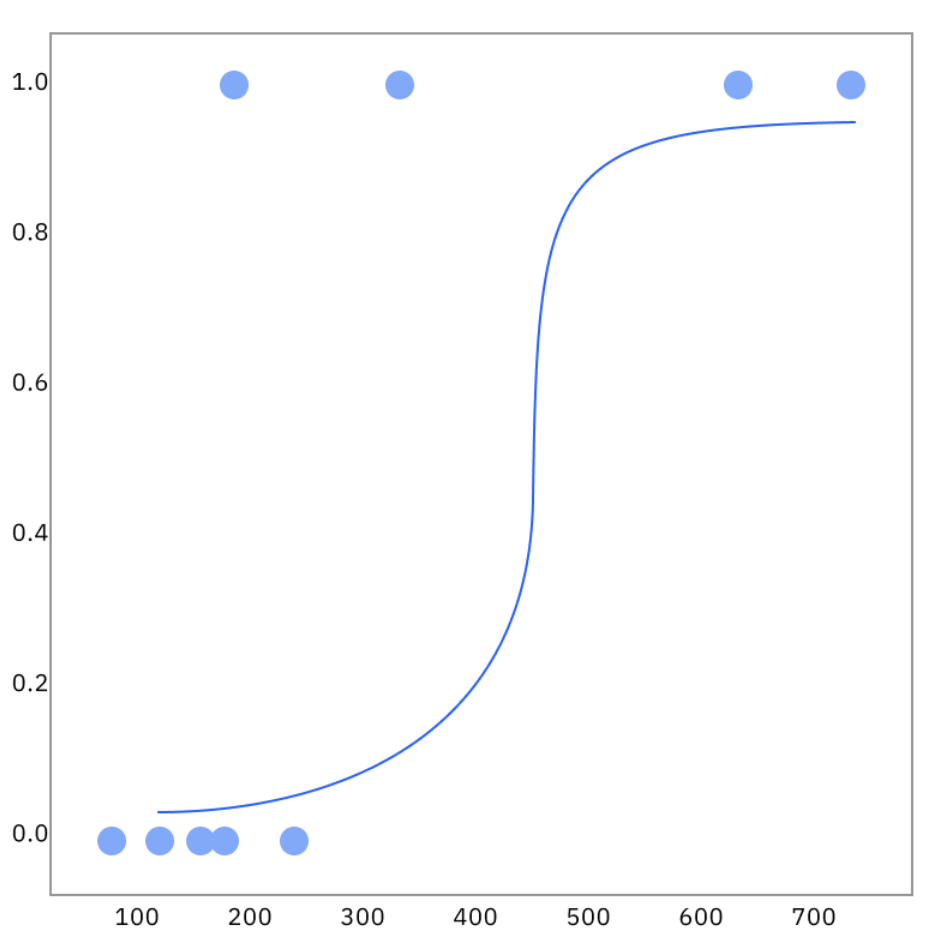

## 监督学习算法

监督学习的核心目标是学习一个从输入特征 (X) 到输出标签 (y) 的映射函数 **f(X) = y**。

根据输出标签 (y) 的类型，我们可以将这些算法分为两大类：**分类** (Classification) 和 **回归** (Regression)。

在训练过程中，模型的算法会处理大型数据集，以探索输入和输出之间潜在的相关性。然后，使用测试数据评估模型性能，以确定其训练是否成功。交叉验证是指使用数据集的不同部分来测试模型的过程。

梯度下降算法家族，包括随机梯度下降（SGD），是训练神经网络和其他机器学习模型时最常用的优化算法或学习算法。模型的优化算法通过损失函数来评估准确性：损失函数是一个衡量模型预测值与实际值之间差异的方程。

损失函数衡量预测值与实际值之间的偏差程度。其梯度指示模型参数应朝哪个方向调整以减少误差。在整个训练过程中，优化算法会更新模型的参数（即其运行规则或“设置”），以优化模型。

由于大型数据集通常包含大量特征，可以通过 **降维** 来简化这种复杂性。将特征数量减少到对预测数据标签最关键的特征，从而在保持准确性的同时提高效率。

## 算法

梯度下降等优化算法可以训练各种机器学习算法，这些算法在监督学习任务中表现出色：

- **朴素贝叶斯**： 朴素贝叶斯是一种分类算法，它采用了贝叶斯定理中的类条件独立性原则。这意味着一个特征的存在与否并不影响另一个特征在结果概率中的作用，每个预测因子对结果的影响是相同的。
  - 朴素贝叶斯分类器包括多项式朴素贝叶斯、伯努利朴素贝叶斯和高斯朴素贝叶斯。
  - 这种技术常用于文本分类、垃圾邮件识别和推荐系统。

- **线性回归**： 线性回归用于识别连续型因变量与一个或多个自变量之间的关系。它通常用于预测未来结果。
  - 线性回归用一条直线来表示变量之间的关系。
  - 当只有一个自变量和一个因变量时，称为简单线性回归。
  - 随着自变量数量的增加，这种方法被称为多元线性回归。

- **非线性回归**：有时，线性输入无法重现输出。
  - 在这种情况下，必须使用非线性函数对输出进行建模。
  - 非线性回归通过非线性或曲线来表示变量之间的关系。
  - 非线性模型可以处理具有多个参数的复杂关系。

- **逻辑回归**： 逻辑回归处理分类因变量——即具有二元输出（例如真或假、正或负）的因变量。虽然线性回归和逻辑回归模型都旨在理解数据输入之间的关系，但逻辑回归主要用于解决二元分类问题，例如垃圾邮件识别。

- **多项式回归**：与其他回归模型类似，多项式回归是回归模型的一种特殊情况，其中输入特征被提升到幂次，从而使线性模型能够拟合非线性模式。

- **支持向量机（SVM）**： 支持向量机可用于数据分类和回归。不过，它通常用于处理分类问题。SVM 通过决策边界或超平面来划分数据点的类别。SVM 算法的目标是绘制一个超平面，使各组数据点之间的距离最大化。

- **K近邻算法**：K近邻（KNN）是一种非参数算法，它基于数据点之间的接近程度以及与其他可用数据的关联性对数据点进行分类。该算法假设相似的数据点在数学绘图中彼此靠近。
 - 它易于使用且计算时间短，因此在推荐引擎和图像识别方面效率很高。但随着测试数据集的增长，处理时间也会延长，使其在分类任务中的吸引力降低。

- **随机森林**：随机森林是一种灵活的监督式机器学习算法，可用于分类和回归。“森林”指的是一组不相关的决策树，这些决策树被合并以降低方差并提高准确率。

## 分类类型

将输入数据划分到不同的类别中。

人工智能 (AI)模型使用分类算法，根据指定的分类器处理输入数据集，该分类器设定了数据排序的标准。分类算法广泛应用于数据科学领域，用于预测模式和结果。

### 二元分类

在二元分类问题中，模型预测数据属于两个类别之一。训练过程中应用的学习技术使模型能够评估训练数据中的特征，并预测每个数据点对应的两个可能标签中的哪一个：正例或负例、真或假、是或否。

例如，垃圾邮件过滤器会将电子邮件分类为垃圾邮件或非垃圾邮件。除了垃圾邮件检测之外，二元分类模型还能可靠地预测行为：潜在客户是会流失还是会购买特定产品？它们在自然语言处理(NLP)、情感分析、图像分类和欺诈检测等领域也很有用。

### 多类分类

多分类问题用于对具有两个以上类别标签的数据进行分类，且所有类别标签互斥。从这个意义上讲，多分类挑战与二元分类任务类似，只是类别更多。

多分类模型在现实世界中有着广泛的应用。除了判断邮件是否为垃圾邮件之外，多分类解决方案还可以判断邮件是促销邮件还是高优先级邮件。图像分类器可以使用大量的类别标签（例如狗、猫、羊驼、鸭嘴兽等等）对宠物图像进行分类。

多分类学习方法的目标是训练模型将输入数据准确地分配到更广泛的类别中。多分类训练中常用的目标函数是分类交叉熵损失，它评估模型对测试数据的预测结果与每个数据点的正确标签之间的差距。

### 多标签分类
多标签分类适用于每个数据点可以被赋予多个非互斥标签的情况。与基于互斥性的分类不同，多标签分类允许数据点同时具有多个类别的特征——这更能反映大数据集中真实存在的模糊性。

多标签分类任务通常是通过结合多个二元或多类分类模型的预测结果来完成的。

### 分类不平衡

分类不平衡，即某些类别的数据点远多于其他类别，需要采用专门的方法。随着某些类别的数据点增多，一些分类模型会逐渐偏向这些类别，并越来越倾向于预测这些类别的结果。

应对措施包括配置算法以更重视错误预测的成本，或者采用抽样方法，要么消除多数样本，要么从代表性不足的群体中过度抽样。

## 分类算法

预测一个离散的类别标签 (例如：“是/否”、“猫/狗/鸟”、“垃圾邮件/正常邮件”)。

常见分类算法：
- 逻辑回归
- 决策树
- 随机森林
- 支持向量机（SVM）
- K近邻算法
- 朴素贝叶斯

### 逻辑回归

虽然名字里有“回归”，但它是一个不折不扣的分类算法。

它通过一个 Sigmoid 函数，将线性回归模型的连续输出值“挤压”到一个 (0, 1) 的区间内，从而得到一个表示“属于某个类别”的概率。如果概率大于 0.5，就预测为类别 1；否则预测为类别 0。

由于线性函数假设存在线性关系，因此当 X 的值变化时，Y 的值可以从负无穷到无穷大不等。我们知道，概率值被限制在 [0,1] 范围内。基于线性模型的这一原理，我们无法直接对二元结果的概率进行建模。相反，我们需要一个逻辑回归模型来理解这些概率。因此，我们需要对输入进行转换，使结果被限制在 [0,1] 范围内。这种转换被称为逻辑回归方程。

它通过对标准线性回归公式应用 logit（或对数几率）转换来实现这一点：

$$Y = P(x) = \frac{e^{\beta_0 + \beta_1 x_1}}{1 + e^{\beta_0 + \beta_1 x_1}}$$

#### 逻辑回归类型

根据类别响应变量的不同，逻辑回归模型主要分为三类：

- **二元逻辑回归** (Binary logistic regression)：在这种方法中，响应变量或因变量本质上是二分的——也就是说，它只有两种可能的结果（例如 0 或 1）。这是逻辑回归中最常用的方法，也是二元分类中最常见的分类器之一。
- **多元逻辑回归** (Multinomial logistic regression)：在这种模型中，因变量有三个或更多可能的结果，但这些值 **没有特定的顺序** 。
- **有序逻辑回归** (Ordinal logistic regression)：当响应变量有三个或更多可能的结果，且这些值 **具有定义的顺序** 时，可以使用此类模型。有序响应的例子包括从 A 到 F 的评分等级，或者从 1 到 5 的李克特量表评分。

要理解逻辑回归函数（或 sigmoid 函数），我们需要了解以下内容：

- 几率、对数几率和几率比
- 逻辑回归系数
- 极大似然估计 (MLE)  

#### 几率

几率的对数称为logit函数，它是逻辑回归的基础。

由于概率的取值范围在 0 到 1 之间，我们无法直接用线性函数来模拟概率，因此我们转而使用几率。虽然概率和几率都表示结果发生的可能性，但它们的定义有所不同：

> 概率衡量的是某个事件在所有可能结果中发生的可能性。  
> 几率是指事件发生的概率与该事件不发生的概率之间的比较。

#### 对数几率

设 p(x) 表示某一结果发生的概率。那么，x的几率定义为：

$$odds(x) = \frac{p(x)}{1 - p(x)}$$

让我们来看一个具体例子：

假设一个篮子里有 3 个苹果和 5 个橘子。

- 选中橘子的**概率**是 $5 / (3 + 5) = 0.625$
- 选中橘子的**几率**是 $5 / 3 \approx 1.667$

这意味着选中橘子的可能性大约是选中苹果的 $1.667$ 倍。反之，选中苹果的几率是 $3 / 5 = 0.6$。该值小于 1，表明该结果（选中苹果）发生的可能性小于其不发生的可能性。根据几率方程，我们也可以将几率理解为：结果发生的概率与结果不发生概率的比值。因此，选中橘子的几率 = $P(\text{oranges}) / (1 - P(\text{oranges})) = 0.625 / (1 - 0.625) \approx 1.667$。

几率的范围可以从 $0$ 到无穷大。几率值大于 1 表示该结果是倾向于发生的，小于 1 表示不倾向于发生，等于 1 则意味着该事件发生与不发生的可能性相等。

然而，几率在 1 附近是不对称的。例如，几率 2 和 0.5 分别代表“两倍可能”和“一半可能”，但它们在数值尺度上差异很大。为了解决这种不平衡，我们对几率取对数，将几率从 $[0, \infty)$ 的尺度转换到实数轴 $(-\infty, \infty)$ 上。这被称为 **对数几率** （Log-odds）或 **Logit**，它是逻辑回归模型的基础。

我们将对数几率定义为：

$$\log\left(\frac{p(x)}{1 - p(x)}\right)$$

这种转换允许我们将对数几率表示为输入的线性函数：

$$\log\left(\frac{p(x)}{1 - p(x)}\right) = \beta_0 + \beta_1 \cdot x_1$$

然后我们可以对等式两边取指数，回到几率的形式：

$$\frac{p(x)}{1 - p(x)} = e^{\beta_0 + \beta_1 \cdot x_1}$$

解出 $p(x)$，我们得到了 **Sigmoid 函数**，它确保了预测值始终保持在 0 和 1 之间：

$$p(x) = \frac{e^{\beta_0 + \beta_1 \cdot x_1}}{1 + e^{\beta_0 + \beta_1 \cdot x_1}}$$

通过这种变换，尽管我们底层使用的是线性函数建模，逻辑回归仍能输出有效的概率值。

#### 几率比

最后，让我们介绍 **几率比**，这是一个有助于解释模型系数影响的概念。几率比告诉我们，当输入变量 $x_1$ 增加一个单位时，几率（Odds）会如何变化。

假设事件的几率为：

$$odds(x_1) = e^{\beta_0 + \beta_1 \cdot x_1}$$

如果我们将 $x_1$ 增加一个单位，新的几率变为：

$$odds(x_1 + 1) = e^{\beta_0 + \beta_1(x_1 + 1)} = e^{\beta_0 + \beta_1 x_1} \cdot e^{\beta_1}$$

这意味着 $x_1$ 每增加一个单位，几率就会乘以 $e^{\beta_1}$。这个乘数就是**几率比**。

- 如果 $\beta_1 > 0$（即 $e^{\beta_1} > 1$），则几率增加（事件发生的可能性变大）。
- 如果 $\beta_1 < 0$（即 $e^{\beta_1} < 1$），则几率减少（事件发生的可能性变小）。
- 如果 $\beta_1 = 0$（即 $e^{\beta_1} = 1$），几率比为 1，意味着输入对几率没有影响。

几率比赋予了逻辑回归极强的可解释性——它告诉您事件的几率如何随输入而变化，这在医疗保健、营销和金融等许多应用场景中都非常有用。

然而，我们不能像解释线性回归系数那样直接解释逻辑回归系数。

#### 逻辑回归系数

##### 连续型预测变量 (Continuous predictors)

回顾一下：在 **线性回归** 中，系数的解释非常直观。以带有连续变量的线性回归为例：输入特征 $x$ 每增加一个单位，预测结果 $y$ 就会增加 $\beta_1$ 个单位。这种直接的关系之所以成立，是因为线性回归假设输入特征与目标变量之间存在恒定的变化率。其输出是无界的，且呈线性增长。

然而，**逻辑回归**并不直接对 $y$ 进行建模，它通过**对数几率** (log-odds) 来对 $y$ 的概率进行建模。正因如此，我们不能说 $x$ 增加一个单位会导致 $y$ 发生恒定的单位变化。相反，我们通过系数对对数几率的影响来解释它，并由此延伸到对几率（Odds）和结果发生概率的影响。

具体来说，在逻辑回归中：

- **正系数**意味着随着输入的增加，结果的对数几率也会增加。这对应于**概率的增加**。
- **负系数**意味着随着输入的增加，对数几率会减少。这对应于**概率的减少**。
- **系数为零**意味着该变量对结果没有影响。

重要的是，**系数的大小**反映了这种影响的强度，而**几率比**（即系数的指数 $e^{\beta_1}$）则告诉我们变量每增加一个单位时，几率（Odds）具体发生了多少变化。

###### 类别型预测变量 (Categorical predictors)

与其他机器学习算法一样，我们可以将类别变量引入逻辑回归中进行预测。在处理类别或离散变量时，我们通常使用特征工程技术（如**独热编码 One-hot encoding** 或 **虚拟变量 Dummy variables**）将它们转换为模型可以使用的二进制格式。

例如，假设我们要根据一个人是否仍有现有债务来预测其贷款申请是否获得批准（$y=1$ 表示批准，$y=0$ 表示未批准）：

- 令 $x=0$ 表示没有现有债务。
- 令 $x=1$ 表示有现有债务。

我们的 $y = \text{批准}$ 的对数几率模型为：
$$\log\left(\frac{p}{1-p}\right) = \beta_0 + \beta_1 \cdot x_1$$

此时，系数 $\beta_1$ 代表了：与没有现有债务的人相比，有现有债务的人在贷款获批对数几率上的**变化量**。

为了使其更具可解释性，我们可以对 $\beta_1$ 取指数来获得**几率比**：

- 如果 $\beta_1$ 为**正**，则 $e^{\beta_1} > 1$，意味着有现有债务会**增加**获批的几率。
- 如果 $\beta_1$ 为**负**，则 $e^{\beta_1} < 1$，意味着有现有债务会**降低**获批的几率。
- 如果 $\beta_1$ 为 **0**，则 $e^{\beta_1} = 1$，意味着债务状态没有影响。

因此，虽然我们失去了线性回归中那种系数的直观解释，但逻辑回归仍然提供了丰富且可解释的洞察——尤其是当我们从几率和概率转变的角度来构建它们时。需要注意的是，概率随 $x$ 增加而增加或减少的幅度并不是 $x$ 的线性函数，而是取决于 $x$ 在特定点上的取值（即概率的变化率随 $x$ 的位置而变化）。

#### 极大似然估计 (Maximum Likelihood Estimate)

逻辑回归中的系数 $\beta_0$ 和 $\beta_1$ 是通过使用**极大似然估计** (MLE) 来估算的。MLE 的核心思想是找到一组参数，使得在逻辑回归模型下，观测到当前实际数据的概率（可能性）最大。

在逻辑回归中，我们使用逻辑函数（Sigmoid 函数）来模拟给定输入 $x_1$ 时，目标变量 $y_1$ 等于 1（例如“获批”）的概率：

$$P(x) = \frac{e^{\beta_0 + \beta_1 x_1}}{1 + e^{\beta_0 + \beta_1 x_1}}$$

MLE 会尝试 $\beta_0$ 和 $\beta_1$ 的不同组合，并针对每种组合询问：在这种参数设置下，观测到数据中实际结果的可能性有多大？

这种可能性通过**似然函数**来表示，它是每个数据点预测概率的累乘：

$$L(\beta_0, \beta_1) = \prod_{i=1}^n p(x_i)^{y_i} \cdot (1 - p(x_i))^{1 - y_i}$$

- 如果 $y_i = 1$（“获批”）：我们希望模型的预测概率 $p(x_i)$ 尽可能接近 1。项 $p(x_i)^{y_i}$ 正是起到了这个作用。如果实际观测数据 $y_i$ 确实是 1，该项的值就是 $p(x_i)$。
- 如果 $y_i = 0$（“未获批”）：我们希望预测概率尽可能接近 0。项 $(1 - p(x_i))^{1 - y_i}$ 处理这种情况。如果实际观测数据 $y_i$ 是 0，那么该项的值就是 $1 - p(x_i)$；当 $p(x_i)$ 接近 0 时，$1 - p(x_i)$ 就会接近 1。

因此，对于每个数据点，我们要么乘以 $p(x_i)$，要么乘以 $1 - p(x_i)$，具体取决于实际标签是 1 还是 0。所有样本的乘积会得到一个数值：即在当前模型下观测到整个数据集的**似然值**。显而易见，如果预测结果（使用参数 $\beta_0$ 和 $\beta_1$）与实际观测数据越吻合，似然值就越大。将所有概率相乘的原因是，我们假设每个样本的结果是**相互独立**的。换句话说，一个人的获批机会不应影响另一个人的获批机会。

由于这种乘积的结果可能变得极小，我们通常使用 **对数似然** (Log-likelihood)，它将乘积转换为求和，从而更易于计算和优化。

为了找到使对数似然最大化的 $\beta_0$ 和 $\beta_1$ 的值，我们使用 **梯度下降** (Gradient Descent)——一种迭代优化算法。在每一步中，我们计算对数似然相对于每个参数的变化（即梯度），然后朝着增加似然值的方向微调参数。随着时间的推移，这个过程会收敛到最拟合数据的 $\beta_0$ 和 $\beta_1$ 值。

