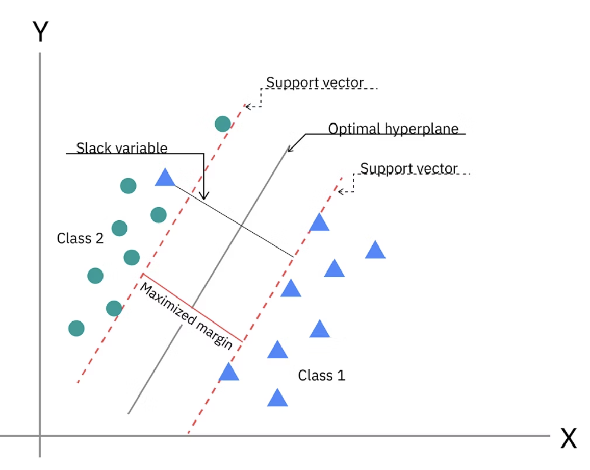
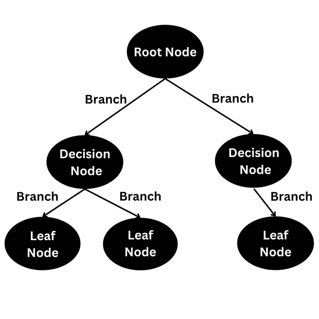
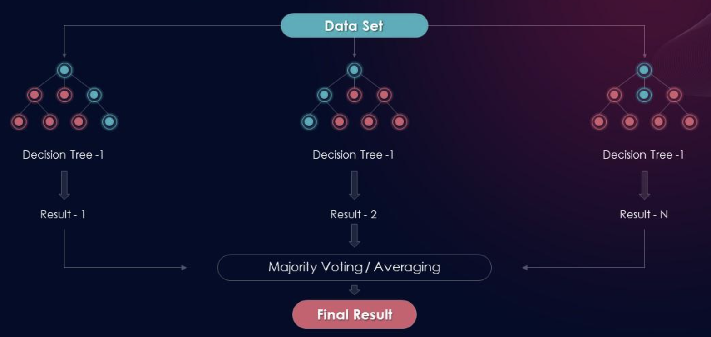
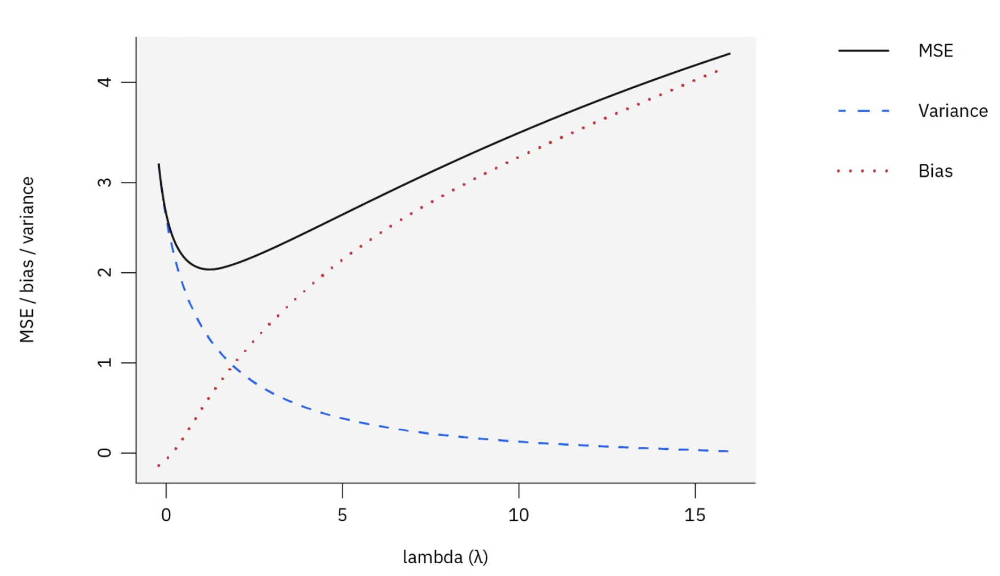

## 监督学习

监督学习的核心目标是学习一个从输入特征 (X) 到输出标签 (y) 的映射函数 **f(X) = y**。

根据输出标签 (y) 的类型，我们可以将这些算法分为两大类：**分类** (Classification) 和 **回归** (Regression)。

在训练过程中，模型的算法会处理大型数据集，以探索输入和输出之间潜在的相关性。然后，使用测试数据评估模型性能，以确定其训练是否成功。交叉验证是指使用数据集的不同部分来测试模型的过程。

梯度下降算法家族，包括随机梯度下降（SGD），是训练神经网络和其他机器学习模型时最常用的优化算法或学习算法。模型的优化算法通过损失函数来评估准确性：损失函数是一个衡量模型预测值与实际值之间差异的方程。

损失函数衡量预测值与实际值之间的偏差程度。其梯度指示模型参数应朝哪个方向调整以减少误差。在整个训练过程中，优化算法会更新模型的参数（即其运行规则或“设置”），以优化模型。

由于大型数据集通常包含大量特征，可以通过 **降维** 来简化这种复杂性。将特征数量减少到对预测数据标签最关键的特征，从而在保持准确性的同时提高效率。

## 算法

梯度下降等优化算法可以训练各种机器学习算法，这些算法在监督学习任务中表现出色：

- **朴素贝叶斯**： 朴素贝叶斯是一种分类算法，它采用了贝叶斯定理中的类条件独立性原则。这意味着一个特征的存在与否并不影响另一个特征在结果概率中的作用，每个预测因子对结果的影响是相同的。
  - 朴素贝叶斯分类器包括多项式朴素贝叶斯、伯努利朴素贝叶斯和高斯朴素贝叶斯。
  - 这种技术常用于文本分类、垃圾邮件识别和推荐系统。

- **线性回归**： 线性回归用于识别连续型因变量与一个或多个自变量之间的关系。它通常用于预测未来结果。
  - 线性回归用一条直线来表示变量之间的关系。
  - 当只有一个自变量和一个因变量时，称为简单线性回归。
  - 随着自变量数量的增加，这种方法被称为多元线性回归。

- **非线性回归**：有时，线性输入无法重现输出。
  - 在这种情况下，必须使用非线性函数对输出进行建模。
  - 非线性回归通过非线性或曲线来表示变量之间的关系。
  - 非线性模型可以处理具有多个参数的复杂关系。

- **逻辑回归**： 逻辑回归处理分类因变量——即具有二元输出（例如真或假、正或负）的因变量。虽然线性回归和逻辑回归模型都旨在理解数据输入之间的关系，但逻辑回归主要用于解决二元分类问题，例如垃圾邮件识别。

- **多项式回归**：与其他回归模型类似，多项式回归是回归模型的一种特殊情况，其中输入特征被提升到幂次，从而使线性模型能够拟合非线性模式。

- **支持向量机（SVM）**： 支持向量机可用于数据分类和回归。不过，它通常用于处理分类问题。SVM 通过决策边界或超平面来划分数据点的类别。SVM 算法的目标是绘制一个超平面，使各组数据点之间的距离最大化。

- **K近邻算法**：K近邻（KNN）是一种非参数算法，它基于数据点之间的接近程度以及与其他可用数据的关联性对数据点进行分类。该算法假设相似的数据点在数学绘图中彼此靠近。
 - 它易于使用且计算时间短，因此在推荐引擎和图像识别方面效率很高。但随着测试数据集的增长，处理时间也会延长，使其在分类任务中的吸引力降低。

- **随机森林**：随机森林是一种灵活的监督式机器学习算法，可用于分类和回归。“森林”指的是一组不相关的决策树，这些决策树被合并以降低方差并提高准确率。

## 分类类型

将输入数据划分到不同的类别中。

人工智能 (AI)模型使用分类算法，根据指定的分类器处理输入数据集，该分类器设定了数据排序的标准。分类算法广泛应用于数据科学领域，用于预测模式和结果。

### 二元分类

在二元分类问题中，模型预测数据属于两个类别之一。训练过程中应用的学习技术使模型能够评估训练数据中的特征，并预测每个数据点对应的两个可能标签中的哪一个：正例或负例、真或假、是或否。

例如，垃圾邮件过滤器会将电子邮件分类为垃圾邮件或非垃圾邮件。除了垃圾邮件检测之外，二元分类模型还能可靠地预测行为：潜在客户是会流失还是会购买特定产品？它们在自然语言处理(NLP)、情感分析、图像分类和欺诈检测等领域也很有用。

### 多类分类

多分类问题用于对具有两个以上类别标签的数据进行分类，且所有类别标签互斥。从这个意义上讲，多分类挑战与二元分类任务类似，只是类别更多。

多分类模型在现实世界中有着广泛的应用。除了判断邮件是否为垃圾邮件之外，多分类解决方案还可以判断邮件是促销邮件还是高优先级邮件。图像分类器可以使用大量的类别标签（例如狗、猫、羊驼、鸭嘴兽等等）对宠物图像进行分类。

多分类学习方法的目标是训练模型将输入数据准确地分配到更广泛的类别中。多分类训练中常用的目标函数是分类交叉熵损失，它评估模型对测试数据的预测结果与每个数据点的正确标签之间的差距。

### 多标签分类
多标签分类适用于每个数据点可以被赋予多个非互斥标签的情况。与基于互斥性的分类不同，多标签分类允许数据点同时具有多个类别的特征——这更能反映大数据集中真实存在的模糊性。

多标签分类任务通常是通过结合多个二元或多类分类模型的预测结果来完成的。

### 分类不平衡

分类不平衡，即某些类别的数据点远多于其他类别，需要采用专门的方法。随着某些类别的数据点增多，一些分类模型会逐渐偏向这些类别，并越来越倾向于预测这些类别的结果。

应对措施包括配置算法以更重视错误预测的成本，或者采用抽样方法，要么消除多数样本，要么从代表性不足的群体中过度抽样。

## 分类算法

预测一个离散的类别标签 (例如：“是/否”、“猫/狗/鸟”、“垃圾邮件/正常邮件”)。

常见分类算法：
- 逻辑回归
- 决策树
- 随机森林
- 支持向量机（SVM）
- K近邻算法
- 朴素贝叶斯

---

### 逻辑回归

虽然名字里有“回归”，但它是一个不折不扣的分类算法。

它通过一个 Sigmoid 函数，将线性回归模型的连续输出值“挤压”到一个 (0, 1) 的区间内，从而得到一个表示“属于某个类别”的概率。如果概率大于 0.5，就预测为类别 1；否则预测为类别 0。

由于线性函数假设存在线性关系，因此当 X 的值变化时，Y 的值可以从负无穷到无穷大不等。我们知道，概率值被限制在 [0,1] 范围内。基于线性模型的这一原理，我们无法直接对二元结果的概率进行建模。相反，我们需要一个逻辑回归模型来理解这些概率。因此，我们需要对输入进行转换，使结果被限制在 [0,1] 范围内。这种转换被称为逻辑回归方程。

它通过对标准线性回归公式应用 logit（或对数几率）转换来实现这一点：

$$Y = P(x) = \frac{e^{\beta_0 + \beta_1 x_1}}{1 + e^{\beta_0 + \beta_1 x_1}}$$

#### 逻辑回归类型

根据类别响应变量的不同，逻辑回归模型主要分为三类：

- **二元逻辑回归** (Binary logistic regression)：在这种方法中，响应变量或因变量本质上是二分的——也就是说，它只有两种可能的结果（例如 0 或 1）。这是逻辑回归中最常用的方法，也是二元分类中最常见的分类器之一。
- **多元逻辑回归** (Multinomial logistic regression)：在这种模型中，因变量有三个或更多可能的结果，但这些值 **没有特定的顺序** 。
- **有序逻辑回归** (Ordinal logistic regression)：当响应变量有三个或更多可能的结果，且这些值 **具有定义的顺序** 时，可以使用此类模型。有序响应的例子包括从 A 到 F 的评分等级，或者从 1 到 5 的李克特量表评分。

要理解逻辑回归函数（或 sigmoid 函数），我们需要了解以下内容：

- 几率、对数几率和几率比
- 逻辑回归系数
- 极大似然估计 (MLE)  

---

#### 几率

几率的对数称为logit函数，它是逻辑回归的基础。

由于概率的取值范围在 0 到 1 之间，我们无法直接用线性函数来模拟概率，因此我们转而使用几率。虽然概率和几率都表示结果发生的可能性，但它们的定义有所不同：

> 概率衡量的是某个事件在所有可能结果中发生的可能性。  
> 几率是指事件发生的概率与该事件不发生的概率之间的比较。

---

#### 对数几率

设 p(x) 表示某一结果发生的概率。那么，x的几率定义为：

$$odds(x) = \frac{p(x)}{1 - p(x)}$$

让我们来看一个具体例子：

假设一个篮子里有 3 个苹果和 5 个橘子。

- 选中橘子的**概率**是 $5 / (3 + 5) = 0.625$
- 选中橘子的**几率**是 $5 / 3 \approx 1.667$

这意味着选中橘子的可能性大约是选中苹果的 $1.667$ 倍。反之，选中苹果的几率是 $3 / 5 = 0.6$。该值小于 1，表明该结果（选中苹果）发生的可能性小于其不发生的可能性。根据几率方程，我们也可以将几率理解为：结果发生的概率与结果不发生概率的比值。因此，选中橘子的几率 = $P(\text{oranges}) / (1 - P(\text{oranges})) = 0.625 / (1 - 0.625) \approx 1.667$。

几率的范围可以从 $0$ 到无穷大。几率值大于 1 表示该结果是倾向于发生的，小于 1 表示不倾向于发生，等于 1 则意味着该事件发生与不发生的可能性相等。

然而，几率在 1 附近是不对称的。例如，几率 2 和 0.5 分别代表“两倍可能”和“一半可能”，但它们在数值尺度上差异很大。为了解决这种不平衡，我们对几率取对数，将几率从 $[0, \infty)$ 的尺度转换到实数轴 $(-\infty, \infty)$ 上。这被称为 **对数几率** （Log-odds）或 **Logit**，它是逻辑回归模型的基础。

我们将对数几率定义为：

$$\log\left(\frac{p(x)}{1 - p(x)}\right)$$

这种转换允许我们将对数几率表示为输入的线性函数：

$$\log\left(\frac{p(x)}{1 - p(x)}\right) = \beta_0 + \beta_1 \cdot x_1$$

然后我们可以对等式两边取指数，回到几率的形式：

$$\frac{p(x)}{1 - p(x)} = e^{\beta_0 + \beta_1 \cdot x_1}$$

解出 $p(x)$，我们得到了 **Sigmoid 函数**，它确保了预测值始终保持在 0 和 1 之间：

$$p(x) = \frac{e^{\beta_0 + \beta_1 \cdot x_1}}{1 + e^{\beta_0 + \beta_1 \cdot x_1}}$$

通过这种变换，尽管我们底层使用的是线性函数建模，逻辑回归仍能输出有效的概率值。

---

#### 几率比

最后，让我们介绍 **几率比**，这是一个有助于解释模型系数影响的概念。几率比告诉我们，当输入变量 $x_1$ 增加一个单位时，几率（Odds）会如何变化。

假设事件的几率为：

$$odds(x_1) = e^{\beta_0 + \beta_1 \cdot x_1}$$

如果我们将 $x_1$ 增加一个单位，新的几率变为：

$$odds(x_1 + 1) = e^{\beta_0 + \beta_1(x_1 + 1)} = e^{\beta_0 + \beta_1 x_1} \cdot e^{\beta_1}$$

这意味着 $x_1$ 每增加一个单位，几率就会乘以 $e^{\beta_1}$。这个乘数就是**几率比**。

- 如果 $\beta_1 > 0$（即 $e^{\beta_1} > 1$），则几率增加（事件发生的可能性变大）。
- 如果 $\beta_1 < 0$（即 $e^{\beta_1} < 1$），则几率减少（事件发生的可能性变小）。
- 如果 $\beta_1 = 0$（即 $e^{\beta_1} = 1$），几率比为 1，意味着输入对几率没有影响。

几率比赋予了逻辑回归极强的可解释性——它告诉您事件的几率如何随输入而变化，这在医疗保健、营销和金融等许多应用场景中都非常有用。

然而，我们不能像解释线性回归系数那样直接解释逻辑回归系数。

---

#### 逻辑回归系数

##### 连续型预测变量

回顾一下：在 **线性回归** 中，系数的解释非常直观。以带有连续变量的线性回归为例：输入特征 $x$ 每增加一个单位，预测结果 $y$ 就会增加 $\beta_1$ 个单位。这种直接的关系之所以成立，是因为线性回归假设输入特征与目标变量之间存在恒定的变化率。其输出是无界的，且呈线性增长。

然而，**逻辑回归**并不直接对 $y$ 进行建模，它通过**对数几率** (log-odds) 来对 $y$ 的概率进行建模。正因如此，我们不能说 $x$ 增加一个单位会导致 $y$ 发生恒定的单位变化。相反，我们通过系数对对数几率的影响来解释它，并由此延伸到对几率（Odds）和结果发生概率的影响。

具体来说，在逻辑回归中：

- **正系数**意味着随着输入的增加，结果的对数几率也会增加。这对应于**概率的增加**。
- **负系数**意味着随着输入的增加，对数几率会减少。这对应于**概率的减少**。
- **系数为零**意味着该变量对结果没有影响。

重要的是，**系数的大小**反映了这种影响的强度，而**几率比**（即系数的指数 $e^{\beta_1}$）则告诉我们变量每增加一个单位时，几率（Odds）具体发生了多少变化。

##### 类别型预测变量

与其他机器学习算法一样，我们可以将类别变量引入逻辑回归中进行预测。在处理类别或离散变量时，我们通常使用特征工程技术（如**独热编码 One-hot encoding** 或 **虚拟变量 Dummy variables**）将它们转换为模型可以使用的二进制格式。

例如，假设我们要根据一个人是否仍有现有债务来预测其贷款申请是否获得批准（$y=1$ 表示批准，$y=0$ 表示未批准）：

- 令 $x=0$ 表示没有现有债务。
- 令 $x=1$ 表示有现有债务。

我们的 $y = \text{批准}$ 的对数几率模型为：
$$\log\left(\frac{p}{1-p}\right) = \beta_0 + \beta_1 \cdot x_1$$

此时，系数 $\beta_1$ 代表了：与没有现有债务的人相比，有现有债务的人在贷款获批对数几率上的**变化量**。

为了使其更具可解释性，我们可以对 $\beta_1$ 取指数来获得**几率比**：

- 如果 $\beta_1$ 为**正**，则 $e^{\beta_1} > 1$，意味着有现有债务会**增加**获批的几率。
- 如果 $\beta_1$ 为**负**，则 $e^{\beta_1} < 1$，意味着有现有债务会**降低**获批的几率。
- 如果 $\beta_1$ 为 **0**，则 $e^{\beta_1} = 1$，意味着债务状态没有影响。

因此，虽然我们失去了线性回归中那种系数的直观解释，但逻辑回归仍然提供了丰富且可解释的洞察——尤其是当我们从几率和概率转变的角度来构建它们时。需要注意的是，概率随 $x$ 增加而增加或减少的幅度并不是 $x$ 的线性函数，而是取决于 $x$ 在特定点上的取值（即概率的变化率随 $x$ 的位置而变化）。

---

#### 极大似然估计 (Maximum Likelihood Estimate)

逻辑回归中的系数 $\beta_0$ 和 $\beta_1$ 是通过使用**极大似然估计** (MLE) 来估算的。MLE 的核心思想是找到一组参数，使得在逻辑回归模型下，观测到当前实际数据的概率（可能性）最大。

在逻辑回归中，我们使用逻辑函数（Sigmoid 函数）来模拟给定输入 $x_1$ 时，目标变量 $y_1$ 等于 1（例如“获批”）的概率：

$$P(x) = \frac{e^{\beta_0 + \beta_1 x_1}}{1 + e^{\beta_0 + \beta_1 x_1}}$$

MLE 会尝试 $\beta_0$ 和 $\beta_1$ 的不同组合，并针对每种组合询问：在这种参数设置下，观测到数据中实际结果的可能性有多大？

这种可能性通过**似然函数**来表示，它是每个数据点预测概率的累乘：

$$L(\beta_0, \beta_1) = \prod_{i=1}^n p(x_i)^{y_i} \cdot (1 - p(x_i))^{1 - y_i}$$

- 如果 $y_i = 1$（“获批”）：我们希望模型的预测概率 $p(x_i)$ 尽可能接近 1。项 $p(x_i)^{y_i}$ 正是起到了这个作用。如果实际观测数据 $y_i$ 确实是 1，该项的值就是 $p(x_i)$。
- 如果 $y_i = 0$（“未获批”）：我们希望预测概率尽可能接近 0。项 $(1 - p(x_i))^{1 - y_i}$ 处理这种情况。如果实际观测数据 $y_i$ 是 0，那么该项的值就是 $1 - p(x_i)$；当 $p(x_i)$ 接近 0 时，$1 - p(x_i)$ 就会接近 1。

因此，对于每个数据点，我们要么乘以 $p(x_i)$，要么乘以 $1 - p(x_i)$，具体取决于实际标签是 1 还是 0。所有样本的乘积会得到一个数值：即在当前模型下观测到整个数据集的**似然值**。显而易见，如果预测结果（使用参数 $\beta_0$ 和 $\beta_1$）与实际观测数据越吻合，似然值就越大。将所有概率相乘的原因是，我们假设每个样本的结果是**相互独立**的。换句话说，一个人的获批机会不应影响另一个人的获批机会。

由于这种乘积的结果可能变得极小，我们通常使用 **对数似然** (Log-likelihood)，它将乘积转换为求和，从而更易于计算和优化。

为了找到使对数似然最大化的 $\beta_0$ 和 $\beta_1$ 的值，我们使用 **梯度下降** (Gradient Descent)——一种迭代优化算法。在每一步中，我们计算对数似然相对于每个参数的变化（即梯度），然后朝着增加似然值的方向微调参数。随着时间的推移，这个过程会收敛到最拟合数据的 $\beta_0$ 和 $\beta_1$ 值。

---

### K-近邻算法 (K-Nearest Neighbors, KNN)

“物以类聚，人以群分”。要预测一个新的数据点属于哪个类别，就看它在特征空间中最接近的 K 个邻居都属于哪个类别，然后采取“少数服从多数”的原则，将它归为邻居中最多的那个类别。

KNN算法属于“惰性学习”模型家族，这意味着它只存储训练数据集，而无需经历训练阶段。这也意味着所有计算都发生在进行分类或预测时。由于它高度依赖内存来存储所有训练数据，因此也被称为基于实例或基于内存的学习方法。

#### 距离度量

为了确定哪些点是“最近的”，KNN 需要计算数据点之间的距离。常见的度量标准包括：

##### 欧几里得距离
这是最常用的距离公式，用于计算多维空间中两点之间的直线距离：
$$d(x, y) = \sqrt{\sum_{i=1}^{n} (y_i - x_i)^2}$$

##### 曼哈顿距离
计算点在标准坐标系上的绝对轴距总和（类似在城市街区中行走）：
$$d(x, y) = \sum_{i=1}^{n} |y_i - x_i|$$

##### 闵可夫斯基距离
这是欧几里得距离和曼哈顿距离的通用形式：
$$d(x, y) = \left( \sum_{i=1}^{n} |y_i - x_i|^p \right)^{1/p}$$
- 当 $p=1$ 时，为曼哈顿距离。
- 当 $p=2$ 时，为欧几里得距离。

##### 汉明距离
主要用于分类变量，计算两个字符串或向量中不同字符的数量。

$$\text{Hamming Distance} = D_H = \left( \sum_{i=1}^{k} |x_i - y_i| \right)$$
$$x = y \quad D = 0$$
$$x \neq y \quad D \neq 1$$

例如，如果有以下字符串，则汉明距离为 2，因为只有两个值不同。

#### 如何选择 k 值？

$k$ 值的选择对 KNN 模型的表现至关重要，它决定了模型在过拟合和欠拟合之间的平衡。

-   **小的 k 值（如 k=1 或 k=3）**：
    -   **优点**：低偏误（Low Bias），能捕捉数据的精细结构。
    -   **缺点**：高变异（High Variance），容易受到噪声和异常值的影响，导致**过拟合**。
-   **大的 k 值**：
    -   **优点**：高稳定性，平滑了噪声的影响。
    -   **缺点**：高偏误（High Bias），可能会模糊不同类别之间的边界，导致**欠拟合**。

**最佳实践**：通常建议使用交叉验证（Cross-validation）来选择 $k$。一般来说，选择一个**奇数**作为 $k$ 值可以避免在分类任务中出现平局。

---

### 支持向量机 (Support Vector Machine, SVM)

寻找一个最优的“决策边界”（超平面），使得不同类别的数据点被这个边界分隔开，并且离这个边界最近的数据点（即“支持向量”）到边界的间隔 (margin) 最大化。

SVM 的强大之处在于，通过“核函数”，它可以巧妙地将数据映射到更高维度的空间，从而在低维空间中线性不可分的数据，在高维空间中变得线性可分。

支持向量机（SVM）是一种经典的**监督学习**算法，常用于**分类**和**回归**任务。尽管它也能处理回归问题，但最常用于解决二分类（Binary Classification）问题。

#### 关键术语
-   **超平面 (Hyperplane)**：在 $n$ 维空间中，超平面是一个 $n-1$ 维的决策边界。例如，在二维空间中，超平面是一条线；在三维空间中，超平面是一个面。
-   **支持向量 (Support Vectors)**：距离超平面最近的那些数据点。它们是构建模型最关键的点，因为如果移动这些点，超平面的位置就会改变。
-   **间隔 (Margin)**：支持向量与超平面之间的距离。SVM 的核心逻辑是**最大化间隔**，间隔越大，模型的泛化能力（对新数据的分类能力）越强。

#### 线性 SVM (Linear SVM)

当数据是线性可分时，我们使用线性 SVM。根据对误差的容忍度，分为两种模式：

- 硬间隔 (Hard Margin)
  - **要求**：所有数据点必须被正确分类，且位于间隔之外。
  - **适用场景**：数据非常干净、无噪声时。

- 软间隔 (Soft Margin)
  -   **原理**：引入“松弛变量（Slack Variables）”，允许部分数据点被错误分类或落在间隔内。
  - **目的**：防止过拟合，提高模型在现实噪声数据中的鲁棒性。

#### 非线性 SVM 与 核技巧 (Kernel Trick)

在现实场景中，数据往往不是线性可分的（例如：数据点呈环形分布）。此时，SVM 引入了**核技巧 (Kernel Trick)**。

核技巧通过一个数学函数将低维空间的输入数据映射到高维空间。在这个更高维的空间中，原本无法线性分隔的数据变得可以线性分隔。

常见的核函数 (Kernel Functions)
-   **线性核 (Linear Kernel)**：适用于数据线性可分的情况。
-   **多项式核 (Polynomial Kernel)**：模拟数据特征之间的相互作用。
-   **径向基函数核 (RBF / Gaussian Kernel)**：最常用的核函数，能处理复杂的非线性边界，将数据映射到无限维空间。
-   **Sigmoid 核**：类似于神经网络中的激活函数。

#### 支持向量回归(SVR)

支持向量回归 (SVR) 是支持向量机 (SVM) 的扩展，用于解决回归问题（即因变量为连续变量）。与线性 SVM 类似，SVR 旨在​​找到数据点之间间隔最大的超平面，通常用于时间序列预测。

支持向量回归 (SVR) 与线性回归的区别在于，使用 SVR 时需要明确指定自变量和因变量之间的关系。理解变量之间的关系及其方向对于线性回归至关重要，而 SVR 则无需这样做，因为它能够自动确定这些关系。

---

### 决策树

模仿人类的决策过程，通过一系列的“是/否”问题（基于特征的判断）来对数据进行划分，最终到达一个“叶子节点”，得出决策结果。

决策树由以下三个核心部分组成：

*   **根节点 (Root Node)**：树的最顶端。它代表整个数据集，是第一个进行分割的特征点。
*   **内部节点 (Internal Nodes)**：代表数据集中的某个特征。每个内部节点都会根据特定的规则引出两个或多个分支。
*   **叶节点 (Leaf Nodes)**：代表最终的决策结果或分类标签。叶节点不再进行分割。

#### 决策树的工作原理：递归分割

决策树通过一种称为**递归分割 (Recursive Partitioning)** 的方法构建。它通过评估各个特征，选择能最有效区分数据点的特征进行分裂。

为了衡量特征的质量，算法使用“不纯度（Impurity）”来评估：

- A. 熵 (Entropy) 与 信息增益 (Information Gain)
熵用于衡量数据的不确定性或混乱程度。信息增益则是指通过某个特征进行分裂后，熵降低了多少。
  -   **熵的公式**：$H(S) = -\sum_{i=1}^{c} p_i \log_2(p_i)$
  - **逻辑**：算法选择能产生最高信息增益（即最大程度降低混乱度）的特征。

- 基尼不纯度 (Gini Impurity)
这是分类回归树 (CART) 算法默认使用的指标。它衡量从数据集中随机选择一个样本并根据类别分布对其进行错误分类的概率。
  -   **基尼系数公式**：$Gini = 1 - \sum_{i=1}^{c} p_i^2$
  - **逻辑**：基尼系数越低，节点越“纯”，说明分类效果越好。

#### 分类树 vs. 回归树 (CART)

决策树算法统称为 **CART (Classification and Regression Trees)**：

-   **分类树 (Classification Trees)**：目标变量是离散的（例如：预测是/否，或 A/B/C 类）。
-   **回归树 (Regression Trees)**：目标变量是连续的（例如：预测房价或气温）。它通过最小化平方误差来寻找分裂点。

#### 过拟合 (Overfitting)

决策树非常容易出现**过拟合**，即模型在训练数据上表现近乎完美，但在处理新数据时表现很差。这是因为树长得太深，捕捉到了数据中的噪声。

### 解决方法
1.  **剪枝 (Pruning)**：移除对预测影响不大的分支。
    *   **预剪枝**：提前停止树的生长（如限制最大深度）。
    *   **后剪枝**：先让树完整生长，然后再移除不重要的部分。
2.  **集成学习 (Ensemble Methods)**：
    *   **随机森林 (Random Forest)**：构建多棵决策树并取平均值或进行投票。
    *   **梯度提升树 (GBDT/XGBoost)**：通过后续树不断修正前序树的误差。

---

### 随机森林 (Random Forest) 

随机森林是一种灵活且易于使用的机器学习算法，它属于**集成学习**（Ensemble Learning）家族。通过结合多棵决策树的预测结果，随机森林能够提供比单棵决策树更准确、更稳定的输出。

#### 集成学习

集成学习通过结合多个模型（通常被称为“弱学习器”）来构建一个更强大的“强学习器”。随机森林是集成学习中**袋装法**（Bagging，即 Bootstrap Aggregating）的典型代表。

-   **核心理念**：与其依赖一个专家的判断，不如参考一群专家的意见并取其平均值。

#### 随机森林的工作原理

随机森林通过以下两个关键技术来增加树的多样性，从而降低模型的方差：

- **自助抽样法** (Bootstrapping / Bagging)
  - 在构建每一棵树时，算法会从原始数据集中进行**有放回的随机抽样**。这意味着：
    - 某些样本可能会在一棵树的训练集中出现多次。
    -  某些样本可能完全不会出现在该树的训练集中（这些被称为“袋外数据”或 Out-of-Bag samples）。

- **特征随机性** (Feature Randomness)
  - 在单棵决策树中，算法会搜索所有特征以寻找最优分裂点。而在随机森林中，每棵树在分裂节点时，只能从**随机选择的特征子集**中寻找最优特征。这进一步确保了各棵树之间的差异性，降低了树与树之间的相关性。

#### 预测过程：投票与平均

当森林构建完成后，新数据的预测过程如下：

-   **分类任务 (Classification)**：每棵决策树都会输出一个类别预测，随机森林最终采取**众数投票（Majority Vote）**，即选择获得票数最多的类别。
-   **回归任务 (Regression)**：每棵决策树输出一个数值，随机森林最终采取所有树输出结果的**平均值（Average）**。

#### 随机森林 vs. 决策树

| 特性 | 决策树 | 随机森林 |
| :--- | :--- | :--- |
| **复杂性** | 较低，单棵树结构 | 较高，包含成百上千棵树 |
| **过拟合风险** | 极高，容易捕捉噪声 | 较低，通过集成降低了过拟合风险 |
| **可解释性** | 极佳，可视化路径清晰 | 较低，被视为“黑盒”模型 |
| **准确度** | 较低（尤其在处理复杂数据时） | 很高，通常是表现最稳健的算法之一 |

### 朴素贝叶斯 (Naive Bayes)

朴素贝叶斯（Naive Bayes）是一组基于**贝叶斯定理**（Bayes' Theorem）的监督学习算法。它被广泛应用于分类任务，尤其是在处理大规模数据集和自然语言处理（NLP）领域。

该算法之所以被称为“朴素”，是因为它建立在一个极强的假设基础之上：**特征条件独立假设**。

-   **含义**：它假设在给定类别的情况下，所有的特征彼此之间是完全独立的。
-   **现实情况**：在现实世界中，特征之间往往存在关联（例如，在预测天气时，湿度和降水通常是相关的）。尽管这个假设在现实中很少成立，但朴素贝叶斯在实践中往往表现得惊人地出色。

#### 贝叶斯定理 (Bayes' Theorem)

朴素贝叶斯的核心是贝叶斯定理，它通过已知条件来计算概率。公式如下：

$$P(A|B) = \frac{P(B|A) \cdot P(A)}{P(B)}$$

在机器学习的分类场景中，公式可以表示为：

$$P(y|x_1, \dots, x_n) = \frac{P(x_1, \dots, x_n|y) \cdot P(y)}{P(x_1, \dots, x_n)}$$

其中：
*   **$P(y|X)$ (后验概率)**：在给定输入特征 $X$ 的条件下，属于类别 $y$ 的概率。
*   **$P(X|y)$ (似然概率)**：已知属于类别 $y$ 的情况下，观测到特征 $X$ 的概率。
*   **$P(y)$ (先验概率)**：在看到任何数据之前，类别 $y$ 发生的概率。
*   **$P(X)$ (边际似然)**：特征 $X$ 发生的总概率（在计算中通常作为归一化常数，被忽略）。

#### 朴素贝叶斯的主要类型

根据数据分布的不同，朴素贝叶斯有几种常见的变体：

1.  **高斯朴素贝叶斯 (Gaussian Naive Bayes)**：
    *   假设特征遵循**正态分布（高斯分布）**。
    *   通常用于处理**连续型**数值数据。
2.  **多项式朴素贝叶斯 (Multinomial Naive Bayes)**：
    *   基于多项式分布。
    *   主要用于**文本分类**，通常使用词频（Word Counts）作为特征。
3.  **伯努利朴素贝叶斯 (Bernoulli Naive Bayes)**：
    *   基于伯努利分布。
    *   适用于**二值特征**（即特征只有“是/否”或“1/0”两种状态），常用于垃圾邮件检测。

## 回归算法

预测一个连续的数值 (例如：价格、温度、销售额)。

### 线性回归 (Linear Regression)

线性回归是一种用于建模自变量（特征）与因变量（目标值）之间线性关系的监督学习算法。

**基本原理**：线性回归假设因变量 $y$ 可以通过自变量 $x$ 的线性组合来预测。其数学表达式通常为：
    $$y = \beta_0 + \beta_1x_1 + \beta_2x_2 + \dots + \beta_nx_n + \epsilon$$
    其中，$\beta_0$ 是截距项，$\beta_1, \dots, \beta_n$ 是回归系数，$\epsilon$ 是随机误差。

该算法的核心目标是找到一组系数，使预测值与实际观测值之间的差异最小。最常用的方法是**普通最小二乘法 (Ordinary Least Squares, OLS)**，它通过最小化**残差平方和 (RSS)** 来确定最优系数：
    $$RSS = \sum_{i=1}^{n} (y_i - \hat{y}_i)^2$$

在线性回归中，每个系数 $\beta_j$ 代表在其他特征保持不变的情况下，特征 $x_j$ 每增加一个单位，因变量 $y$ 的预期变化量。

---

### Lasso 回归 (Lasso Regression)

Lasso 回归全称为“最小绝对收缩和选择算子”（Least Absolute Shrinkage and Selection Operator），它是线性回归的一种正则化变体。

Lasso 回归在线性回归的损失函数中引入了 **L1 正则化项**。它不仅考虑残差平方和，还加上了系数绝对值的总和作为惩罚项。

**目标函数**：其优化的目标函数为：
    $$\text{Minimize: } RSS + \lambda \sum_{j=1}^{n} |\beta_j|$$
    其中，$\lambda$ 是惩罚强度参数（也称为正则化参数）。当 $\lambda$ 越大，对系数的收缩作用越强。

Lasso 回归最显著的特征是它可以产生**稀疏模型**。由于 L1 惩罚项的几何特性，在优化过程中，一些不重要或冗余特征的系数会被压缩至**恰好为零**。

**应用逻辑**：通过将部分系数设为零，Lasso 回归在建立预测模型的同时，自动执行了特征选择的过程，从而简化了模型的维度。

---

### 岭回归 (Ridge Regression) 

岭回归（Ridge Regression），也称为 **L2 正则化**，是一种用于处理多重共线性（Multicollinearity）数据的线性回归扩展技术。当线性回归模型中存在高度相关的自变量时，普通最小二乘法（OLS）会对噪声非常敏感，从而导致模型方差过大。岭回归通过引入惩罚项来解决这一问题。

岭回归的核心是在普通线性回归的损失函数中增加了一个**惩罚项**。这个惩罚项与模型系数的**平方和**成正比。

岭回归通过最小化以下目标函数来确定系数：
$$\text{Minimize: } RSS + \lambda \sum_{j=1}^{n} \beta_j^2$$

其中：
*   **RSS (Residual Sum of Squares)**：残差平方和，即预测值与实际值之间的差异。
*   **$\lambda$ (Lambda)**：调节参数（Tuning Parameter），也称为正则化参数。
*   **$\sum \beta_j^2$**：L2 惩罚项，即所有回归系数的平方和。

#### 调节参数 $\lambda$ 

$\lambda$ 控制着正则化的强度，决定了在缩小残差与缩小系数之间如何取得平衡：
*   当 **$\lambda = 0$** 时：惩罚项失去作用，岭回归等同于普通最小二乘线性回归（OLS）。
*   当 **$\lambda$ 趋向无穷大** 时：惩罚项的影响占主导地位，回归系数 $\beta$ 会无限趋近于零（但永远不会等于零）。

通过增加 $\lambda$，模型的**方差（Variance）会降低，但偏误（Bias）会增加**。岭回归的目标是找到一个最优的 $\lambda$，使总误差（偏误与方差的和）达到最小。

#### 岭回归 vs. Lasso 回归

虽然两者都属于正则化技术，但它们在处理系数的方式上有本质区别：

*   **惩罚类型**：岭回归使用 **L2 正则化**（系数的平方），而 Lasso 使用 **L1 正则化**（系数的绝对值）。
*   **稀疏性**：Lasso 回归可以将不重要的特征系数压缩为 **0**，从而实现特征选择。岭回归则将系数压缩为**接近 0**，但保留所有特征。
*   **适用场景**：如果数据集中大多数特征都有贡献，岭回归通常表现更好；如果只有少数特征对结果有显著影响，Lasso 则更合适。

#### 岭回归的主要应用场景

岭回归在以下场景中表现尤为出色：

1.  **多重共线性 (Multicollinearity)**：当两个或多个自变量之间存在高度线性相关时，普通线性回归的系数估计会变得极不稳定。岭回归通过收缩系数来稳定估计值。
2.  **特征数量多于样本量 ($n < p$)**：在某些高维数据场景下（如基因组学），普通线性回归无法求出唯一解，岭回归通过引入惩罚项使数学矩阵变得可逆，从而求出稳定解。
3.  **防止过拟合 (Overfitting)**：当模型在训练集上表现过于复杂，捕捉了太多噪声时，岭回归可以通过限制系数的大小来提高模型在测试集上的泛化能力。

---

### 状态空间模型 (State Space Model, SSM) 

状态空间模型（State Space Model, SSM）是一种用于描述、分析和预测复杂动态系统的数学框架。它最初源于控制工程和物理学，现在已广泛应用于经济学、时间序列分析，以及最新的**深度学习**领域（如 Mamba 模型）。

状态空间模型通过一组输入、输出和**状态变量**来表示系统。状态变量是模型的核心，它们代表了系统在某一时刻的内部状态，捕获了足以预测系统未来的历史信息。

SSM 通常由两个核心方程组成：
1.  **状态方程 (State Equation)**：描述系统内部状态随时间的变化逻辑。
2.  **观测方程 (Observation Equation)**：描述如何从当前的内部状态中观察到输出信号。

在现代计算（特别是 AI）中，SSM 通常以线性离散形式表示：

$$x(t+1) = Ax(t) + Bu(t)$$
$$y(t) = Cx(t) + Du(t)$$

其中各部分的含义如下：
*   **$u(t)$**：在时间 $t$ 的**输入信号**（例如传感器的原始数据或词向量）。
*   **$x(t)$**：在时间 $t$ 的**隐状态**（系统的“记忆”）。
*   **$y(t)$**：在时间 $t$ 的**输出值**（预测结果）。
*   **矩阵 $A$ (系统矩阵)**：决定系统如何随时间演化（记忆如何衰减或保持）。
*   **矩阵 $B$ (输入矩阵)**：决定输入如何影响隐状态。
*   **矩阵 $C$ (输出矩阵)**：决定如何从隐状态映射到最终输出。
*   **矩阵 $D$ (直接传递矩阵)**：通常为零或恒等，表示输入对输出的直接影响。

传统的 SSM（如卡尔曼滤波器）主要用于简单的物理系统。近年来，结构化状态空间模型（Structured SSMs, 如 **S4**）和自适应 SSM（如 **Mamba**）在深度学习中引起了革命，成为 Transformer 的有力竞争者。

 为什么 SSM 在深度学习中变得流行？
*   **线性复杂度 ($O(L)$)**：Transformer 的计算量随序列长度 $L$ 的平方增长，而 SSM 的计算复杂度随序列长度线性增长。这使其在处理超长文本或高清视频时效率极高。
*   **双重特性**：
    *   **循环模式 (RNN 风格)**：在推理时，它可以像 RNN 一样逐个处理令牌，内存占用极低。
    *   **卷积模式 (CNN 风格)**：在训练时，它可以被转换为卷积形式，实现大规模并行计算。
*   **无限上下文潜力**：由于其循环本质，SSM 理论上可以处理无限长的序列，而不会像 Transformer 那样因缓存过大而耗尽显存。

---

### 时间序列模型 (Time Series Models)

时间序列模型是一种用于分析随时间收集的一系列数据点的统计技术。与分析随机样本（即数据点彼此独立）的传统统计方法不同，时间序列建模假设在不同时间收集的数据点之间存在某种潜在结构，例如趋势或季节性模式。

时间序列分析的主要目标是了解过去并预测未来。通过识别数据中的模式，企业可以针对未来的需求、销售、天气模式或金融市场趋势做出明智的预测。

为了有效地建立时间序列模型，必须将数据分解为几个关键组成部分：

*   **趋势 (Trend)**：数据在长时间内的总体方向。趋势可以是向上的、向下的或平稳的。
*   **季节性 (Seasonality)**：在固定间隔（如每天、每周、每月或每季度）内发生的周期性波动。例如，冷饮销量在夏季通常会上升。
*   **周期性 (Cyclicality)**：与固定频率无关的波动，通常与经济循环或商业周期有关。
*   **随机成分/噪声 (Irregularity/Noise)**：数据中无法解释的随机变动。它是由于不可预测的事件导致的，不遵循任何特定模式。

#### 平稳性 (Stationarity)

平稳性是时间序列建模中的一个基本假设。如果一个序列的统计特性（如均值、方差和自相关性）随时间保持恒定，则称该序列是**平稳的**。

大多数时间序列预测模型（如 ARIMA）都建立在数据平稳的假设之上。如果数据不平稳（例如存在明显的趋势），则必须通过**差分 (Differencing)** 或对数变换等技术将其转换为平稳数据，然后才能进行建模。

#### 常见的时间序列模型

根据数据的性质和复杂程度，可以选择不同的模型：

### 统计模型 (Statistical Models)
*   **自回归模型 (AR)**：基于数据当前值与其过去值之间关系的预测。
*   **滑动平均模型 (MA)**：使用过去预测误差的加权线性组合来预测当前值。
*   **自回归差分滑动平均模型 (ARIMA)**：这是最通用的统计模型之一，它结合了 AR 和 MA 模型，并通过“差分”处理非平稳数据。
*   **季节性 ARIMA (SARIMA)**：ARIMA 的扩展版本，专门用于处理包含显著季节性成分的数据。
*   **指数平滑 (Exponential Smoothing)**：通过对过去观测值赋予指数递减的权重来进行预测，最新数据拥有最高的权重。

### 机器学习与深度学习模型
*   **回归树与随机森林**：可以处理复杂的非线性关系，但在处理时间依赖性方面不如专门的时间序列模型。
*   **递归神经网络 (RNN)**：一种专门处理序列数据的神经网络。
*   **长短期记忆网络 (LSTM)**：RNN 的一种特殊变体，擅长捕捉数据中的长期依赖关系，非常适合处理具有复杂周期性的长时间序列。

时间序列模型通过揭示数据中随时间演变的隐藏模式，为决策者提供了预测未来的能力。随着计算能力的提高和机器学习算法的发展，时间序列分析已从简单的平均法演变为能够处理全球范围内海量数据的复杂实时系统。

---

### 自回归模型 (Autoregressive Modeling)

自回归模型（Autoregressive modeling）是一种主要用于时间序列分析和预测的机器学习技术，它通过使用时间序列中前一个或多个时间步的值来构建回归模型。

这是一种简单但强大的时间序列分析技术。如果您的数据在不同时间步之间存在相关性，该技术可以提供高度可解释且有效的预测。这种跨时间步的相关性被称为**自相关（Autocorrelation）**，因为它衡量的是一个数值与自身的相关程度。一个纯线性过程在整个时间序列中会与其自身完美自相关，从而可以通过自回归过程利用先前的值精确预测下一个值。而像**白噪声**（White noise）这样的完全随机过程则没有自相关性，因为我们无法通过过去的值预测当前或未来的值。

#### 时间序列与变量表示
时间序列是在一段时间内对相同变量或一组变量进行的一系列测量。测量通常以均匀的时间间隔进行，例如每小时、每月或每年。例如，我们可能有一组衡量某个国家每月航空旅客人数的数据。在这种情况下，$y$ 代表测量的旅客计数，并强调测量值随时间存在。通常使用下标 $t$ 而不是常用的 $i$ 来表示 $y_t$，意为 $y$ 在任意时间点 $t$ 的值。

#### 自回归阶数
自回归模型是将时间序列中的某个值对其自身的先前值进行回归。例如，$y_t$ 对 $y_{t-1}$ 的回归使用了 $y$ 的前一个值（称为**滞后值/Lagged value**）来预测 $y$ 的当前值。在这个简单的回归模型中，前一时期的因变量变成了当前的预测变量。误差项代表了简单线性回归模型中关于误差的所有常规假设。我们通常将自回归的**阶数**（Order）视为序列中用于预测当前值的先行值的数量。因此，$y_t$ 对 $y_{t-1}$ 的回归是一阶自回归，写作 **AR(1)**。

#### 自回归的定义

在多元线性回归中，输出是多个输入变量的线性组合。而在自回归模型中，输出是未来的数据点，表现为过去 $p$ 个数据点的线性组合。$p$ 是等式中包含的滞后数量。**AR(1)** 模型的数学定义为：

$$x_t = \delta + \phi_1 x_{t-1} + \alpha_t$$

其中：
*   **$x_{t-1}$**：前一个滞后时间步的序列值。
*   **$\phi$**：为该滞后项计算的系数。
*   **$\alpha_t$**：白噪声（如随机性）。
*   **$\delta$**（Delta）定义为：
    $$\delta = (1 - \sum_{i=1}^{p} \phi_i) \mu$$
    对于 $p$ 阶自回归模型，$p$ 是计算的滞后协变量总数，$\mu$ 是过程均值。

当模型中增加更多滞后项时，等式中会加入更多系数和滞后变量。例如，包含两个滞后项的**二阶自回归**模型为：
$$x_t = \delta + \phi_1 x_{t-1} + \phi_2 x_{t-2} + \alpha_t$$

阶数为 $p$ 的自回归方程通用形式为：
$$x_t = \delta + \phi_1 x_{t-1} + \dots + \phi_p x_{t-p} + \alpha_t$$

在进行预测时，我们使用当前时间值和任何历史数据来预测下一个时间步。例如，具有 2 个滞后项的 AR 模型预测未来一个步长：
$$x_{t+1} = \delta + \phi_1 x_t + \phi_2 x_{t-1} + \alpha_{t+1}$$

#### 估计系数

计算每个滞后项系数最常用的方法是**极大似然估计 (MLE)** 或 **普通最小二乘法 (OLS)**。这些方法在拟合线性模型回归时存在的局限性，在拟合自回归模型时同样存在。根据您使用的语言（Python 或 R）及其库，除了 MLE 或 OLS 外，您可能还可以使用 **Yule-Walker** 或 **Burg** 方法。

许多库允许用户根据特定准则从所有候选模型中选择最优模型。例如，您可以根据用例和数据，通过最小化 **赤池信息量准则 (AIC)** 或 **贝叶斯信息准则 (BIC)** 来确定模型系数。

#### 选择 AR 模型的阶数

自相关计算时间序列与其自身的滞后版本之间的相关性。**滞后**（Lag）是时间序列位移的时间单位数。滞后 1 将序列与前一个时间步进行比较；滞后 2 将其与更前一个时间步比较。特定滞后下的自相关程度显示了数据的**时间依赖性**。
*   自相关性高：当前值与该滞后值之间存在强关系。
*   自相关性低或接近零：表示关系微弱或没有关系。

可视化自相关的常用方法是计算**自相关函数 (ACF)** 或绘制 **ACF 图**。横轴代表滞后，纵轴代表自相关值。ACF 图中的显著峰值或模式可以揭示数据的底层时间结构。AR 模型中滞后阶数 ($p$) 的选择通常依赖于对 ACF 图的分析。

自相关还用于评估时间序列是否是**平稳的（Stationary）**。对于平稳序列，自相关应随着滞后的增加而逐渐减小；如果 ACF 图没有显示出减小趋势，则数据可能具有非平稳性。

#### 自回归模型的变体

针对标准自回归模型的挑战和缺陷，存在许多不同的变体：

##### 向量自回归模型 (Vector Autoregressive Models, VAR)
普通的自回归模型处理单变量数据集。**向量自回归模型 (VAR)** 允许对多变量时间序列进行建模。在 VAR 中，每个变量都是其自身过去滞后项和其他变量过去滞后项的线性函数。假设您有包含每月航班数 ($X_a$) 和每月铁路行程数 ($X_r$) 的时间序列，VAR 模型会分别为两者建立回归方程：
$$x_{t,r} = \alpha_r + \phi_{11} x_{t-1,a} + \phi_{12} x_{t-1,r} + \epsilon_{t,r}$$
$$x_{t,a} = \alpha_a + \phi_{11} x_{t-1,a} + \phi_{12} x_{t-1,r} + \epsilon_{t,a}$$

##### ARMA 和 ARIMA
普通 AR 模型在处理具有强趋势的时间序列时可能会遇到困难。
*   **ARMA (自回归滑动平均)**：结合了自回归和滑动平均。
*   **ARIMA (差分自回归滑动平均)**：在数据有强趋势时尤其有用，它集成了“差分”过程以处理非平稳数据。
*   **扩展版本**：多变量数据使用 **VARIMA**，具有强季节性的数据使用 **SARIMA (季节性 ARIMA)**。

##### 自回归条件异方差模型 (ARCH)
当时间序列平稳且方差恒定时，AR 模型表现最可靠。但在金融等领域，方差（波动性）往往随时间变化。
*   **ARCH (自回归条件异方差)**：提供了一种对时间依赖性方差（如增加或减少的波动性）进行建模的方法。
*   **GARCH (广义 ARCH)**：支持更复杂的波动性变化（如在同一序列中波动性时而增加时而减少）。

**波动率预测（Volatility Forecasting）**：当时间序列方差的变化是非随机的，ARCH 算法可以预测数据集波动性的变化。这在计量经济学和财务分析中非常常见，例如在处理股票价格数据时，研究兴趣不仅在于预测价格，还在于预测价格何时开始剧烈波动。

---

### 梯度提升 (Gradient Boosting)

梯度提升（Gradient Boosting）是一种强大的机器学习技术，用于解决回归和分类问题。它属于**集成学习**（Ensemble Learning）家族，通过结合多个弱预测模型（通常是决策树）来构建一个强大的强预测模型。

梯度提升的核心理念是**顺序训练（Sequential Training）**。与随机森林（并行训练多棵树）不同，梯度提升是逐个构建模型的。每一棵新树的目标都是为了修正前一棵树所犯的错误。

“梯度”一词来源于这样一个事实：该算法使用**梯度下降**（Gradient Descent）算法来最小化损失函数（Loss Function），从而不断优化预测结果。

梯度提升的过程可以拆解为以下几个关键步骤：  

* A. 初始预测  
  算法首先建立一个非常简单的基础模型（通常是一个常数，如所有目标值的平均值），作为初始预测值 $F_0(x)$。  

* B. 计算残差（Residuals）  
  对于数据集中的每一个点，计算实际值与当前预测值之间的差异。在梯度提升中，这些差异被称为**伪残差**（Pseudo-residuals），它们代表了损失函数下降最快的方向。  

* C. 拟合弱学习器  
  训练一个新的弱学习器（通常是一棵深度很浅的决策树），使其去预测上一步计算出的**残差**，而不是直接预测原始目标值。  

* D. 更新模型  
将新树的预测结果加到现有的模型中。为了防止过拟合，通常会引入一个**学习率**（Learning Rate） η:

  $$
  F_m(x) = F_{m-1}(x) + \eta \cdot h_m(x)
$$

  - 其中 $h_m(x)$ 是新训练的树。

* E. 迭代  
  重复计算残差、拟合新树并更新模型的过程，直到达到预设的迭代次数或损失函数降至最低。

#### 核心组成

1.  **损失函数 (Loss Function)**：衡量预测值与真实值之间的差距。不同的任务使用不同的损失函数（如回归任务使用均方误差 MSE，分类任务使用对数损失 Log Loss）。
2.  **弱学习器 (Weak Learner)**：通常是带有较少叶子节点的决策树（也称为基学习器）。
3.  **加性模型 (Additive Model)**：通过不断累加模型来逼近最终目标。

#### 常见的梯度提升算法实现

由于原始的梯度提升算法计算量大，业界开发了几个高度优化的库：

*   **XGBoost (Extreme Gradient Boosting)**：引入了正则化项以控制过拟合，并支持并行计算，是数据科学竞赛中最常用的工具之一。
*   **LightGBM**：由微软开发，使用基于直方图的算法和叶子生长策略（Leaf-wise），在处理海量数据时速度极快且内存消耗低。
*   **CatBoost**：由 Yandex 开发，特别擅长处理类别型变量（Categorical Features），且拥有极佳的默认参数设置。